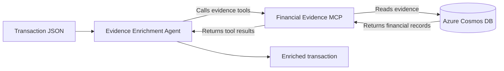
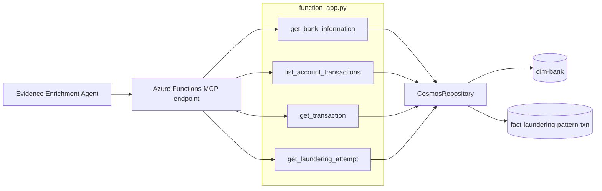

# Challenge 2 - Build the Evidence Enrichment Agent

[Previous challenge](solution-01.md) | **[Home](../README.md)** | [Next challenge](solution-03.md)

## 🎯 Objective

Load historical AML evidence into Azure Cosmos DB, deploy a read-only **Financial Evidence MCP**, and connect it to an **Evidence Enrichment Agent** in Microsoft Foundry.

## 🧭 Context and Background

The Evidence Enrichment Agent receives a transaction and retrieves relevant banks, accounts, historical transactions, and laundering evidence. It adds traceable facts to the original transaction without making a compliance decision.



In this challenge, you will populate the Cosmos DB evidence store, review and deploy the MCP source code, connect Application Insights to your Foundry project, configure the agent, and inspect its tool calls in the Foundry playground.

## ✅ Tasks

### 1. Load the evidence data into Cosmos DB

The Azure Cosmos DB account and `aml` database were provisioned in Challenge 1. Load the supplied evidence data into that database from your GitHub Codespace. Run the **load-cosmos.sh** script using the following command:

```bash
"$walkthroughHome/challenge-02/cosmos/load-cosmos.sh" "$cosmosAccountName"
```

The script creates the containers as needed and imports the supplied data. A successful run includes output similar to this:

```text
...
2026-08-26 13:16:48,487 INFO dim-bank complete: 2578 documents
...
2026-08-26 13:17:48,868 INFO fact-laundering-pattern-txn complete: 22743 documents
...
```

Open **Data Explorer** for the Cosmos DB account in the Azure portal. Explore documents in the `dim-bank` and `fact-laundering-pattern-txn` containers to understand the structure of the evidence available to the agent.

### 2. Review and deploy the Financial Evidence MCP

The **Financial Evidence MCP** provides read-only access to the evidence in Cosmos DB. It exposes tools that allow the Evidence Enrichment Agent to retrieve bank details, account history, individual transactions, and laundering-attempt timelines.



Each MCP tool delegates data access to a shared repository. The repository reads from the appropriate Cosmos DB container and returns structured evidence to the agent.

Key source files are:

- `walkthrough/challenge-02/financial-evidence-mcp/src/function_app.py` - the Azure Functions app that implements the MCP tools.
- `walkthrough/challenge-02/financial-evidence-mcp/src/cosmos_repository.py` - the repository that interacts with Cosmos DB.

Review these files to understand how the tools are implemented and how they interact with Cosmos DB. You can also run the MCP locally with Azure Functions Core Tools before deploying it.

Deploy the MCP to Azure Functions from your Codespace:

```bash
"$walkthroughHome/challenge-02/financial-evidence-mcp/deploy.sh" \
	-g "$rg" \
	-a "$cosmosAccountName" \
	-d "aml" \
	-l "$location"
```

Follow the progress in the terminal. The script creates the Azure Function App, configures its Cosmos DB settings, grants its managed identity the required read permissions, and publishes the MCP code.

When deployment finishes, retrieve the MCP endpoint and the `mcp_extension` system key. You will use both values when connecting the MCP to the agent.

Copy the endpoint printed by the deployment script:

```text
MCP endpoint: https://<function-app-name>.azurewebsites.net/runtime/webhooks/mcp
```

Add the endpoint to the `hackenv` file. The following commands retrieve the Function App name and build the full URL:

```bash
functionAppName=$(az functionapp list --resource-group "$rg" --query "[?starts_with(name, 'mcp-financial-evidence')].name" --output tsv)
echo "financialEvidenceMcpEndpoint=https://$functionAppName.azurewebsites.net/runtime/webhooks/mcp" >> hackenv
```

In the Azure portal, open the Function App and select **Functions** > **App keys** > **System keys**.


Copy the value of the `mcp_extension` key and add it to `hackenv`:

```bash
echo 'financialEvidenceMcpSystemKey=<mcp-extension-value>' >> hackenv
```

Load the new environment variables into your shell:

```bash
source hackenv
```

### 3. Create the Evidence Enrichment Agent in Microsoft Foundry

The agent will use the Financial Evidence MCP to retrieve evidence from Cosmos DB and enrich transactions with traceable facts.

In the Azure portal, open your **Microsoft Foundry** resource and select **Go to Foundry Portal**. Sign in using your Hackbox credentials.


#### Explore the Foundry project

The provided Microsoft Foundry project contains two model deployments: a chat model used by the agent and an embedding model. Find both deployments and review their details.

Next, connect the Application Insights resource deployed in your environment to the Foundry project. This connection allows you to monitor agent performance and investigate issues.

Open **Manage** and select **Project details** from the left menu. Select **Connected resources**, then **Add connection**.


Select **Application Insights**, then select **Continue**. Choose the Application Insights resource deployed for your lab, leave **API key** as the authentication method, and select **Connect**.

#### Create the agent

Under **Build**, open **Agents**, select **New agent**, then select **Build an agent**.


Name the agent `EvidenceEnrichmentAgent`.

The new agent opens with a blank configuration:


The chat model is selected automatically because it is the only deployed model that can power this agent. The embedding deployment is not a chat model.

Select **Instructions** and copy the contents of `walkthrough/challenge-02/evidence-enrichment-agent/instructions.md` into the instruction editor.

Review the instructions before continuing. They define how the agent handles input, invokes tools, reports missing evidence, and avoids making compliance decisions.

Expand **Tools** and remove the existing **Web Search** tool because it is not an approved evidence source for this agent.

Select **Add** > **Add tools**, open the **Custom** tab, select **Model Context Protocol**, then select **Create**.

The MCP configuration form opens:


Configure these values:

- **Name:** `financial-evidence-mcp`
- **Remote MCP endpoint:** Use the value returned by `echo "$financialEvidenceMcpEndpoint"`.
- **Authentication:** Leave **Key-based** selected.
- **Key:** `x-functions-key`
- **Value:** Use the value returned by `echo "$financialEvidenceMcpSystemKey"`.

Select **Connect**. Foundry returns to the agent page and displays the new MCP tool.

Open the MCP tool's `...` menu and select **Configure**:


Then enable **Always auto-approve all tools**.


This setting allows the agent to use the MCP tools without requesting approval for every call.

Select **Save**. Foundry creates a new version of the agent.

### 4. Test and trace the agent

Open the **Playground** to test the agent.


Submit this transaction:

```json
{
  "transaction_id": "TX-TEST-0001",
  "originator_name": "James Carter",
  "origin_account": "83D4B1F30",
  "bank_origin": "0121",
  "beneficiary_name": "Emily Foster",
  "destination_account": "818CCA030",
  "bank_destination": "29196",
  "amount": 15000,
  "currency": "EUR"
}
```

The response should be a JSON object that contains the original transaction enriched with relevant bank, account, historical transaction, and laundering evidence.

For this example, the agent should find three pieces of evidence. To inspect the trace, scroll to the bottom and select **Traces**. It shows the agent calling the MCP tools according to its instructions and using the returned evidence to enrich the transaction.


Select any **Execute tool** span to inspect the data returned by the MCP.

## 🚀 Go Further

Test a transaction with incomplete or conflicting evidence. Observe how the agent reports uncertainty and confirm that it does not fabricate evidence or make a compliance decision.

Run the Financial Evidence MCP locally with Azure Functions Core Tools, invoke each tool directly, and compare the responses with the calls shown in the Foundry trace.

## 🛠️ Troubleshooting

- **The Cosmos import fails:** Confirm that `cosmosAccountName` contains the account name, that your Azure identity has Cosmos DB data-plane access, and that the account endpoint is reachable.
- **The MCP deployment fails:** Confirm that `rg`, `location`, and `cosmosAccountName` are loaded from `hackenv`, and verify that Azure Functions Core Tools is installed.
- **The MCP does not connect in Foundry:** Confirm that the endpoint ends with `/runtime/webhooks/mcp` and that the `x-functions-key` value is the `mcp_extension` system key.
- **No MCP tools appear:** Verify that the Function App deployment completed successfully, then reconnect the MCP tool in Foundry.
- **The agent does not call the MCP:** Confirm that the agent instructions were copied completely, Web Search was removed, the MCP tools are auto-approved, and the latest agent version was saved.
- **No traces appear:** Verify that the correct Application Insights resource is connected to the Foundry project, then run the test again.

## 🧠 Conclusion

You have built an Evidence Enrichment Agent that retrieves traceable financial evidence from Azure Cosmos DB through a read-only MCP. Continue to [Challenge 3](solution-03.md), where the enriched transaction will be assessed against global and regional regulations.
