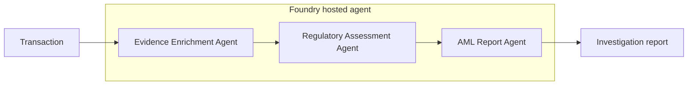

# Challenge 4 - Build and Orchestrate the Investigation

[Previous challenge](solution-03.md) | **[Home](../README.md)** | [Next challenge](solution-05.md)

## 🎯 Objective

Build an **AML Report Agent**, compose it with the Evidence Enrichment and Regulatory Assessment agents using the **Microsoft Agent Framework**, and deploy the workflow as a hosted agent in Microsoft Foundry.

## 🧭 Context and Background

The first two agents produce evidence and a regulatory decision. The AML Report Agent converts those structured inputs into a consistent, audit-ready investigation report without changing the underlying facts or assessment.



The orchestration owns sequencing, state transfer, failure handling, and the final response. Each specialist agent retains a narrow responsibility.

## ✅ Tasks

Before starting, source `baseenv` and `hackenv` to load the environment variables used by this challenge.

```bash
source baseenv
source hackenv
```

### 1. Create the AML Report Agent

The AML report agent is responsible for generating a comprehensive investigation report based on the assessments provided by the evidence enrichment and regulatory assessment agents. It ensures that all findings are documented in a structured and audit-ready format.

The report must preserve source identifiers so an analyst can trace each finding back to its evidence or policy. It must also preserve the regulatory status, avoid adding facts, and distinguish missing information from confirmed findings.

This is the third agent you will build, so follow the same creation and configuration process used for the previous agents. Configure the following settings:

- Define the agent's name as `AMLReportAgent`
- Set the model: `gpt-5.6-luna`
- Set instructions: find them under `walkthrough/challenge-04/aml-report-agent/instructions.md`. Review and validate content.
- Remove the `Web Search` tool, irrelevant for this agent.

This agent does not require any tools, so skip the tool configuration step. Select **Save** to create the agent and make it ready for use.

### 2. Test the AML Report Agent

Test the AML Report Agent using the same approach as for the previous agents. Verify that it generates a comprehensive, structured investigation report based on the assessments from the Evidence Enrichment and Regulatory Assessment agents.

If you saved the output from the `RegulatoryAssessmentAgent` test, provide it as input to the `AMLReportAgent` to simulate a complete investigation workflow. Otherwise, use the following JSON:

```json
{
  "transaction_id": "TX-TEST-0001",
  "original_transaction": {
    "transaction_id": "TX-TEST-0001",
    "originator_name": "James Carter",
    "origin_account": "83D4B1F30",
    "bank_origin": "0121",
    "beneficiary_name": "Emily Foster",
    "destination_account": "818CCA030",
    "bank_destination": "29196",
    "amount": 15000,
    "currency": "EUR"
  },
  "data_agent_response": {
    "transaction_id": "TX-TEST-0001",
    "match_found": true,
    "assessment": "Historical laundering records were found for one or more accounts in the transaction.",
    "origin_account": {
      "originator_name": "James Carter",
      "account": "83D4B1F30",
      "bank_id": "0121",
      "bank_name": "Israel Bank #35",
      "country": "Israel",
      "historical_participation": true,
      "role": "Receiver",
      "laundering_transaction_count": 3,
      "laundering_attempt_count": 3,
      "first_seen": "2026-09-02T10:03:00Z",
      "last_seen": "2026-09-18T05:02:00Z",
      "pattern_types": [
        "BIPARTITE",
        "FAN-OUT",
        "GATHER-SCATTER"
      ],
      "evidence": [
        {
          "pattern_txn_sk": 120259084422,
          "attempt_id": 2502,
          "pattern_type": "GATHER-SCATTER",
          "step_in_attempt": 5,
          "date_key": 20260918,
          "txn_ts": "2026-09-18T05:02:00Z",
          "from_bank_id": "0015",
          "from_account": "84221F9F0",
          "to_bank_id": "0121",
          "to_account": "83D4B1F30",
          "amount_received": 44947.3,
          "receiving_currency": "Shekel",
          "amount_paid": 44947.3,
          "payment_currency": "Shekel",
          "payment_format": "ACH",
          "is_laundering": 1,
          "id": "120259084422",
          "partition_key": "2502"
        },
        {
          "pattern_txn_sk": 68719477003,
          "attempt_id": 1385,
          "pattern_type": "FAN-OUT",
          "step_in_attempt": 1,
          "date_key": 20260909,
          "txn_ts": "2026-09-09T02:52:00Z",
          "from_bank_id": "0015",
          "from_account": "84221D110",
          "to_bank_id": "0121",
          "to_account": "83D4B1F30",
          "amount_received": 23427.81,
          "receiving_currency": "Shekel",
          "amount_paid": 23427.81,
          "payment_currency": "Shekel",
          "payment_format": "ACH",
          "is_laundering": 1,
          "id": "68719477003",
          "partition_key": "1385"
        },
        {
          "pattern_txn_sk": 8589934791,
          "attempt_id": 150,
          "pattern_type": "BIPARTITE",
          "step_in_attempt": 13,
          "date_key": 20260902,
          "txn_ts": "2026-09-02T10:03:00Z",
          "from_bank_id": "0220",
          "from_account": "8000EB430",
          "to_bank_id": "0121",
          "to_account": "83D4B1F30",
          "amount_received": 58403.73,
          "receiving_currency": "Shekel",
          "amount_paid": 58403.73,
          "payment_currency": "Shekel",
          "payment_format": "ACH",
          "is_laundering": 1,
          "id": "8589934791",
          "partition_key": "150"
        }
      ]
    },
    "destination_account": {
      "beneficiary_name": "Emily Foster",
      "account": "818CCA030",
      "bank_id": "29196",
      "bank_name": "Bank of Topeka",
      "country": "Bangladesh",
      "historical_participation": false,
      "role": null,
      "laundering_transaction_count": 0,
      "laundering_attempt_count": 0,
      "first_seen": null,
      "last_seen": null,
      "pattern_types": [],
      "evidence": []
    }
  },
  "historical_context": {
    "accounts_with_history": 1,
    "accounts_without_history": 1,
    "highest_historical_context_level": 4,
    "transaction_interpretation": "One account involved in the transaction has historical AML participation."
  },
  "origin_account_enrichment": {
    "historical_context_level": 4,
    "historical_context_category": "Repeated Participation Across Multiple Patterns",
    "participation_consistency": "Receiver Only",
    "participation_frequency": "Repeated",
    "pattern_diversity_count": 3,
    "pattern_diversity_level": "High",
    "days_since_last_seen": 10,
    "recency_band": "Recent",
    "investigator_interpretation": "The account shows repeated historical participation spanning multiple laundering patterns."
  },
  "destination_account_enrichment": {
    "historical_context_level": 0,
    "historical_context_category": "No Historical AML Participation",
    "participation_consistency": "None",
    "participation_frequency": "None",
    "pattern_diversity_count": 0,
    "pattern_diversity_level": "None",
    "days_since_last_seen": null,
    "recency_band": "None",
    "investigator_interpretation": "No historical AML participation was identified."
  },
  "derived_features": {
    "origin_has_history": true,
    "destination_has_history": false,
    "multiple_pattern_presence": true,
    "recent_historical_activity": true,
    "highest_historical_context_level": 4
  },
  "aml_regulatory_inputs": {
    "historical_context_level": 4,
    "pattern_diversity_count": 3,
    "laundering_attempt_count": 3,
    "recent_participation": true,
    "historical_participation_role": "Receiver",
    "historical_participation_detected": true
  },
  "aml_regulatory_assessment": {
    "assessment_source": "kb-aml",
    "assessment_type": "AML regulation and policy compliance validation",
    "regulatory_scope": {
      "global_rules_evaluated": true,
      "supranational_rules_evaluated": true,
      "origin_country_rules_evaluated": true,
      "destination_country_rules_evaluated": true,
      "cross_border_rules_evaluated": true,
      "historical_aml_context_rules_evaluated": true,
      "origin_country": "Israel",
      "destination_country": "Bangladesh",
      "is_cross_border": true
    },
    "retrieved_policy_sets": [
      {
        "policy_set_id": "GLB-STD-001",
        "policy_set_name": "Global AML/CFT Standards - Consolidated",
        "scope": "GLOBAL",
        "jurisdiction": null,
        "summary": "Risk-based AML controls, customer due diligence, enhanced due diligence, wire-transfer transparency, monitoring, reporting and record keeping.",
        "source_reference": "GLB-STD-001, pa[[1]]†source】"
      },
      {
        "policy_set_id": "EU-GL-002",
        "policy_set_name": "EU ML/TF Risk Factors Guidelines",
        "scope": "SUPRANATIONAL",
        "jurisdiction": "European Union",
        "summary": "Risk-factor and enhanced-due-diligence guidance retrieved as supranational material; direct applicability to these non-EU jurisdictions is not established by the input.",
        "source_reference": "EU[[2]]†source】"
      },
      {
        "policy_set_id": "IL-REG-016",
        "policy_set_name": "Israel - Prohibition on Money Laundering",
        "scope": "ORIGIN_COUNTRY",
        "jurisdiction": "Israel",
        "summary": "Identification, beneficiary and controlling-shareholder declarations, cross-border reporting and suspicious-activity duties.",
        "source_reference": "IL-REG-016, pa[[3]]†source】"
      },
      {
        "policy_set_id": "BD-REG-017",
        "policy_set_name": "Bangladesh - Money Laundering Prevention",
        "scope": "DESTINATION_COUNTRY",
        "jurisdiction": "Bangladesh",
        "summary": "Customer identification, suspicious-activity reporting, outward-remittance purpose documentation and foreign-exchange records.",
        "source_reference": "BD-REG-017, pa[[4]]†source】"
      },
      {
        "policy_set_id": "GLB-STD-001-CB",
        "policy_set_name": "Global Cross-Border Wire Transfer Controls",
        "scope": "CROSS_BORDER",
        "jurisdiction": "Israel to Bangladesh",
        "summary": "Cross-border transfers require accurate originator and beneficiary information and retention of required information through the payment chain.",
        "source_reference": "GLB-STD-001, wire-transfer [[5]]†source】"
      },
      {
        "policy_set_id": "OPS-GEO-005",
        "policy_set_name": "Jurisdiction Risk Matrix and Corridor Rules",
        "scope": "CROSS_BORDER",
        "jurisdiction": "Israel to Bangladesh",
        "summary": "Retrieved country ratings are Israel 2 and Bangladesh 3; the higher rating is relevant to corridor review.",
        "source_reference": "OPS-[[6]]†source】"
      },
      {
        "policy_set_id": "OPS-RULE-021-HIST",
        "policy_set_name": "Payment-Level Detection Rules - Prior Involvement",
        "scope": "HISTORICAL_AML_CONTEXT",
        "jurisdiction": null,
        "summary": "Prior reported or otherwise documented AML involvement is a specific historical-context evaluation family.",
        "source_reference": "OPS-RULE-021, HIST[[7]]†source】"
      },
      {
        "policy_set_id": "GLB-TYP-015",
        "policy_set_name": "Typology Casebook and Detection Scenarios",
        "scope": "HISTORICAL_AML_CONTEXT",
        "jurisdiction": null,
        "summary": "Multiple typologies and repeated historical participation are relevant indicators, but a single indicator is not evidence of laundering.",
        "source_reference": "GLB-[[8]]†source】"
      }
    ],
    "rule_evaluations": [
      {
        "rule_id": "GLB-STD-001-RBA",
        "rule_name": "Risk-based assessment of geography and transaction profile",
        "policy_set_name": "Global AML/CFT Standards - Consolidated",
        "scope": "GLOBAL",
        "jurisdiction": null,
        "rule_summary": "Obliged entities shall assess customer, product, channel and origin/destination geography risks and apply proportionate controls.",
        "applies_to_transaction": true,
        "compliance_status": "COMPLIANT",
        "validation_result": {
          "passed": true,
          "failed": false,
          "missing_required_data": false
        },
        "evidence_used": {
          "transaction_id": "TX-TEST-0001",
          "origin_country": "Israel",
          "destination_country": "Bangladesh",
          "origin_bank_id": "0121",
          "destination_bank_id": "29196",
          "amount": 15000,
          "currency": "EUR",
          "origin_historical_participation": true,
          "destination_historical_participation": false,
          "highest_historical_context_level": 4,
          "pattern_types": [
            "BIPARTITE",
            "FAN-OUT",
            "GATHER-SCATTER"
          ],
          "recent_historical_activity": true
        },
        "interpretation": "The input contains origin and destination countries, transaction value and currency, bank identifiers, and substantial historical AML context. These fields support risk-based assessment. They do not establish that all required mitigating controls were completed.",
        "kb_source_reference": "GLB-[[9]]†source】"
      },
      {
        "rule_id": "GLB-STD-001-CDD",
        "rule_name": "Customer due diligence and ongoing due diligence",
        "policy_set_name": "Global AML/CFT Standards - Consolidated",
        "scope": "GLOBAL",
        "jurisdiction": null,
        "rule_summary": "CDD includes identity verification, beneficial-owner identification, purpose and intended-nature information, and ongoing scrutiny against customer profile and source of funds or wealth.",
        "applies_to_transaction": true,
        "compliance_status": "INSUFFICIENT_DATA",
        "validation_result": {
          "passed": false,
          "failed": false,
          "missing_required_data": true
        },
        "evidence_used": {
          "transaction_id": "TX-TEST-0001",
          "origin_country": "Israel",
          "destination_country": "Bangladesh",
          "origin_bank_id": "0121",
          "destination_bank_id": "29196",
          "amount": 15000,
          "currency": "EUR",
          "origin_historical_participation": true,
          "destination_historical_participation": false,
          "highest_historical_context_level": 4,
          "pattern_types": [
            "BIPARTITE",
            "FAN-OUT",
            "GATHER-SCATTER"
          ],
          "recent_historical_activity": true
        },
        "interpretation": "Names and account identifiers are present, but the input does not establish identity verification, beneficial-owner information, transaction purpose, source of funds, source of wealth or customer-profile consistency.",
        "kb_source_reference": "GLB-[[10]]†source】"
      },
      {
        "rule_id": "GLB-STD-001-EDD",
        "rule_name": "Enhanced due diligence for complex or unusually large transactions",
        "policy_set_name": "Global AML/CFT Standards - Consolidated",
        "scope": "GLOBAL",
        "jurisdiction": null,
        "rule_summary": "Enhanced measures apply to complex or unusually large transactions without an apparent economic or lawful purpose and require additional customer, ownership, purpose and source-of-funds information.",
        "applies_to_transaction": true,
        "compliance_status": "POTENTIAL_GAP",
        "validation_result": {
          "passed": false,
          "failed": false,
          "missing_required_data": true
        },
        "evidence_used": {
          "transaction_id": "TX-TEST-0001",
          "origin_country": "Israel",
          "destination_country": "Bangladesh",
          "origin_bank_id": "0121",
          "destination_bank_id": "29196",
          "amount": 15000,
          "currency": "EUR",
          "origin_historical_participation": true,
          "destination_historical_participation": false,
          "highest_historical_context_level": 4,
          "pattern_types": [
            "BIPARTITE",
            "FAN-OUT",
            "GATHER-SCATTER"
          ],
          "recent_historical_activity": true
        },
        "interpretation": "The transaction is cross-border and one account has recent repeated participation across three historical AML patterns. The input does not show whether enhanced due diligence, senior approval, source-of-funds corroboration or purpose validation occurred.",
        "kb_source_reference": "GLB-[[11]]†source】"
      },
      {
        "rule_id": "GLB-STD-001-WIRE",
        "rule_name": "Cross-border wire-transfer information completeness",
        "policy_set_name": "Global Cross-Border Wire Transfer Controls",
        "scope": "CROSS_BORDER",
        "jurisdiction": "Israel to Bangladesh",
        "rule_summary": "Cross-border transfers must include originator name and account or unique reference, beneficiary name and account or unique reference, plus originator address, national ID, or date and place of birth.",
        "applies_to_transaction": true,
        "compliance_status": "POTENTIAL_GAP",
        "validation_result": {
          "passed": false,
          "failed": false,
          "missing_required_data": true
        },
        "evidence_used": {
          "transaction_id": "TX-TEST-0001",
          "origin_country": "Israel",
          "destination_country": "Bangladesh",
          "origin_bank_id": "0121",
          "destination_bank_id": "29196",
          "amount": 15000,
          "currency": "EUR",
          "origin_historical_participation": true,
          "destination_historical_participation": false,
          "highest_historical_context_level": 4,
          "pattern_types": [
            "BIPARTITE",
            "FAN-OUT",
            "GATHER-SCATTER"
          ],
          "recent_historical_activity": true
        },
        "interpretation": "Originator and beneficiary names and account numbers are supplied. Originator address, national identification number, or date and place of birth are absent, and the input does not confirm that required data travelled with the payment.",
        "kb_source_reference": "GLB-[[12]]†source】"
      },
      {
        "rule_id": "GLB-STD-001-MON",
        "rule_name": "Transaction monitoring and suspicious-activity escalation",
        "policy_set_name": "Global AML/CFT Standards - Consolidated",
        "scope": "GLOBAL",
        "jurisdiction": null,
        "rule_summary": "Institutions must monitor transactions, assess suspicious indicators, escalate promptly and report without delay where suspicion or reasonable grounds to suspect arise.",
        "applies_to_transaction": true,
        "compliance_status": "POTENTIAL_GAP",
        "validation_result": {
          "passed": false,
          "failed": false,
          "missing_required_data": true
        },
        "evidence_used": {
          "transaction_id": "TX-TEST-0001",
          "origin_country": "Israel",
          "destination_country": "Bangladesh",
          "origin_bank_id": "0121",
          "destination_bank_id": "29196",
          "amount": 15000,
          "currency": "EUR",
          "origin_historical_participation": true,
          "destination_historical_participation": false,
          "highest_historical_context_level": 4,
          "pattern_types": [
            "BIPARTITE",
            "FAN-OUT",
            "GATHER-SCATTER"
          ],
          "recent_historical_activity": true
        },
        "interpretation": "The enriched data supplies significant monitoring indicators and historical records, but does not state whether this transaction was reviewed, escalated, reported, or documented by the compliance function. The evidence supports a potential control gap, not a finding of non-compliance.",
        "kb_source_reference": "GLB-[[13]]†source】"
      },
      {
        "rule_id": "IL-REG-016-ID",
        "rule_name": "Origin-jurisdiction identification and beneficiary declaration",
        "policy_set_name": "Israel - Prohibition on Money Laundering",
        "scope": "ORIGIN_COUNTRY",
        "jurisdiction": "Israel",
        "rule_summary": "Identification, official verification, beneficiary declaration and controlling-shareholder declaration are required as specified by the applicable sectoral order.",
        "applies_to_transaction": true,
        "compliance_status": "INSUFFICIENT_DATA",
        "validation_result": {
          "passed": false,
          "failed": false,
          "missing_required_data": true
        },
        "evidence_used": {
          "transaction_id": "TX-TEST-0001",
          "origin_country": "Israel",
          "destination_country": "Bangladesh",
          "origin_bank_id": "0121",
          "destination_bank_id": "29196",
          "amount": 15000,
          "currency": "EUR",
          "origin_historical_participation": true,
          "destination_historical_participation": false,
          "highest_historical_context_level": 4,
          "pattern_types": [
            "BIPARTITE",
            "FAN-OUT",
            "GATHER-SCATTER"
          ],
          "recent_historical_activity": true
        },
        "interpretation": "The origin country is Israel and the originating bank is identified. The input does not contain verification records, beneficiary declarations, controlling-shareholder information, applicable sectoral order, or evidence of compliance with any cross-border reporting threshold.",
        "kb_source_reference": "IL-[[14]]†source】"
      },
      {
        "rule_id": "BD-REG-017-REM",
        "rule_name": "Destination-jurisdiction remittance purpose and record requirements",
        "policy_set_name": "Bangladesh - Money Laundering Prevention",
        "scope": "DESTINATION_COUNTRY",
        "jurisdiction": "Bangladesh",
        "rule_summary": "Outward remittances require an authorised purpose and supporting documentation; foreign-exchange transaction records must be retained.",
        "applies_to_transaction": true,
        "compliance_status": "INSUFFICIENT_DATA",
        "validation_result": {
          "passed": false,
          "failed": false,
          "missing_required_data": true
        },
        "evidence_used": {
          "transaction_id": "TX-TEST-0001",
          "origin_country": "Israel",
          "destination_country": "Bangladesh",
          "origin_bank_id": "0121",
          "destination_bank_id": "29196",
          "amount": 15000,
          "currency": "EUR",
          "origin_historical_participation": true,
          "destination_historical_participation": false,
          "highest_historical_context_level": 4,
          "pattern_types": [
            "BIPARTITE",
            "FAN-OUT",
            "GATHER-SCATTER"
          ],
          "recent_historical_activity": true
        },
        "interpretation": "The destination account is in Bangladesh, but the input does not provide an authorised purpose code, supporting documentation, licensed remittance channel, sender relationship, or foreign-exchange record.",
        "kb_source_reference": "BD-[[15]]†source】"
      },
      {
        "rule_id": "OPS-GEO-005-CORRIDOR",
        "rule_name": "Cross-border corridor risk review",
        "policy_set_name": "Jurisdiction Risk Matrix and Corridor Rules",
        "scope": "CROSS_BORDER",
        "jurisdiction": "Israel to Bangladesh",
        "rule_summary": "The corridor assessment considers both country ratings and applies the higher rating to the transaction.",
        "applies_to_transaction": true,
        "compliance_status": "COMPLIANT",
        "validation_result": {
          "passed": true,
          "failed": false,
          "missing_required_data": false
        },
        "evidence_used": {
          "transaction_id": "TX-TEST-0001",
          "origin_country": "Israel",
          "destination_country": "Bangladesh",
          "origin_bank_id": "0121",
          "destination_bank_id": "29196",
          "amount": 15000,
          "currency": "EUR",
          "origin_historical_participation": true,
          "destination_historical_participation": false,
          "highest_historical_context_level": 4,
          "pattern_types": [
            "BIPARTITE",
            "FAN-OUT",
            "GATHER-SCATTER"
          ],
          "recent_historical_activity": true
        },
        "interpretation": "The countries differ, so cross-border review applies. The retrieved matrix rates Israel 2 and Bangladesh 3; the assessment records the higher Bangladesh rating. No call-for-action or sanctions-programme designation was retrieved for either country.",
        "kb_source_reference": "OPS-[[16]]†source】"
      },
      {
        "rule_id": "OPS-RULE-021-HIST-01",
        "rule_name": "Prior AML involvement and historical context evaluation",
        "policy_set_name": "Payment-Level Detection Rules - Prior Involvement",
        "scope": "HISTORICAL_AML_CONTEXT",
        "jurisdiction": null,
        "rule_summary": "Accounts previously identified in AML activity are subject to a dedicated historical-involvement evaluation family.",
        "applies_to_transaction": true,
        "compliance_status": "COMPLIANT",
        "validation_result": {
          "passed": true,
          "failed": false,
          "missing_required_data": false
        },
        "evidence_used": {
          "transaction_id": "TX-TEST-0001",
          "origin_country": "Israel",
          "destination_country": "Bangladesh",
          "origin_bank_id": "0121",
          "destination_bank_id": "29196",
          "amount": 15000,
          "currency": "EUR",
          "origin_historical_participation": true,
          "destination_historical_participation": false,
          "highest_historical_context_level": 4,
          "pattern_types": [
            "BIPARTITE",
            "FAN-OUT",
            "GATHER-SCATTER"
          ],
          "recent_historical_activity": true
        },
        "interpretation": "The origin account has three recorded laundering transactions and attempts, three pattern types, historical context level 4, and recent activity. The historical-context rule therefore applies and the required historical indicators are present.",
        "kb_source_reference": "OPS-RULE-021 HIST[[17]]†source】"
      },
      {
        "rule_id": "GLB-TYP-015-HIGH",
        "rule_name": "Multiple historical typology indicators",
        "policy_set_name": "Typology Casebook and Detection Scenarios",
        "scope": "HISTORICAL_AML_CONTEXT",
        "jurisdiction": null,
        "rule_summary": "Co-occurring typology indicators have enhanced analytical relevance, while a single indicator alone is not evidence of laundering.",
        "applies_to_transaction": true,
        "compliance_status": "COMPLIANT",
        "validation_result": {
          "passed": true,
          "failed": false,
          "missing_required_data": false
        },
        "evidence_used": {
          "transaction_id": "TX-TEST-0001",
          "origin_country": "Israel",
          "destination_country": "Bangladesh",
          "origin_bank_id": "0121",
          "destination_bank_id": "29196",
          "amount": 15000,
          "currency": "EUR",
          "origin_historical_participation": true,
          "destination_historical_participation": false,
          "highest_historical_context_level": 4,
          "pattern_types": [
            "BIPARTITE",
            "FAN-OUT",
            "GATHER-SCATTER"
          ],
          "recent_historical_activity": true
        },
        "interpretation": "The origin account appears across three historical pattern types and has recent repeated participation. These are regulatory monitoring indicators, not a determination that the current transaction constitutes laundering.",
        "kb_source_reference": "GLB-[[18]]†source】"
      }
    ],
    "overall_compliance": {
      "overall_status": "POTENTIAL_GAP",
      "non_compliant_rule_count": 0,
      "potential_gap_rule_count": 3,
      "insufficient_data_rule_count": 3,
      "not_applicable_rule_count": 0,
      "compliant_rule_count": 4
    },
    "decision_support": {
      "calculation_version": "1.0",
      "calculation_inputs": {
        "highest_historical_context_level": 4,
        "non_compliant_rule_count": 0,
        "potential_gap_rule_count": 3,
        "insufficient_data_rule_count": 3,
        "not_applicable_rule_count": 0,
        "compliant_rule_count": 4
      },
      "investigation_priority": {
        "base_historical_context_score": 50,
        "potential_gap_points": 30,
        "insufficient_data_points": 15,
        "non_compliance_points": 0,
        "raw_score": 95,
        "score": 95,
        "maximum_score": 100,
        "priority_band": "Critical"
      },
      "workflow_classification": {
        "final_verdict": "ENHANCED REVIEW REQUIRED",
        "matched_rule_id": "LEVEL_C",
        "rationale": [
          "The highest historical context level is 4.",
          "Three potential regulatory gaps were identified.",
          "Three applicable rules could not be fully assessed because required data was absent.",
          "No retrieved rule was assessed as non-compliant."
        ],
        "meaning": "The transaction has substantial historical AML relevance and unresolved regulatory validation gaps. The classification is a workflow result and does not establish a legal breach or money laundering.",
        "is_legal_conclusion": false,
        "establishes_money_laundering": false
      }
    },
    "regulatory_interpretation": {
      "summary": "The transaction is regulatory-relevant because it is cross-border from Israel to Bangladesh and the originating account has recent, repeated historical AML participation across three pattern types. The retrieved rules do not support a finding of non-compliance on the available evidence. However, CDD, enhanced-due-diligence, wire-transfer, monitoring, Israeli reporting, and Bangladesh remittance-purpose fields are incomplete or unverified.",
      "key_findings": [
        "The origin account has historical AML participation with three recorded laundering transactions and attempts.",
        "The origin account has historical participation across BIPARTITE, FAN-OUT and GATHER-SCATTER patterns.",
        "The destination account has no historical AML participation in the supplied enrichment.",
        "The transaction is cross-border because the origin and destination countries differ.",
        "The retrieved jurisdiction matrix rates Israel 2 and Bangladesh 3; no sanctions or call-for-action designation was retrieved for either country.",
        "Originator and beneficiary names and account identifiers are present, but address or equivalent originator identification data is absent.",
        "CDD, source-of-funds, transaction-purpose, sanctions-screening, enhanced-review and reporting-status evidence is absent."
      ],
      "regulatory_relevance": "The available evidence supports enhanced regulatory scrutiny and leaves multiple control-validation gaps. It does not establish fraud, money laundering, suspicious activity, or a mandatory operational outcome. Sources: GLB-[[19]]†source】, IL-[[20]]†source】, BD-[[21]]†source】."
    },
    "missing_data": [
      {
        "field": "identity_verification_status",
        "required_for_rule": "GLB-STD-001-CDD and IL-REG-016-ID",
        "reason": "Names and account identifiers do not demonstrate verification using reliable independent documents or electronic verification."
      },
      {
        "field": "beneficial_owner_and_controlling_shareholder_information",
        "required_for_rule": "GLB-STD-001-CDD and IL-REG-016-ID",
        "reason": "The input does not identify or verify beneficial ownership or controlling-shareholder declarations."
      },
      {
        "field": "transaction_purpose_and_intended_nature",
        "required_for_rule": "GLB-STD-001-CDD and BD-REG-017-REM",
        "reason": "No purpose code, economic rationale or intended-nature information is supplied."
      },
      {
        "field": "source_of_funds_and_source_of_wealth",
        "required_for_rule": "GLB-STD-001-CDD and GLB-STD-001-EDD",
        "reason": "The input does not contain source-of-funds or source-of-wealth information or corroboration."
      },
      {
        "field": "originator_address_or_national_id_or_date_and_place_of_birth",
        "required_for_rule": "GLB-STD-001-WIRE",
        "reason": "The retrieved cross-border wire rule requires one of these originator data elements, which is absent."
      },
      {
        "field": "wire_transfer_information_propagation_status",
        "required_for_rule": "GLB-STD-001-WIRE",
        "reason": "The input does not confirm that required originator and beneficiary information remained with the payment through the chain."
      },
      {
        "field": "enhanced_due_diligence_and_senior_approval_status",
        "required_for_rule": "GLB-STD-001-EDD",
        "reason": "The input does not show whether enhanced review or senior approval was performed in light of the historical context and transaction profile."
      },
      {
        "field": "transaction_monitoring_review_and_escalation_status",
        "required_for_rule": "GLB-STD-001-MON",
        "reason": "No compliance review, escalation, report filing, or documented disposition is supplied."
      },
      {
        "field": "israel_sectoral_order_and_cross_border_reporting_status",
        "required_for_rule": "IL-REG-016-ID",
        "reason": "The applicable sectoral order and any required cross-border report status are not provided."
      },
      {
        "field": "bangladesh_authorised_remittance_purpose_code_and_supporting_documentation",
        "required_for_rule": "BD-REG-017-REM",
        "reason": "The destination-country policy requires an authorised purpose and supporting documentation for outward remittance records."
      },
      {
        "field": "sanctions_screening_result",
        "required_for_rule": "Global sanctions-screening controls",
        "reason": "No sanctions-screening result is present in the input. No specific sanctions match can be determined."
      }
    ],
    "downstream_inputs": {
      "has_regulatory_non_compliance": false,
      "has_potential_regulatory_gap": true,
      "requires_case_recommendation_review": true,
      "highest_historical_context_level": 4,
      "rules_triggered": [
        "GLB-STD-001-RBA",
        "GLB-STD-001-CDD",
        "GLB-STD-001-EDD",
        "GLB-STD-001-WIRE",
        "GLB-STD-001-MON",
        "IL-REG-016-ID",
        "BD-REG-017-REM",
        "OPS-GEO-005-CORRIDOR",
        "OPS-RULE-021-HIST-01",
        "GLB-TYP-015-HIGH"
      ],
      "countries_evaluated": [
        "Israel",
        "Bangladesh"
      ],
      "policy_scopes_evaluated": [
        "GLOBAL",
        "SUPRANATIONAL",
        "ORIGIN_COUNTRY",
        "DESTINATION_COUNTRY",
        "CROSS_BORDER",
        "HISTORICAL_AML_CONTEXT"
      ]
    }
  }
}
```

The output is a Markdown report summarizing the regulatory compliance gaps and potential issues identified from the two previous agents' input.

### 3. Review the Agent Framework Orchestration

Several frameworks are available for orchestrating agents, each with its own approach to communication, task delegation, and data flow. This challenge uses [Agent Framework](https://learn.microsoft.com/en-us/agent-framework/) to coordinate multiple agents.

First, run the orchestration locally and test it with the `Agent inspector` tool provided by the **Foundry Toolkit** for Visual Studio Code.

The source code is in the `orchestration` directory under `challenge-04`. Review these key files:

- `src/main.py`: The main entry point for the orchestration logic. That is where we will initialize and coordinate the various agents involved in the process.
- `azure.yaml`: Configuration file for the agent that is required during the phase of deploying the agent as **Hosted Agent** in **Microsoft Foundry**.

Ensure that the agents are defined correctly in the `main.py` file and that their names and versions match those running in the Foundry environment. Open the **Agents** section in the portal to verify these values.

Those names and versions should be set correctly in the `main.py` file:


### 4. Configure and Run the Orchestration Locally

Create an `.env` file in the `src` folder containing the **FOUNDRY_PROJECT_ENDPOINT**. The local orchestration authenticates using the identity signed in to Azure through `az login`. Run the following command to create the file:

```bash
echo "FOUNDRY_PROJECT_ENDPOINT=https://$foundryAccountName.services.ai.azure.com/api/projects/$foundryProjectName" > $walkthroughHome/challenge-04/orchestration/src/.env
```

Validate the `.env` file to ensure that the **FOUNDRY_PROJECT_ENDPOINT** is set correctly:

```bash
cat $walkthroughHome/challenge-04/orchestration/src/.env
```

After setting the endpoint, run the agent orchestration locally using the provided script:

```bash
$walkthroughHome/challenge-04/orchestration/run-agent.sh
```

The script will set up a virtual environment, install the required dependencies, and then run the main orchestration logic. This allows you to test the entire agent workflow locally before deploying it to the hosted environment.

In the logs, you should see the initialization of each agent:


The final trace shows the port on which the agent is listening:


To test the orchestration locally, select the **Foundry Toolkit** icon in Visual Studio Code and use the **Agent inspector** tool to interact with the running agents:


Then use the initial JSON request from Challenge 2 to interact with the agents:
```json
{
  "transaction_id": "TX-TEST-0001",
  "originator_name": "James Carter",
  "origin_account": "83D4B1F30",
  "bank_origin": "0121",
  "beneficiary_name": "Emily Foster",
  "destination_account": "818CCA030",
  "bank_destination": "29196",
  "amount": 15000,
  "currency": "EUR"
}
```

Press `Enter` to send the request. Processing may take some time because all three agents run sequentially.


The result should be a Markdown report containing the transaction details and the analysis performed by the agents.

### 5. Deploy to Microsoft Foundry

Before deploying, ensure that you are signed in to your Azure account. Use the Azure extension in Visual Studio Code for this process. Select the **Azure** icon in the left sidebar to open the extension panel:


Select **Sign in with new account** and enter the credentials for the Azure account provided for the lab.

Before proceeding, confirm that the correct Azure subscription is selected. Open **View** > **Command Palette**, then search for `Azure: Select Subscriptions` and choose the appropriate subscription:


Then:


Return to the **Foundry Toolkit** extension and set your **Foundry project** as the default. Under **My resources**, select **Set Foundry project**, then choose the project used for this lab.

After setting the default, you can manage your Foundry project resources and deploy the orchestration directly from Visual Studio Code.

There are multiple ways to deploy your orchestration to Microsoft Foundry. You can use the `azd` command-line tool or deploy directly from the **Foundry Toolkit** extension.

**Important Note:** due to limitations in how the extension manages source code, move the orchestration source and the `azure.yaml` agent definition to the root of the project directory before deploying. Run the following command:

```bash
cp -Rf \
  "$walkthroughHome/challenge-04/orchestration/src" \
  "$walkthroughHome/challenge-04/orchestration/azure.yaml" \
  "$rootHome/"
```

Use the latter method to deploy directly from the **Foundry Toolkit** extension. Under **Developer Tools**, expand the **Build** section, then select **Deploy to Microsoft Foundry**.

Follow these steps to deploy your orchestration. Ensure you use:
- **Deployment method**: Code
- **Package mode**: Remote
- **Deploy to**: New agent, as it is the first deployment of this orchestration


Finally, review the deployment options before confirming the deployment:


Track the deployment progress in the **Output** panel in Visual Studio Code by selecting **Foundry Toolkit** as the output source:


Once the deployment is complete, you can run a test using the **Hosted Agent Playground**:


The new hosted agent also appears under **Agents** in the **Microsoft Foundry** portal, where you can interact with it and test its functionality:


Test it from the playground as well:


### 6. Review Traces

Challenge 6 explores this topic in depth. For now, take a preliminary look at the traces generated by your orchestration.

In the agent playground, select **Traces**:


Open the last trace to inspect the detailed execution flow of your orchestration:


We will explore tracing and metrics in more depth in Challenge 6. For now, this preliminary view is enough to confirm that the three agents ran in the expected sequence.

## 🚀 Go Further

Add idempotent case identifiers and checkpointing so a transient failure can resume without repeating completed investigation stages.

## 🛠️ Troubleshooting

- **A remote agent cannot be invoked:** Verify the project endpoint, agent name and version, managed identity, and role assignments.
- **A handoff fails validation:** Compare the producing agent's output with the consuming schema and inspect the raw response in the trace.
- **The report changes the decision:** Ensure the report agent receives the assessment as authoritative and has no instruction to reassess it.
- **Local authentication fails:** Sign in with the lab identity and confirm that `DefaultAzureCredential` selects the intended credential.
- **Hosted deployment fails:** Review the build logs, entry point, dependency versions, environment variables, and hosted-agent health status.

## 🧠 Conclusion

You have composed evidence enrichment, regulatory assessment, and reporting into a deployable investigation workflow. Continue to [Challenge 5](solution-05.md) to govern model and MCP traffic and add operational alerting.