# Configure the DataFlow
## Introduction
In this step we'll setup the dataflow from the SAP System and Cosmos DB towards the Synapse DB. Sales OrderHeaders will be extracted via the first Synapse pipeline using the SAP Table connector, Sales Order Items will be extracted via a second Synapse Pipeline using the SAP ECC (oData) connector.
Payment data will be extracted from CosmosDB using a third pipeline.


The first step is to setup the target DB structures in Synapse.
The next step is to define the pipelines to copy the data. For this we first need to create technical connections, called `Linked Services`, to the different data sources and sinks. These `Linked Services`define the adapter to use and the corresponding connection parameters. For our example we'll need 4 `Linked Services`. 

| Scenario | Source LinkedService | Sink Linked Service |
|----------|:------:|---------------------:|
| Sales Order Header | SAP Table Connector | Synapse SQL Pool MicroHack |
| Sales Order Items | SAP ECC Connector | Synapse SQL Pool MicroHack |
| Payments | CosmosDB Collection - paymentData | Synapse SQL Pool MicroHack | 

Based upon the `Linked Services`, we need to define the datasets to extract and where to write these within the target.
This is defined in `Integration Datasets`.

| Scenario | Source Integration Dataset | Sink Integration Dataset |
|----------|:------:|---------------------:|
| Sales Order Header | CDS View - `ZBD_ISALESDOC_E` | Table - `SalesOrderHeaders` |
| Sales Order Items | oData EntitySet - `C_Salesorderitemfs` | Table -`SalesOrderItems` |
| Payments | CosmosDB Collection - `paymentData` | Table - `Payments` | 

The table beneath summarizes the `Integration Datasets` and `Linked Services`.

|Scenario            |Source Integration Dataset                       | Source Linked Service |Sink Integration Dataset                               | Sink Linked Service  |
|--------------------|:-----------------------------------------------:|:---------------------:|:-----------------------------------------------------:|:--------------------:|
|Sales Order Headers | CDS View `ZBD_ISALESDOC_E` | SAP Table Connector | Synape Table `SalesOrderHeaders` | `microHack` SQL Pool - Azure Synapse Analytics |
|Sales Order Items | oData Entity Set `C_Salesorderitemfs` | SAP ECC Connector | Synape Table `SalesOrderItems` | `microHack` SQL Pool - Azure Synapse Analytics |
|Payments | CosmosDB Collection `paymentData` | Cosmos DB - `SAPS4D` DataBase - CosmosDB SQL API | Synapse Table `Payments` | `microHack` SQL Pool - Azure Synapse Analytics |

The last step is to define the `Synapse Pipelines`which will execute the copy. Here we link the source and sink/target datasets. This also where you can execute data mappings if necessary.

We'll start with creating the Synapse Tables, which will receive the extracted data. The we'll define the extraction pipelines one by one.

## Synapse Table Setup
Create the Synapse tables in the SQL Pool
These tables are the receivers of the SAP Sales Order data and the Cosmos Payment Data.
Use the following SQL Scripts to create the tables.
You can do this via `Synapse Studio` or alternatively use the [Azure Data Studio](https://docs.microsoft.com/en-us/sql/azure-data-studio).

We'll describe the usage of Synapse Studio.

* In the Azure Portal, select your Synapse Workspace.
* Select `Open Synapse Studio`


* Select 'Develop'
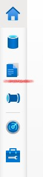

* Create SQL Scripts for each of the tables (`SalesOrderHeaders`, `SalesOrderItems`, `Payments`)
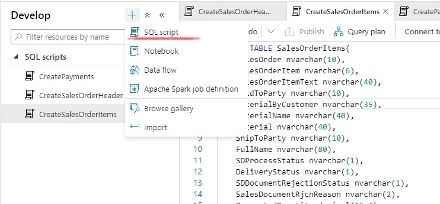

> Note: Make sure to change the "Connect to" value from 'builtin' to your own SQL pool as shown in the screenshot below. As by default it will be connected to the 'builtin' SQL pool of Synapse.

>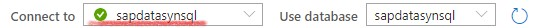

Make sure to run all the scripts in order to create the tables.

- SalesOrderHeaders
```sql
CREATE TABLE SalesOrderHeaders(
	BILLINGCOMPANYCODE nvarchar(4),
	BILLINGDOCUMENTDATE date,
	COUNTRY nvarchar(3),
	CREATIONDATE date,
	CREATIONTIME time,
	CREDITCONTROLAREA nvarchar(4),
	CUSTOMERACCOUNTGROUP nvarchar(4),
	CUSTOMERGROUP nvarchar(2),
	CUSTOMERNAME nvarchar(80),
	DISTRIBUTIONCHANNEL nvarchar(2),
	LASTCHANGEDATE date,
	LASTCHANGEDATETIME decimal(21,0),
	MANDT int,
	ORGANIZATIONDIVISION nvarchar(2),
	PRICINGDATE date,
	PURCHASEORDERBYCUSTOMER nvarchar(35),
	SALESDISTRICT nvarchar(6),
	SALESDOCUMENT nvarchar(10) NOT NULL,
	SALESDOCUMENTPROCESSINGTYPE nvarchar(1),
	SALESDOCUMENTTYPE nvarchar(4),
	SALESGROUP nvarchar(3),
	SALESOFFICE nvarchar(4),
	SALESORGANIZATION nvarchar(4),
	SDDOCUMENTCATEGORY nvarchar(4),
	SOLDTOPARTY nvarchar(10),
	TOTALNETAMOUNT decimal(15, 2),
	TRANSACTIONCURRENCY nvarchar(5),
	CITYNAME nvarchar(35),
	POSTALCODE nvarchar(10)
)
```
- SalesOrderItems
```sql
CREATE TABLE SalesOrderItems(
    SalesOrder nvarchar(10),
    SalesOrderItem nvarchar(6),
    SalesOrderItemText nvarchar(40),
    SoldToParty nvarchar(10),
    MaterialByCustomer nvarchar(35),
    MaterialName nvarchar(40),
    Material nvarchar(40),
    ShipToParty nvarchar(10),
    FullName nvarchar(80),
    SDProcessStatus nvarchar(1),
    DeliveryStatus nvarchar(1),
    SDDocumentRejectionStatus nvarchar(1),
    SalesDocumentRjcnReason nvarchar(2),
    RequestedQuantity decimal(15,3),
    RequestedQuantityUnit nvarchar(3),
    TransactionCurrency nvarchar(5),
    NetAmount decimal(16, 3),
    MaterialGroup nvarchar(9),
    Batch nvarchar(10),
    ProductionPlant nvarchar(4),
    StorageLocation nvarchar(4),
    ShippingPointName nvarchar(30),
    ShippingPoint nvarchar(4),
    SalesOrderItemCategory nvarchar(4),
    BillingBlockCriticality tinyint,
    ItemBillingBlockReason nvarchar(2),
    OrderRelatedBillingStatus nvarchar(1),
    RequestedDeliveryDate date,
    HigherLevelItem nvarchar(6),
    SalesOrderProcessingType nvarchar(1),
    RequirementSegment nvarchar(40)
)
```
- Payments
```sql
CREATE TABLE Payments(
	PaymentNr nvarchar(10),
	SalesOrderNr nvarchar(10),
	CustomerNr nvarchar(10),
	CustomerName nvarchar(80),
	PaymentDate date,
	PaymentValue decimal(15,2),
	Currency nvarchar(5)
)
```

# Implement the SalesOrderHeaders Pipeline

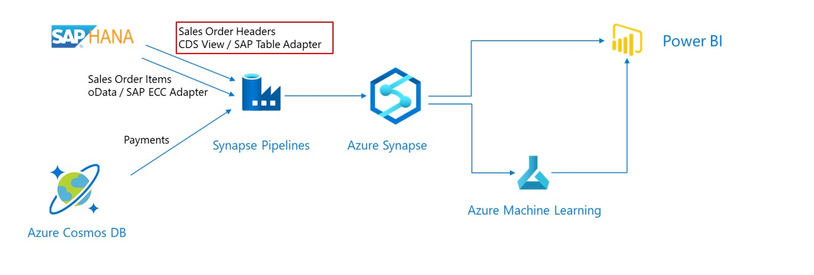

The sales order headers are extracted from SAP using the SAP Table Adapter which uses an RFC.
The view to extract from is : `ZBD_ISALESDOC_E`. 
>Note: You can have a look in the SAP system to check the contents. Use the Data Dictionary, transaction `SE11`.

## Create a Linked Service to the SAP System
* In Synapse Studio, go to the `Manage` View


* Select `Linked Services`


* Create a new `Linked Service` of type `SAP Table`

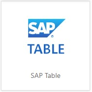

* Enter the connection details for the SAP System, we use the name `S4DCLNT100`. Use the username and password for the SAP system provided to you at the start of the Microhack.

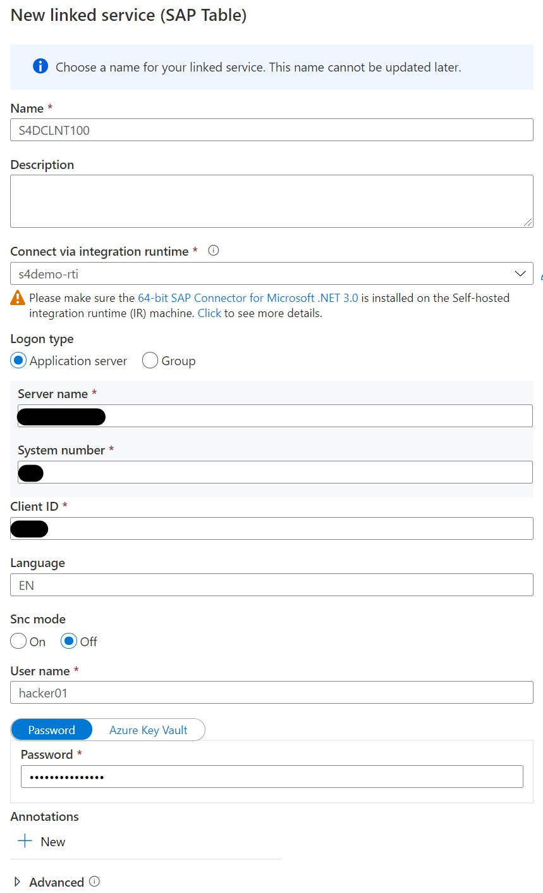

>Note : use `Test Connection` to verify your settings

>Note : SAP Connection Details will be handed out before the MicroHack

## Select the data to extract
Create an Integration DataSet based on the previously created `Linked Service`.
This dataset will act as the source.
* Switch to the `Data` View
* Create a new `Integration Dataset`

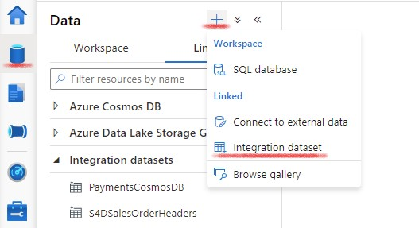

* Use type `SAP Table`


* Use your previously created Linked Service for the SAP System (Table connector), as name we used `S4DCLNT100`

* Use `ZBD_ISALESDOC_E` as table, it can take some time before the list of tables is loaded

* Use `Preview Data` to check if the data can be retrieved

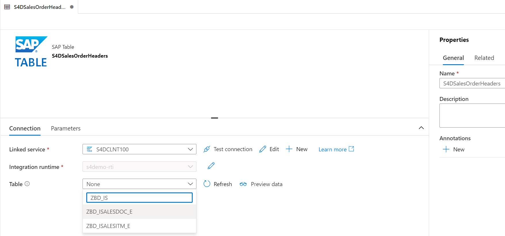

* Once the information is entered succesfully and the data can be retrieved, leave the tab as-is. We will publish the changes after the rest of the components of this data flow are done.

> Note : the source code of the CDS View can be found [here](scripts/zbd_i_salesdocument_e.asddls)

## Create a Linked Service to the Synapse SQL Pool
* this will represent the target/sink of the pipeline

* Switch to the `Manage` view

* Create a new Linked Service of type `Azure Synapse Analytics`, as name we used `SynMicroHackPool`

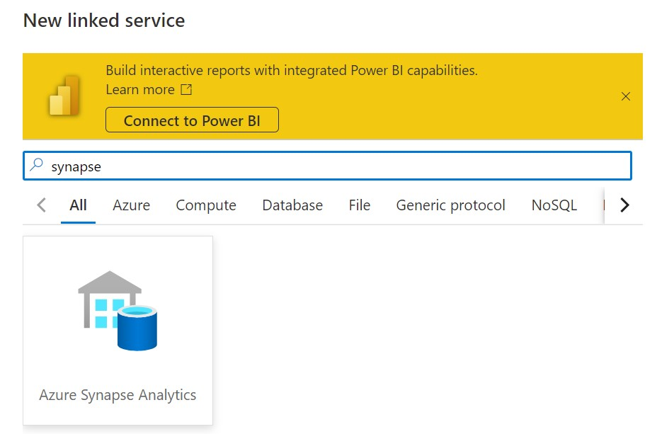

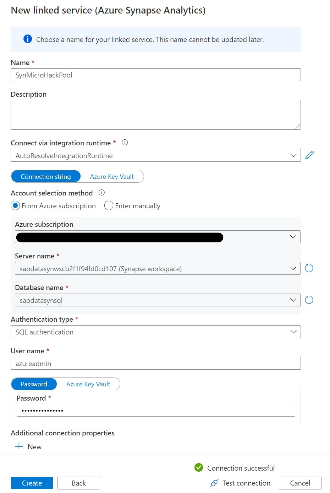

>Note: Since this linked service represents the Synapse SQL pool, it will be re-used in the `SalesOrderItems`and `Payments` pipeline.

### Create an Integration DataSet for the Synapse Sales Orders
This dataset will act as the `sink` in our pipeline.
* Switch to the `Data`View

* Create a new `Integration DataSet` for the Synapse Sales Orders

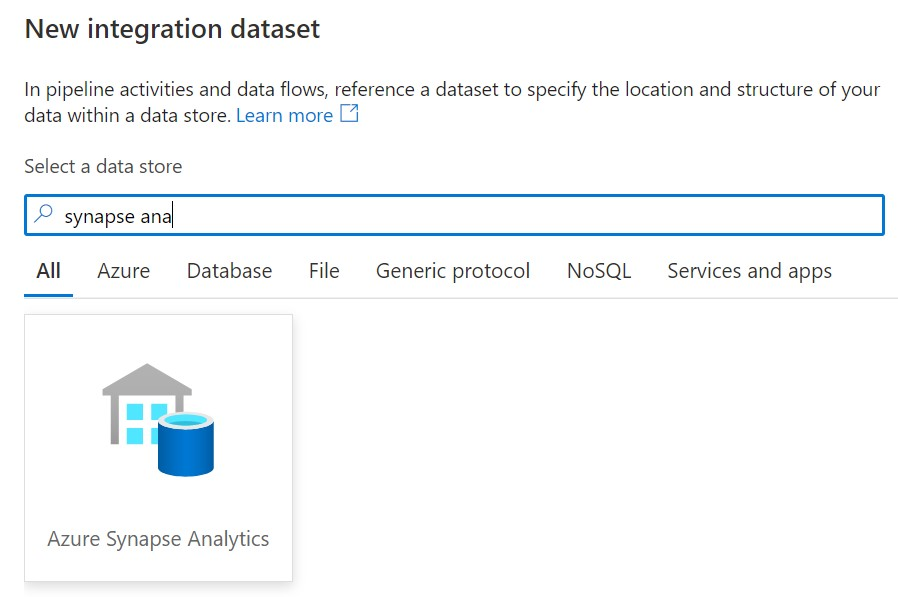

* As a name we used `SynSalesOrderHeaders` and for the linked service we used the one we just created `SynMicroHackPool`

* Select the `SalesOrderHeaders` table


* Again leave the information on the tab as-is and move to the next step

## Create an Integration pipeline
* Swith to the `Integrate` view


* Create a new `Pipeline`, we used `ExtractSalesOrderHeaders` as a name


* Use the `copy action` by dragging it onto the pipeline canvas

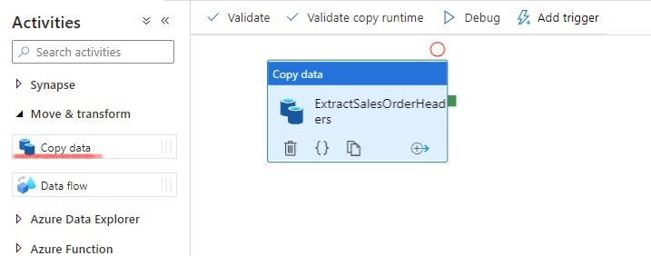

* In the `source` tab, select your SAP Sales Order Dataset as the source


* In the `sink` tab, select the Synapse Sales Order Dataset as the sink


>Note : Ensure to select `PolyBase`

* In the mapping tab, choose `Import schemas`. Since source and target fields have the same name, the system can auto-generate the mapping


* For the prediction model we will calculate the offset between the billing document date and the actual payment data. For this we need to have these date fields mapped to SQL Date fields. Therefore, go to the JSON Code for the pipeline and add `convertDateToDateTime` and `convertTimeToTimespan` parameters.

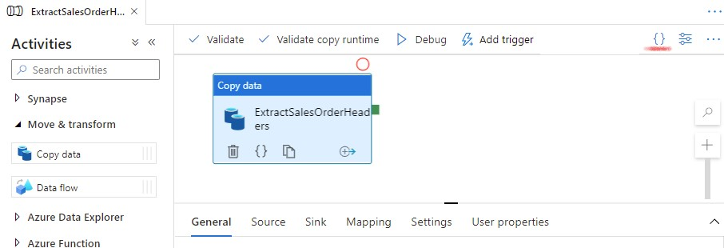

Add the parameters `convertDateToDatetime` and `convertTimeToTimespan` at the existing `typeproperties > source` element. The resulting document should looks as follows :
```javascript
  "typeProperties": {
                    "source": {
                        "type": "SapTableSource",
                        "partitionOption": "None",
                        "convertDateToDatetime": true,
                        "convertTimeToTimespan": true
                    },
                    "sink": { 
                        ...
```
<!-- >>Note : if these parameters are not entered correctly the date fields will remain as a String format. -->
<!-- Note : these are internal parameters!!! -->

* In the `Settings` blade, `enable staging` and use the existing Linked Service to the Synapse Data Lake.

* Enter the path to the staging directory of your Azure Data Lake. The staging directory `sap-data-adls/staging`, was already created by the Terraform script.

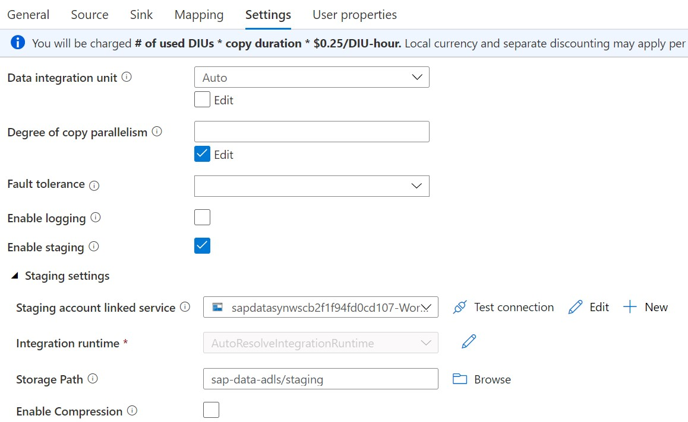

* Now `Publish all` and once this is successfull trigger the pipeline, use `Add trigger` -> `Trigger now` -> `OK`

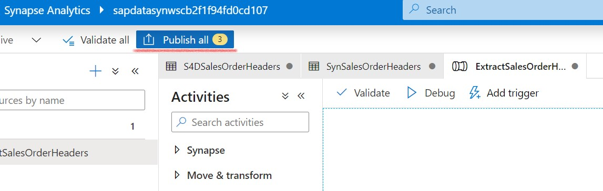


* Swith to the `Monitor`view to monitor the pipeline run


* Check the result in Synapse using SQL. You can do this via the `Develop` view and create a new SQL script.

```sql
select count(*) from SalesOrderHeaders
select * from SalesOrderHeaders
```

## Implement the SalesOrderItems Pipeline

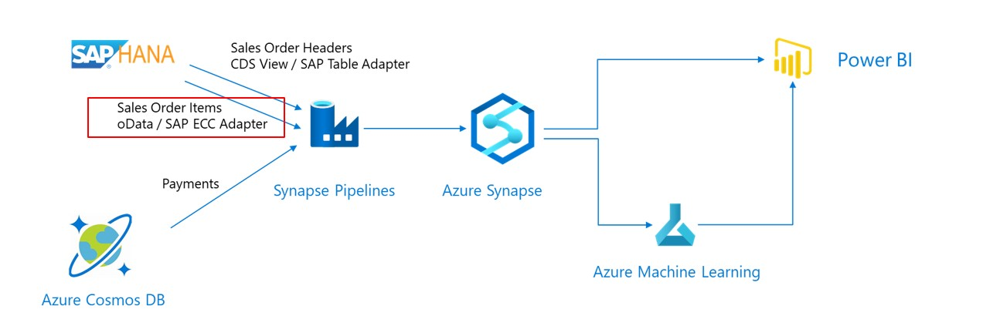

The SalesOrderItems are extracted from SAP using the SAP ECC Connector which is based on oData. We will use the oData service at `http://<System IP>/sap/opu/odata/sap/sd_f1814_so_fs_srv/`


### Create a Linked Service to the SAP oData Service
* Create a `Linked Service`of type `SAP ECC`

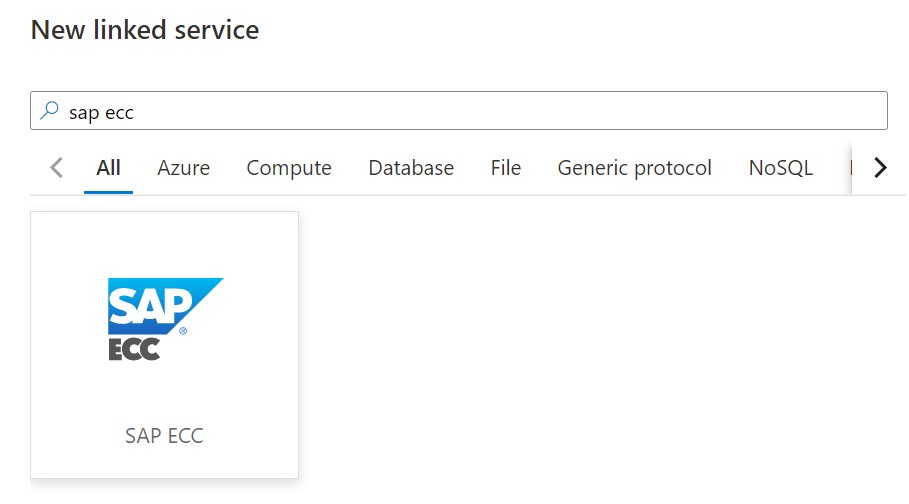

* Enter the connection details, we used `S4DCLNT100_ODATA` as the name


### Create a Integration DataSet for the SAP Sales Order Items
This dataset will act as the source for our pipeline.
* Create a `Integration DataSet` based on `SAP ECC` adapter

* Use the previously created linked service and as a name we used `S4DSalesOrderItems`

* Use `C_Salesorderitemfs`as path

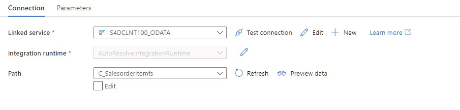

* Leave the information as-is and move to the next step


### Create a Integration DataSet for the Synapse Sales Order Items

This dataset will act as the sink for our pipeline.
* Create a `Integration DataSet` based on `Azure Synapse Analytics`, we use the linked service created earlier

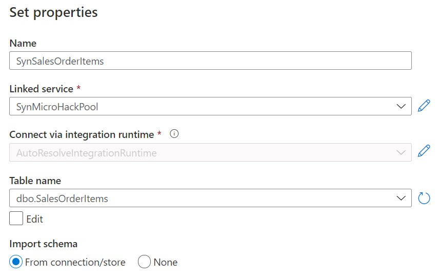

* As a name we use `SynSalesOrderItems` and select the `SalesOrderItems` table


### Create the integration pipeline

* Go to the `Integrate` view, and execute the same steps as for the SalesOrderHeaders data
* Create a new `Pipeline`
* Use the `Copy` action, as name we use `ExtractSalesOrderItems`

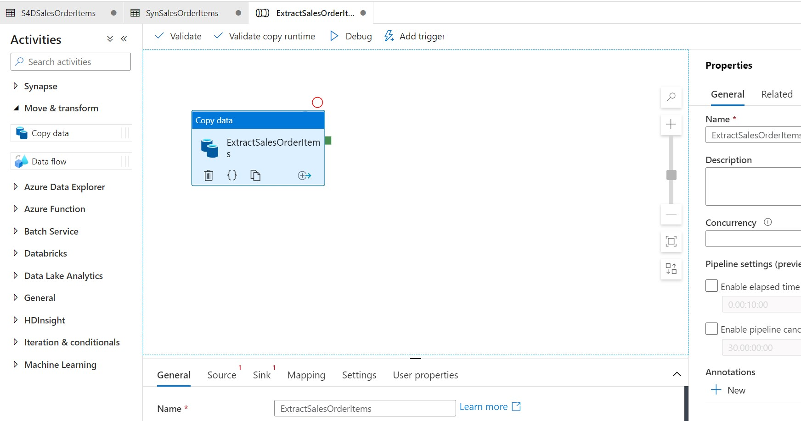

* As source select the SAP SalesOrderItem oData Dataset, which we named as `S4DSalesOrderItems`.
* As sink, select the Synapse SalesOrderItem DataSet. We named this as `SynSalesOrderItems`. Again, change the copy method to `PolyBase`.
* Under the `Mapping` tab use `Import schemas`
* Under the `Settings` tab enable and configure the `Staging Area` as done in the SalesOrderHeaders step
* Publish, Trigger and Monitor the integration pipeline
* Create a new SQL scrtipt to check the result in Synapse

```sql 
select count(*) from SalesOrderItems
select * from SalesOrderItems
```

## Implement the Payment Pipeline

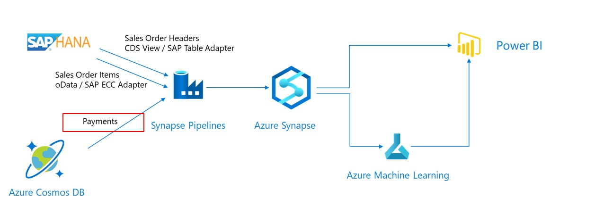

The Payments are extracted from CosmosDB and will be stored in a Synapse Table.

### Create Linked Service for CosmosDB
* Create a Linked Service of type CosmosDB (SQL API)

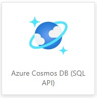

* Enter the connection parameters, as name we use `CosmosSAPS4D`

Azure Cosmos DB account URI : `<handed out at micro hack>`

Azure Cosmos DB access key : `<handed out at micro hack>`

Database name : `SAPS4D` 

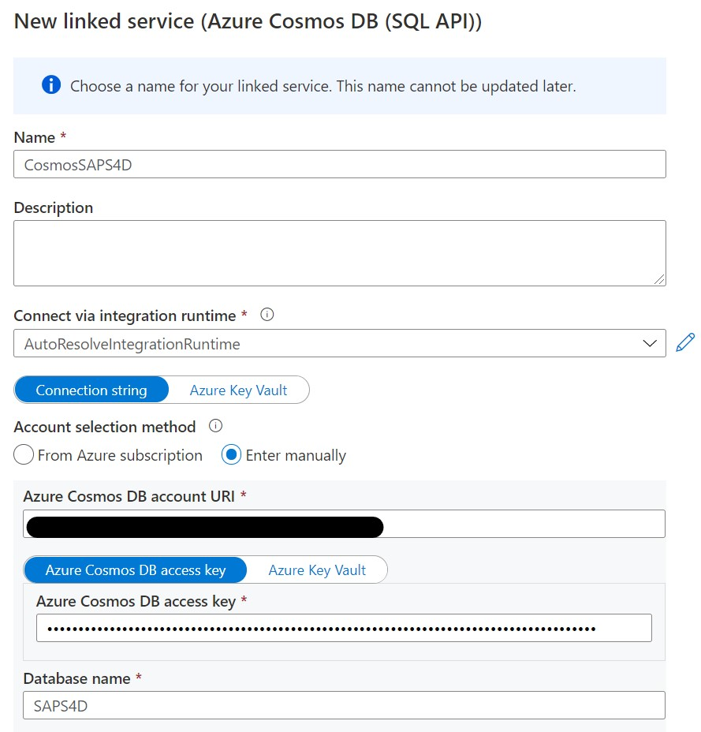

* Test the connection and create the linked service.


### Create a Integration DataSet for the CosmosDB Payments
This dataset will act as the source for our pipeline.
* Create a `source` DataSet for the Payment Data based on the CosmosDB `SQL API` Adapter

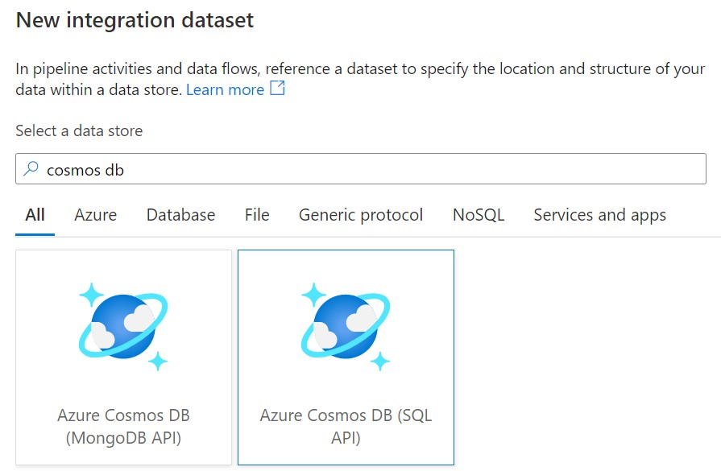

* As name we use `CosmosPaymentData`. Use collection : `paymentData`.

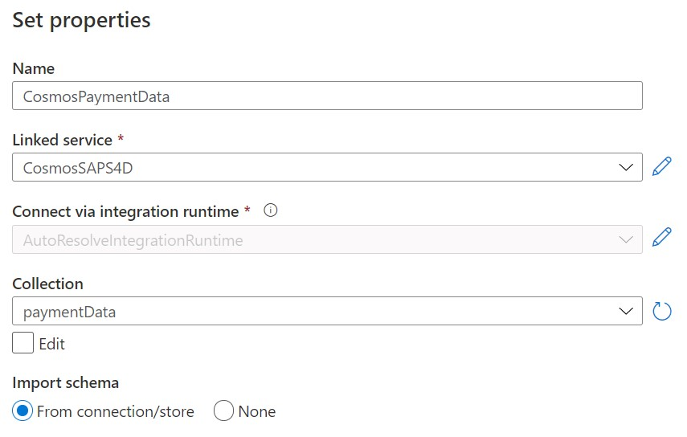


### Create a Integration DataSet for the Synapse Payments
This dataset will act as the sink for our pipeline
* Create a `Integration DataSet` based on `Azure Synapse Analytics`


* As name we use `SynPayments`. Select the `Payments` table

### Create the Integration pipeline for the Payment flow
* Go to the `Integrate` view
* Add a new `Pipeline`
* Use the `Copy` action and name it `ExtractPayments`
* As source select the Cosmos DB payment Dataset, we named this `CosmosPaymentData`.
* As sink, select the Synapse Payment DataSet. We named this `SynPayments`. As Copy method choose `PolyBase`.
* Under the `Settings` tab enable and configure the `Staging Area` as done in the earlier pipelines
* Go to the tab `Mapping` and choose `Import schemas`. Make sure to remove the mappings which are not shown in the screenshot starting with `_`, you can remove them my unchecking the checkbox behind them. Do not forget to change the `Column name` for `Value` to `PaymentValue`.

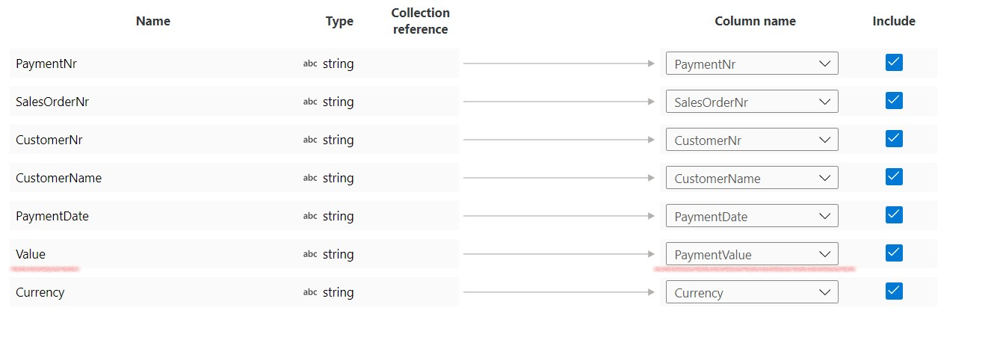

* Create, publish and trigger the integration pipeline
* Check the result in Synapse using SQL

```sql
select count(*) from Payments
select * from Payments
```

You can now proceed with the [next](PowerBiVisualisation.md) step.