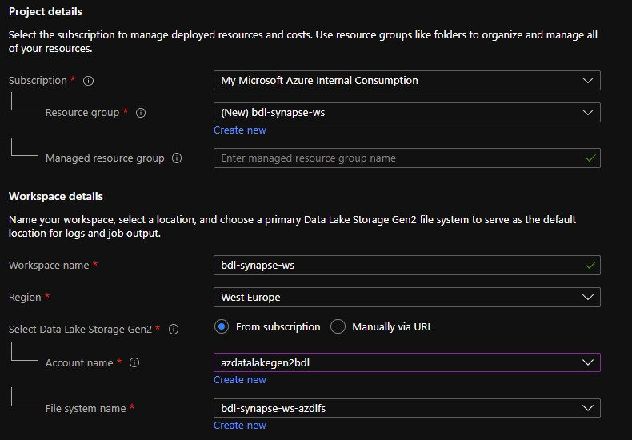
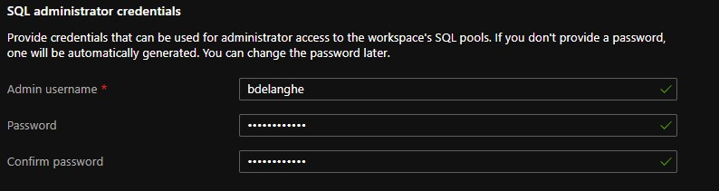
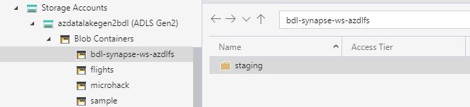

# Deploy Synapse Workspace

## Introduction
In this part we'll create the Synapse Workspace.

## Creation
* Create a Synapse Analytics Workspace

Enter the following settings :
### Basics :
* Resource Group
* Workspace Name
* Data Lake Storage : Select an existing Data Lake or create a new one
* File System Name : Select an exising File System or create a new one

### Security :
* Admin Username & Password : this will be there userId and password for the related SQL Pools.

Other settings can remain as default.

# After deployment :
* Create a `staging` directory within the Synapse Azure Data Lake container. This directory is used for storage of temporary files during data upload to Synapse.

* Create a new SQL Pool\
Choose `DW100c` as performance level (to save on costs).

Continue to the [Synapse configuration](SynapseWorkspace.md)