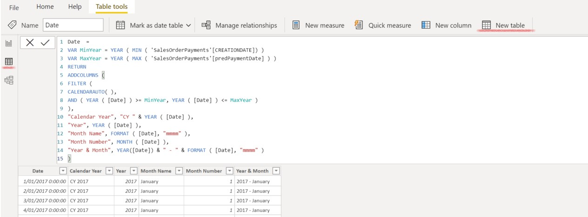
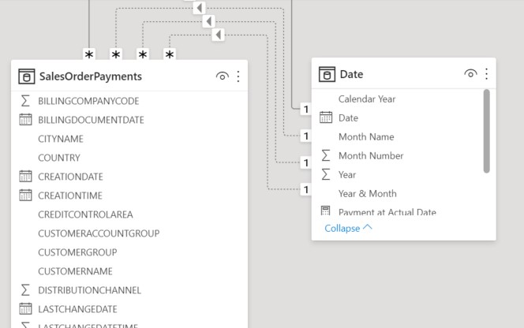

# Integrate Azure Machine Learning and PowerBI

We can now integrate the ML Model within PowerBI. The Azure ML exposes a REST interface which we can integrate in powerBi.
> Note : for this example we'll predict the payment date of the 'Historical Sales Orders'. In real-life you would do this for new unpaid Sales Orders

## Add Machine Learning info to the PowerBI Datamodel
In this section we'll add a new column to `SalesOrderPayments` which will contain the `Payment Off/Delay` calculated by our Machine Learning Model. 

* In PowerBI, select Transform Data
* Select the View `SalesOrderPayments` containing the combined SalesOrderHeader & Payments data
* Select `Azure Machine Learning` button

    

* Select your Azure Machine Learning Model
* Map the input fields of the Machine Learning Model to your column names

    

> Note : if you can't map the fields then you might need to change the data type of your columns. (Eg. `BILLINGCOMPANYCODE`, `DISTRIBUTIONCHANNEL`, `ORGANIZATIONDIVISION`, `SALESORGANIZATION`)

* This will add an additional column to the table with the predicted offset

* Rename the column to `predOffset` and change the date type to `Whole Number`

* You can now calculate the predicted payment date
    * Add a new column `predPaymentDate` and use the following formula

        ```
        Date.AddDays([BILLINGDOCUMENTDATE], [predOffset])
        ```

        

* Change the data type of this column to `Date`

* You can now use this column in reporting

## PowerBI Report Creation
We will now display the Sales & predicted payment forecast in PowerBI. Since we want to display the Sales and Payment figures aggregated by different days (`BILLINGDOCUMENTDATE`, `predPaymentDate`), we need to create a 'calendar' table with the timeslots by which to aggregate.

### Create Date Table
First we will create a new `Date` table. This table contains the timeline against which to plot the different Sales and Payment values.
In PowerBI switch to the `Data` View and select `New table`.



Use the formula beneath

```
Date= 
VAR MinYear = YEAR ( MIN ( 'SalesOrderPayments'[CREATIONDATE]) )
VAR MaxYear = YEAR ( MAX ( 'SalesOrderPayments'[predPaymentDate] ) )
RETURN
ADDCOLUMNS (
FILTER (
CALENDARAUTO( ),
AND ( YEAR ( [Date] ) >= MinYear, YEAR ( [Date] ) <= MaxYear )
),
"Calendar Year", "CY " & YEAR ( [Date] ),
"Year", YEAR ( [Date] ),
"Month Name", FORMAT ( [Date], "mmmm" ),
"Month Number", MONTH ( [Date] ),
"Year & Month", YEAR([Date]) & " - " & FORMAT ( [Date], "mmmm" )
)
```

### Create Relationships
Create relationships between the `Date` table and `SalesOrderPaymentsFull` table
* Date[Date] - SalesOrderPayments[CREATIONDATE] : this is the default (active) relationship
* Date[Date] - SalesOrderPayments[BILLINGDOCUMENTDATE]
* Date[Date] - SalesOrderPayments[Payments.PaymentDate]
* Date[Date] - SalesOrderPayments[predPaymentDate]

    

### Create new Measures
In the `Date` table, create new measures. 

```
Sales at CreationDate = sum('SalesOrderPayments'[TOTALNETAMOUNT])
Sales at BillingDate = CALCULATE(sum(SalesOrderPayments[TOTALNETAMOUNT]),USERELATIONSHIP('Date'[Date],SalesOrderPayments[BILLINGDOCUMENTDATE]))
Payment at Actual Date = CALCULATE(sum('SalesOrderPayments'[Payments.PaymentValue]), USERELATIONSHIP('Date'[Date],SalesOrderPayments[Payments.PaymentDate]))
Payment at pred Date = CALCULATE(sum('SalesOrderPayments'[Payments.PaymentValue]), USERELATIONSHIP('Date'[Date], SalesOrderPayments[predPaymentDate]))
```

### Create Sales and Payment Forecast report

* Select a `Clustered' Column Chart`
* Use the `Date.Date` hierarchy as X-axis
* Use `Date.Sales at Billing Date`as Y-axis
* Use `Date.Payment at pred Date` as Y-axis
* Use `Date.Payment at actual Date`as Y-axis if you want to compare prediction and actual

    

In this picture you can judge how well our 'forecasted' payment values are compared to the past actual payment values.

The Microhack is now finished, congratulations! You can continue to the [next](CleanEnvironment.md) step to clean up the environment.
