# Predict Incoming Cashflow
In this section we'll create a model to predict incoming cashflow based on historical payment delays for previous sales.

We'll be using [Azure Machine Learning](https://ml.azure.com) for this.

## Setup in Synapse
In Synapse Studio, we will create a view joining data coming from `SalesOrderHeaders` and `Payments` tables that will be used for the prediction. 
You can create this view either via Synapse Studio or via Azure Data Studio.

* Choose the `Develop` tab, select `SQL Scripts` and click on `Actions` then `New SQL Script`
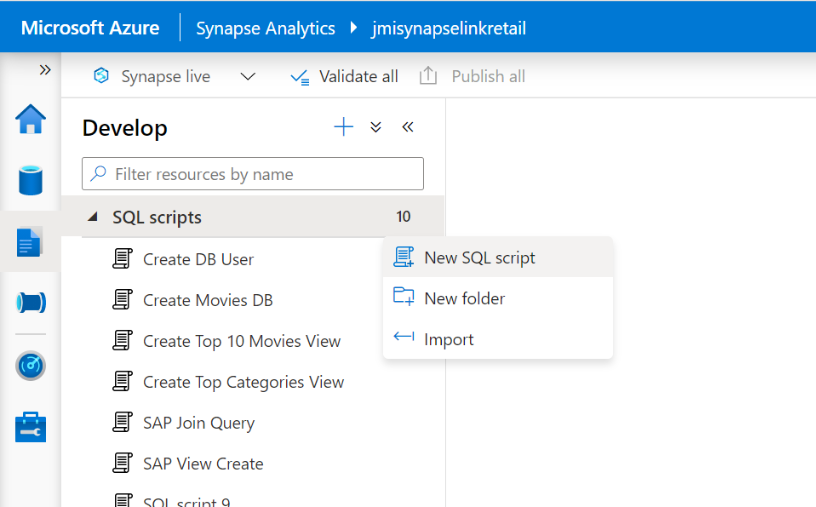

> Note : Ensure to connect to your SQL Pool

* In the newly created script tab, copy paste the following SQL Query that will execute a join between `SalesOrderHeaders` and `Payments` to create a new view.

```sql
CREATE VIEW [dbo].[SalesPaymentsFull]
	AS SELECT s.[SALESDOCUMENT]
    , s.[CUSTOMERNAME]
    , s.[CUSTOMERGROUP]
    , s.[BILLINGCOMPANYCODE]
    , s.[BILLINGDOCUMENTDATE]
    , p.[PaymentDate] as PAYMENTDATE
    , s.[CUSTOMERACCOUNTGROUP]
    , s.[CREDITCONTROLAREA]
    , s.[DISTRIBUTIONCHANNEL]
    , s.[ORGANIZATIONDIVISION]
    , s.[SALESDISTRICT]
    , s.[SALESGROUP]
    , s.[SALESOFFICE]
    , s.[SALESORGANIZATION]
    , s.[SDDOCUMENTCATEGORY]
    , s.[CITYNAME]
    , s.[POSTALCODE]
    , DATEDIFF(dayofyear, s.BILLINGDOCUMENTDATE, p.PaymentDate) as PAYMENTDELAYINDAYS
 FROM [dbo].[SalesOrderHeaders] as s
JOIN [dbo].[Payments] as p ON REPLACE(LTRIM(REPLACE(s.[SALESDOCUMENT], '0', ' ')), ' ', '0') = p.[SalesOrderNr]
```

After `Refresh`the view will appear under `Views` when using Azure Data Studio.


You can now test the view by executing the SQL:

```sql
select * from SalesPaymentsFull
```


## Azure Machine Learning

The Azure Machine Learning Workspace is automatically deployed with the Terraform script from the first steps. If you didn't use the Terraform option you will first have to create an Azure Machine Learning Workspace via [these](DeployAzureMLWorkspace.md) instructions.

For more info on Azure ML, pleae have a look at [What is automated machine learning (AutoML)](https://docs.microsoft.com/en-us/azure/machine-learning/concept-automated-ml).

### Open the ML Studio
By default the name for the ML Workspace is `sap-data-ml-ws`. Go to this workspace via your resource group or using the search bar. You can now open the ML Studio via `Launch studio` from here or alternatively sign in via https://ml.azure.com.

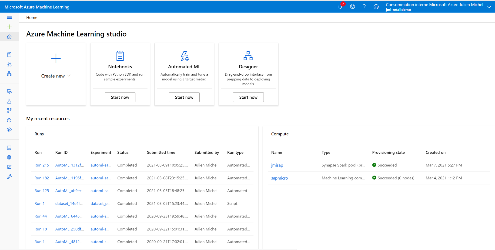

### DataStore Creation
First you have to point the ML studio to the location of your data, which is the Synapse SQL Pool. For this you have to create a `DataStore`.

Go to the `Datastores` view and choose `New datastore`. As name we use `sap_data_ml_ds`. Connect to the Synapse database.

* Datastore name : `sap_data_ml_ds`
* Use Data store type : `Azure SQL Database`
* Use Account Selection method : `Enter Manually`
* Use your Synapse Workspace name as `Server Name`
* Use your Synapse SQL Pool as Database Name, in our case this is `sapdatasynsql`
* Select your Subscription
* Enter your resource group name, in our case this is `microhack-sap-data-rg`
* Authentication Type : `SQL Authentication`
* Enter UserId and Password


### Automated ML
We'll be using `Automated Machine Learning` to predict when customers will pay for their Sales Orders

* On the left menu, click on `Automated ML`


* Select `New Automated ML Run`
* Select `Create Dataset` > `From datastore`


A Guided Procedure will appear :
* <b>Basic info : </b> Provide a Name for the `Dataset`. We use `SalesPaymentsView`. `Next`.


* <b>DataStore Selection : </b> Select your datastore.


* Use the following SQL query to get all the data from the view defined above.
```sql
select * from SalesPaymentsFull
```

* <b>Settings and Preview :</b> To Ensure that your query is working fine you are able to visualize the data in the next window.
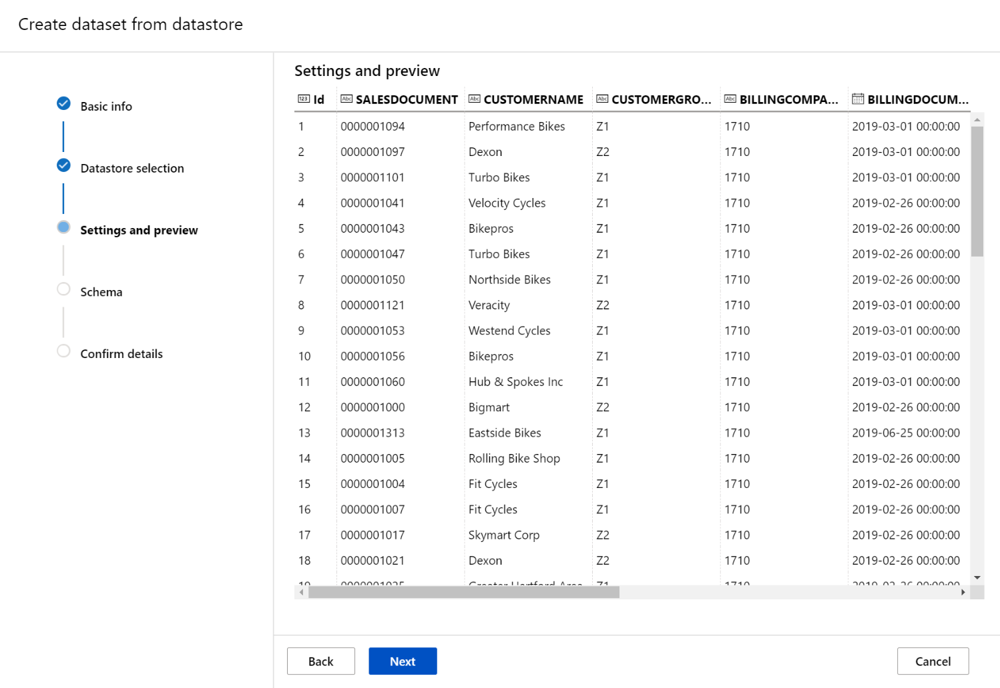

* <b>Schema :</b> In order to get a model we have to do some cleaning of the data.
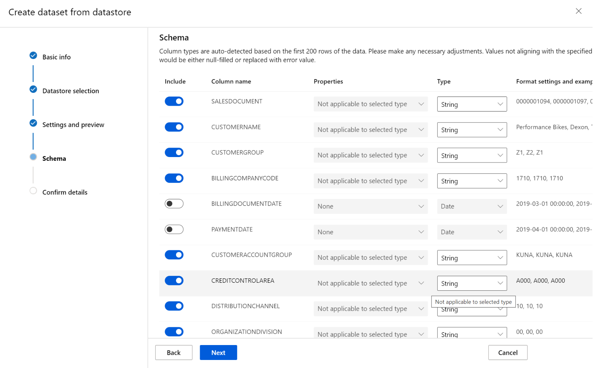

<!-- 1. Check if an Integer type is used for any numeric field () -->

1. Uncheck the date fields (`BILLINGDOCUMENTDATE`, `PAYMENTDATE`) (We will not use these in our the model.)
<!--  -->

2. Uncheck the fields that do not contain any data or which are not relevant for the forecast. Eg. `SALESDOCUMENT`, `SALESGROUP`, `SALESOFFICE` 
<!-- 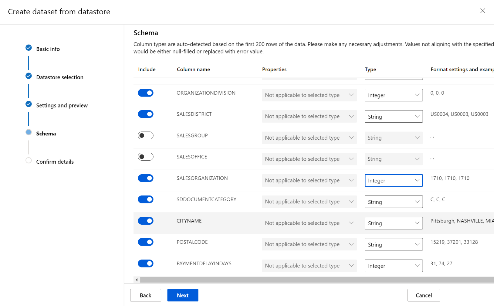 -->

* <b>Confirm details</b>
Create the dataset


## Configure the Automated ML Run
* Select the newly created `Dataset` and create a new experiment.


1. Specify a name, we use `sap-data-ml-experiment`
2. Select the `Target Column` : in our case we will use `PAYMENTDELAYINDAYS` to predict the forecast.

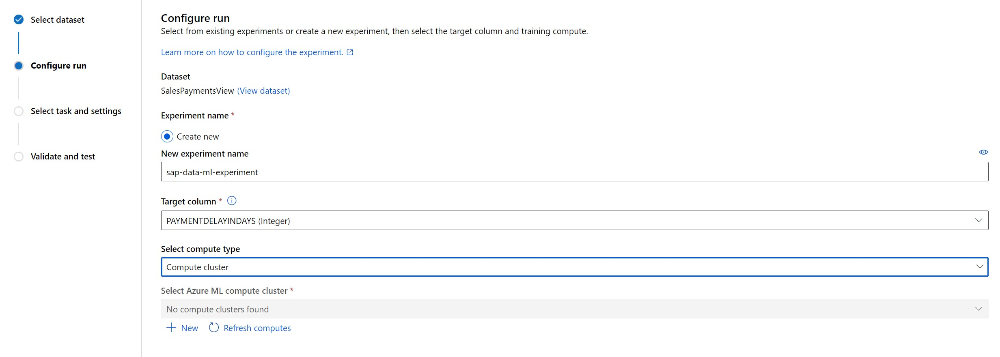

3. Create a new compute that will be used to train your model. As name we use `sap-data-ml-vm`. In this example we use a maximum of 3 nodes to increase the processing power.

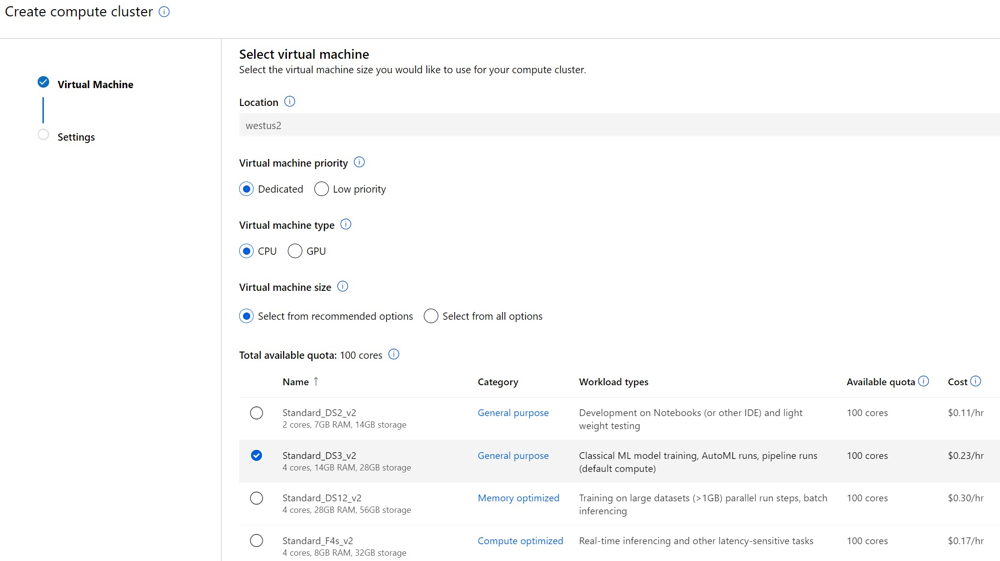

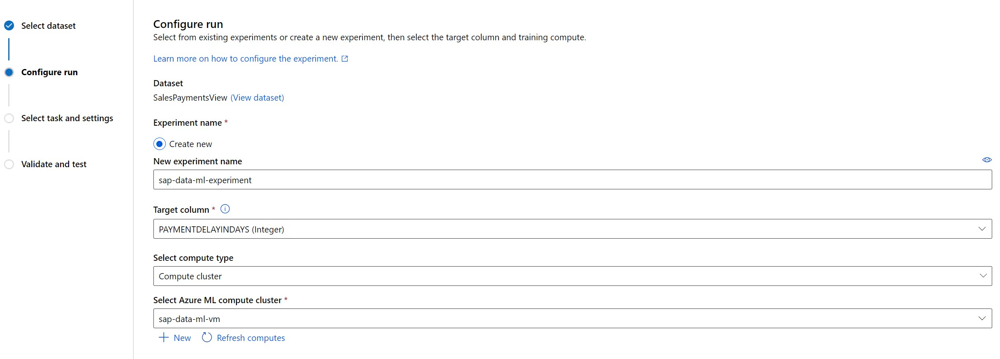

> Note : Create a cluster of for example 3 nodes. Azure ML can then run multiple trainings in parallel. This will reduce the runtime of the Automated ML run.

* We can now select the ML task type we want to use for this experiment, as we want to build prediction on a numeric value we will select the `Regression` task type. 


* Then we need to configure the `Regression` using `Additional Configuration settings`.
    1. Select `Normalized root mean squared error` as Primary metric.
    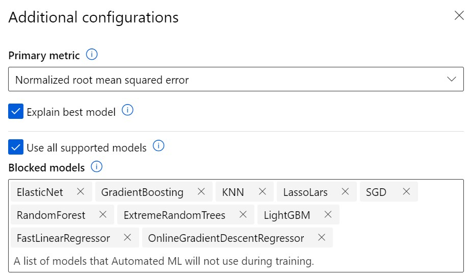

    2. In order to reduce the runtime of our 'Automated ML Run', we'll deselect some algorithms : `ElasticNet, GradientBoosting, KNN, LassoLars, SGD, RandomForest, ExtremeRandomTrees, LightGBM, FastLinearRegressor, OnlineGradientDescentRegressor`
    > Note : If you have time you can include these algorithms.
    <!-- >>>Note : You need to add `TensorFlowLinearRegressor`, `TensorFlowDNN` manually -->
    <!-- keep decisiontree? -->

    3. `Save`, `Next`, skip the optional steps and click on `Finish`

    
    

    4. During the run you can follow-up on the tested models via the `Models` tab

    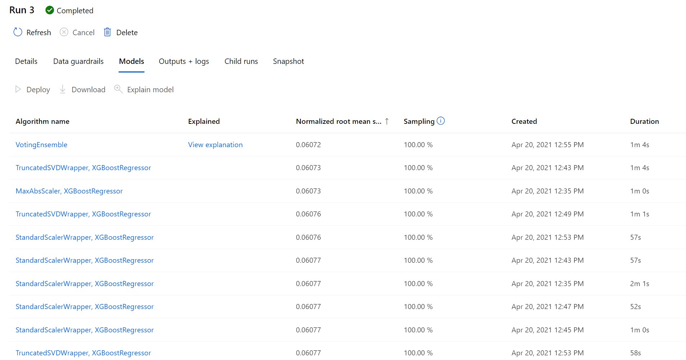


## Deploy the best model
In this step we will deploy the best model that has been trained by AutoML and test it.
>Note : the best model is selected based on the error between the predicted Payment Offset and the Actual offset. The model with the least error is selected. For more info on this, see [How automated ML works](https://docs.microsoft.com/en-us/azure/machine-learning/concept-automated-ml#how-automated-ml-works)

* When the training is over, you can see the `Best model summary` section filled with the best algorithm, click on it.


* You can navigate into the different sections and visualize the information about this algorithm, then click on deploy.


* Specify a name for your deployment, we used `sap-data-ml-model`, and select `Azure Container Instance` as compute type.

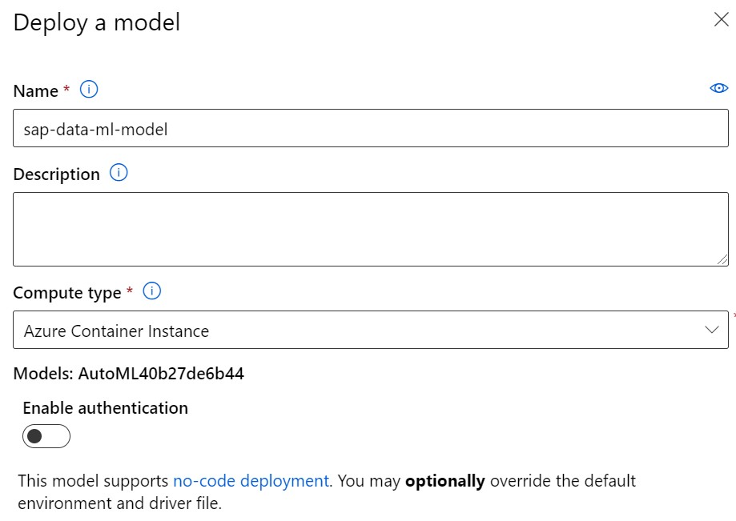

>Note: Select `Deploy to WebService`


* Validate and wait for the completion of the deployment. This can take a few minutes.


* When completed, click on the link to the `Deploy status` of the deployed model.


* In this page, you will have access to information on your endpoint. It provides code samples to consume it from Python or C# but also a page to directly test your model.


>Note: for a sample Python program, have a look at [testForecast.py](scripts/testForecast.py)

* The Azure ML can also be called as a REST Interface. You could use this REST Interace in a custom Fiori App or ABAP code to execute a `Payment Prediction` when creating a Sales Order.

## Test the Payment Delay/Offset Prediction
Select the `Test` tab and insert values coming from the `SalesPaymentsFull` view created at the beginning to replace the `example_value` value for the different fields and run the model.


> Note : Experiment with CustomerGroup `Z1` and `Z2` and note the Payment Delay/Offset. You can also compare with the actual value in powerBI or in Synapse.

You can now proceed with the [next](IntegrateMLPowerBI.md) step.

## [Optional] Test the ML Endpoint via HTTP
You can also test the ML model via http. You can find the URL to use via the ML `endpoint` menu.


Select your ML Model


>Note : you can have a look at the API definition using the Swagger UI

You can test the ML model via a HTTP post request on the Endpoint URI. Below you can find a sample request.

<b>HTTP Header</b>
```
Content-Type : application/json
```
<b>HTTP Body</b>
```
{"data": [ 
    { 
    "CUSTOMERNAME": "Westend Cycles",
    "CUSTOMERGROUP": "Z1",
    "BILLINGCOMPANYCODE": 1710,
    "CUSTOMERACCOUNTGROUP": "KUNA",
    "CREDITCONTROLAREA": "A000",
    "DISTRIBUTIONCHANNEL": 10,
    "ORGANIZATIONDIVISION": 0,
    "SALESDISTRICT": "US0003",
    "SALESORGANIZATION": 1710,
    "SDDOCUMENTCATEGORY": "C",
    "CITYNAME": "RALEIGH",
    "POSTALCODE": "27603"
    },
    { 
    "CUSTOMERNAME": "Skymart Corp",
    "CUSTOMERGROUP": "Z2",
    "BILLINGCOMPANYCODE": 1710,
    "CUSTOMERACCOUNTGROUP": "KUNA",
    "CREDITCONTROLAREA": "A000",
    "DISTRIBUTIONCHANNEL": 10,
    "ORGANIZATIONDIVISION": 0,
    "SALESDISTRICT": "US0004",
    "SALESORGANIZATION": 1710,
    "SDDOCUMENTCATEGORY": "C",
    "CITYNAME": "New York",
    "POSTALCODE": "10007"
    }
]}
```

The HTTP response will looks as follows :
```
"{ "result": [30.966167923963926, 70.18799357457902]}"
```

>Note : if you're using `Postman`, you can find a sample test at [Postman Sample Test](scripts/MicroHack.postman_collection.json)

You can now proceed with the [next](IntegrateMLPowerBI.md) step.

## [Optional] Automated ML - Best Model - Additional Info
If you're interested in the 'Best Model' Auto ML selected, return to your 'Automated ML Run'.

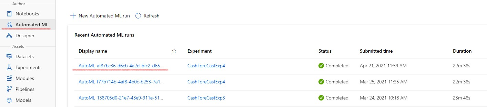

Under Model Summary you can see the Algorithm which was selected as best and the corresponding error.

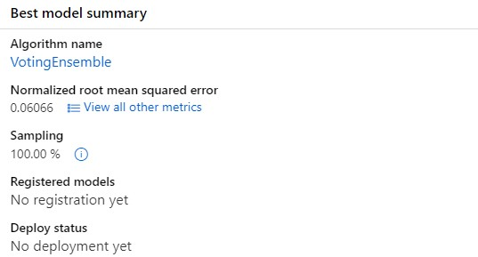

Under Models, you can see all the algorithms which were evaluated during the Auto ML run.

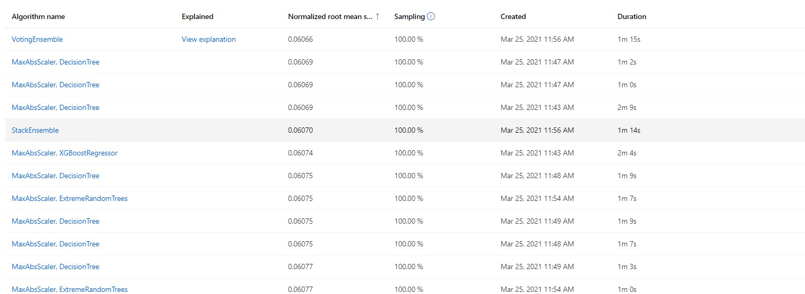

Select your Best Model, and select `View Explanation`. Select an `Explanation ID` and `Aggregate Feature Importance`.

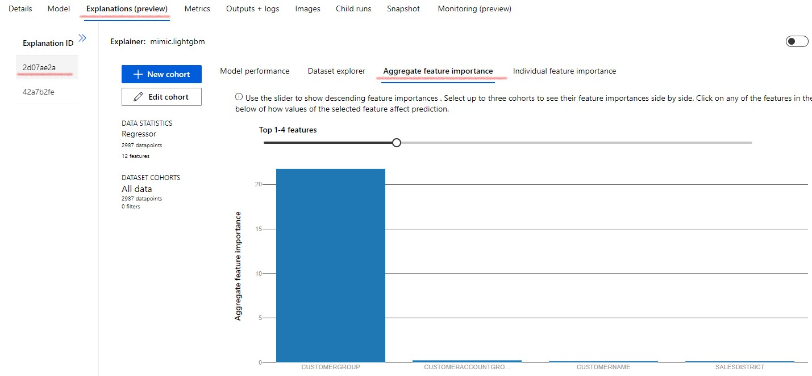

From this view, you can see that `CUSTOMERGROUP` was the most important feature to determine the offset.