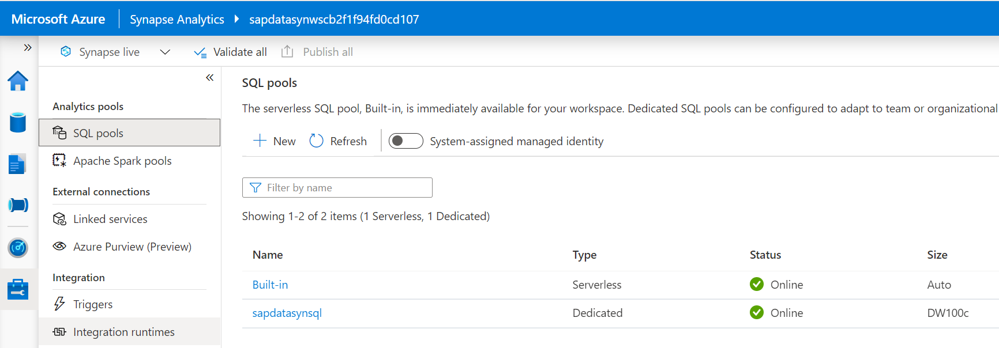
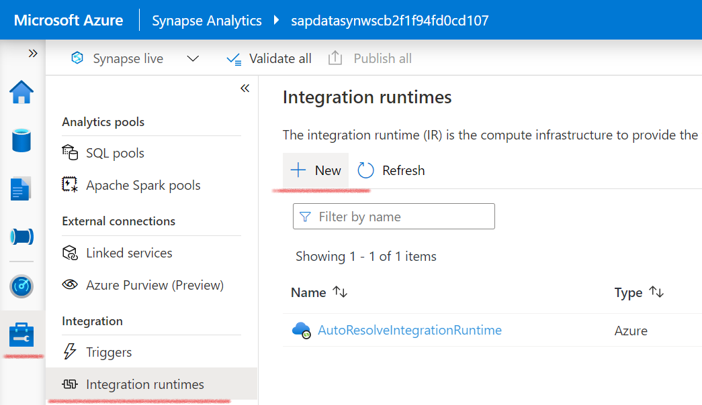
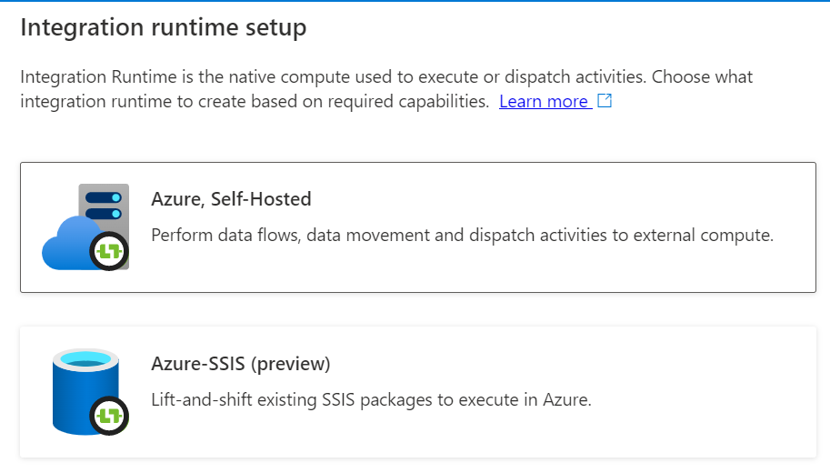
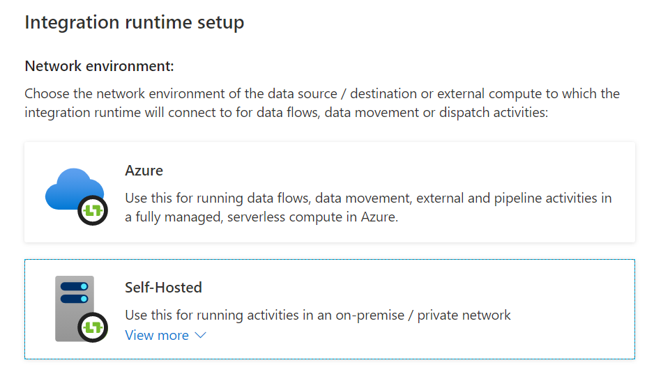
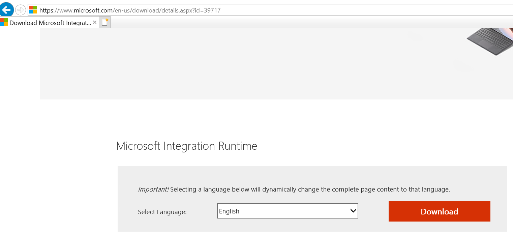
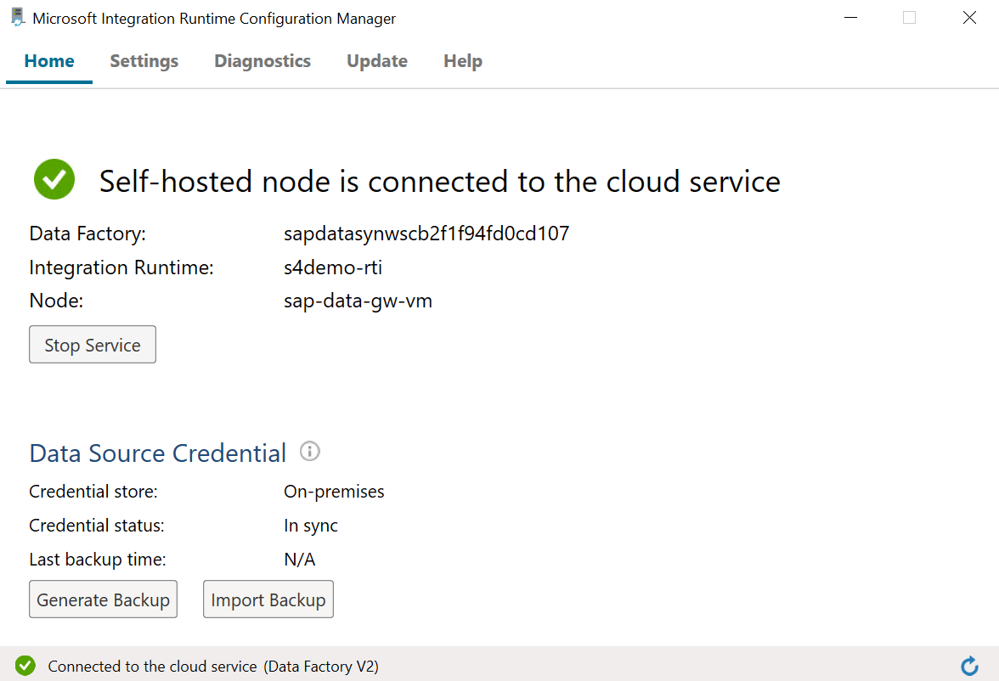

# Configure Synapse Workspace

## Introduction
In this part we'll configure the Synapse Workspace and install the Ingration Runtime on our Azure Virtual Machine. If you didn't install the Synapse workspace with the Terraform script (included by default) earlier you can deploy the Synapse Workspace following [these](DeploySynapseWorkspace.md) steps.

# Synapse Configuration
## Register Integration Runtime
The rest of the configuration is done via `Synapse Studio` which is shown on the `Overview` page:\

To register the integration runtime click on manage:

* Click on `Integration runtimes`:

* Click on `+ New`:

* Choose `Azure, Self-Hosted`:

* Choose `Self-Hosted`:

* Choose a name for the runtime installation:

* You will receive two key values. Make sure to note these down, in the next step you need one of these keys

* In `Option 2: Manual setup` you can download the integration runtime via `Step 1`. Click on the link and copy the URL from the URL bar. Paste this URL in `Microsoft Edge` on your Gateway VM.

Choose `Download`

Select the latest version available:

Choose `Next`. The download will start.

* Execute the MSI package and press `Next`, `Install` and `Finish`, after that you get the question for the `authentication key`:

* Enter one of the keys you noted down earlier from the integration runtime setup and choose `Register`.

* Enter the name of the integration runtime node configured earlier, this is already completed by default

* Choose `Finish`, this can take a few minutes.

The installation is done and the node is connected and can be used.
You can now proceed with the [next](DataFlowConfig.md) step.
