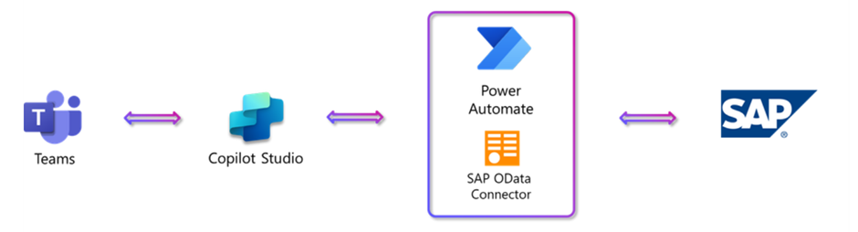

# **MicroHack SAP & Teams Integration with Copilot Studio and Generative AI**

## **MicroHack Introduction**
This Microhack scenario walks through the use of AI to optimize SAP workflows within Microsoft Teams. This solution is particularly advantageous for mobile users or those with limited SAP experience, enabling them to efficiently manage even complex, repetitive SAP tasks.

**Example: Product Specification Updates**
* **Scenario:** Product Managers at Contoso need to review and update product information in their SAP system on a regular basis.
* **Solution:** With the SAP and Teams integration provided by Copilot Studio, the product manager at Contoso can easily get the current product information from SAP and update specifications conveniently in an adaptive card.  

By integrating SAP with Microsoft Teams using Copilot Studio and Generative AI, you can significantly enhance productivity and streamline workflows. This blog will take you through the entire process of setting up a Copilot to interact with SAP data in Teams. We'll utilize the Power Platform and SAP OData Connector to achieve this integration. By following along you will create and configure a Copilot, test and deploy it within Teams, enable Generative AI, build automation flows, and create adaptive cards for dynamic data representation and even change data in SAP. 

You can check the [Blog Post](https://techcommunity.microsoft.com/gxcuf89792/attachments/gxcuf89792/SAPApplications/1042/5/sap_product_adaptive_card_with_action.docx) for further details.

## **MicroHack Context**
The solution consists of three main components: Copilot Studio, Power Automate Flow and SAP OData Connector.
* Copilot Studio: is a web-based tool that allows you to create and manage conversational AI agents, called Copilots, that can interact with users through Microsoft Teams.
* Power Automate Flow: is a tool that allows you to automate workflows between your applications.
* SAP OData Connector: is a custom connector that enables you to connect to SAP systems using the OData protocol.
The following diagram illustrates how these components work together to provide a seamless SAP and Teams integration experience.

Further resources:
[sap_product_adaptive_card_draft.docx](https://techcommunity.microsoft.com/gxcuf89792/attachments/gxcuf89792/SAPApplications/1042/1/sap_product_adaptive_card_draft.docx) 
[sap_product_adaptive_card.docx](https://techcommunity.microsoft.com/gxcuf89792/attachments/gxcuf89792/SAPApplications/1042/2/sap_product_adaptive_card.docx)
[sap_product_adaptive_card_with_action.docx](https://techcommunity.microsoft.com/gxcuf89792/attachments/gxcuf89792/SAPApplications/1042/5/sap_product_adaptive_card_with_action.docx)
[sap_product_adaptive_card.zip](https://techcommunity.microsoft.com/gxcuf89792/attachments/gxcuf89792/SAPApplications/1042/6/sap_product_adaptive_card.zip)

## **Objectives:**
After completing this MicroHack you will:
* Know how to build a custom Copilot.
* Understand the differences between actions and topics of Copilot.
* Know to connect Copilot with SAP OData system.
* Leverage Power Automate Flow and the SAP OData Connector to build a robust automated workflow. 
* Able to have a Copilot within Microsoft Teams.
* Able to access and update data in the SAP system from Microsoft Teams.

## **Challenges:**

### **Challenge 1 - Prerequisites and landing zone preparation**
#### Goal
* To ensure you have access to the Power Platform and to an SAP system.

#### Actions
You can leverage the licenses and SAP systems that are available in your company, or alternatively you can use a trial license for the Power Platform and a public SAP demo system.

#### Success criteria
* You have successfully accessed both the Power Platform and to an SAP system

#### Learning resources
* [What is Power Platform?](https://learn.microsoft.com/en-us/power-platform/)
* [Creating SAP Gateway Demo System](https://developers.sap.com/tutorials/gateway-demo-signup.html)

#### Solution
* Power Platform Access: [Power Platform Access Trial license](https://learn.microsoft.com/en-us/power-apps/maker/signup-for-powerapps)
* SAP System Access: [Request SAP Gateway Demo System ES5 Login](https://developers.sap.com/tutorials/gateway-demo-signup.html) 

### **Challenge 2 – Create a Copilot**
#### Goal
* To have a custom Copilot connected to SAP system and is accessible within the Microsoft Teams.

#### Actions
* Create a Copilot
* Setup Flow + Connector
* Test the flow
* Connect the Copilot with the Flow.
* Test the Copilot in the test pane
* Add the Copilot to Teams

#### Success criteria
* A working Copilot is created that can interact with your SAP system and performing actions as instructed.
* The Copilot is available in Teams, and users can interact with it directly within a Teams channel.

#### Learning resources
[How to Build a Custom Copilot](https://learn.microsoft.com/en-us/power-virtual-agents/)
[Power Virtual Agents Integration with Teams](https://learn.microsoft.com/en-us/microsoftteams/platform/bots/how-to/add-power-virtual-agents-bot-to-teams)

#### Solution
[Solution Steps](https://techcommunity.microsoft.com/t5/running-sap-applications-on-the/sap-amp-teams-integration-with-copilot-studio-and-generative-ai/ba-p/4213260)  – Step 3

### **Challenge 3 – Use Adaptive Cards to present SAP information**
#### Goal
* Design and implement adaptive cards that display dynamic content.

#### Actions
* Create a Topic “SAP Product Data”
* Create a Flow to get SAP product details
* Call the Flow from the Topic
* Add error handling when no data is found
* “Parse value” the Flow Output
* Adaptive Card with SAP Data

#### Success criteria
* Adaptive cards are integrated with the Copilot in Teams, and users can interact with them to update or view SAP data.

#### Learning resources
[Designing Adaptive Cards in Teams](https://learn.microsoft.com/en-us/microsoftteams/platform/task-modules-and-cards/cards/design-effective-cards?tabs=design)

#### Solution
[Solution Steps](https://techcommunity.microsoft.com/t5/running-sap-applications-on-the/sap-amp-teams-integration-with-copilot-studio-and-generative-ai/ba-p/4213260) – Step 4

### **Challenge 4 – Change Data within SAP**
#### Goal
* To modify data within SAP based on user input from Teams.

#### Actions
* Add “Ask with adaptive card” Node
* Create “Update SAP Product Details” Flow
* Update the Copilot Topic to call the update flow

#### Success criteria
* The Copilot can successfully update specific SAP data fields as directed by users through Teams.

#### Learning resources
[SAP on Power Platform](https://learn.microsoft.com/en-us/power-platform/sap/overview)

#### Solution
[Solution Steps](https://techcommunity.microsoft.com/t5/running-sap-applications-on-the/sap-amp-teams-integration-with-copilot-studio-and-generative-ai/ba-p/4213260) – Step 5

## **Finish**
Congratulations! You finished the MicroHack for SAP & Teams Integration with Copilot Studio and Generative AI. We hope you had the chance to learn about the how to implement a successful SAP&Teams Integration using Copilot Studio. If you want to give feedback please don’t hesitate to open an Issue on the repository or get in touch with one of us directly.
Thank you for investing the time and see you next time!

## **Contributors**
Michael Mergell [Github](https://github.com/mimergel) [Linkedin](https://de.linkedin.com/in/michaelmergell)
Maral Demirsecen [Github](https://github.com/marald44/) [Linkedin](https://de.linkedin.com/in/maral-demirsecen)

