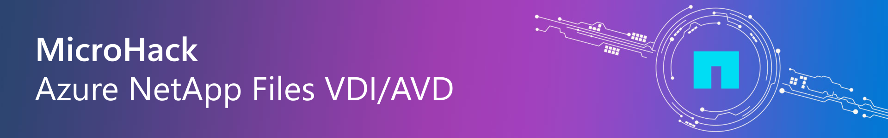
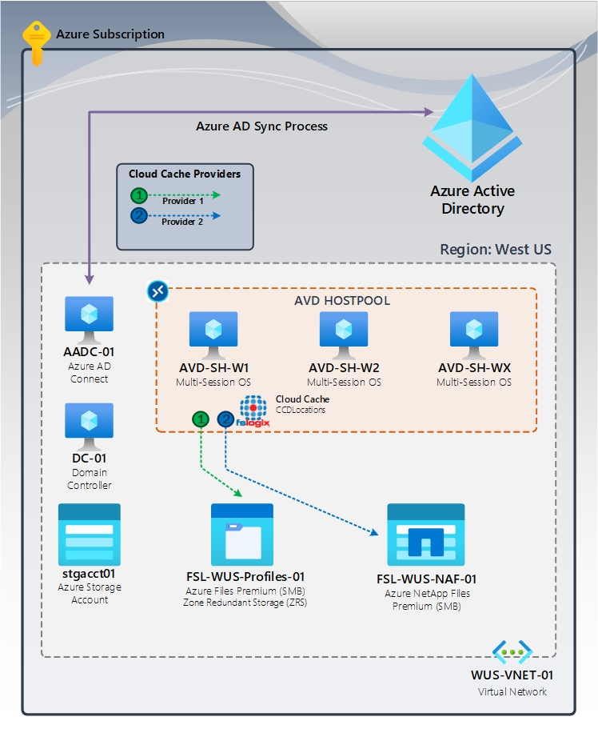

# Azure NetApp Files Microhack VDI/AVD 

- [**MicroHack introduction**](#MicroHack-introduction)
- [**MicroHack context**](#microhack-context)
- [**Objectives**](#objectives)
- [**MicroHack Challenges**](#microhack-challenges)
- [**Contributors**](#contributors)

# MicroHack introduction

This MicroHack scenario walks through the use of FSLogix with Azure NetApp Files in AVD environments.

focus on the best practices and the design principles. Specifically, this builds up to include working with an existing infrastructure.

This lab is not a full explanation of .... as a technology, please consider the following articles required pre-reading to build foundational knowledge.

Optional (read this after completing this lab to take your learning even deeper!)

Describe the scenario here...

# MicroHack context
This MicroHack scenario walks through the use of Azure NetApp Files with Azure Virtual Desktop.

# Objectives

Provide an overview of Azure NetApp Files, including its purpose, benefits, and key features.

After completing this MicroHack you will:

- Know how to build a Azure NetApp Files Enviroment
- Understand how to implement FsLogiX to redirect Profiles and App Containers ..
- Understand how to...

# MicroHack challenges

## General prerequisites

This MicroHack has a few but important prerequisites

In order to use the MicroHack time most effectively, the following tasks should be completed prior to starting the session.

With these pre-requisites in place, we can focus on building the differentiated knowledge in ... that is required when working with the product, rather than spending hours repeating relatively simple tasks such as setting up....

In summary:

- Azure Subscription 
- Resource Group 
- Service 1
- Service 2  

Permissions for the deployment: 
- Contributor on your Resource Group
- Other necessary permissions

## Challenges
* [Challenge 1 - Introduction to Azure NetApp Files](challenges/challenge-01.md)
* [Challenge 2 - Setup Network Configuration](challenges/challenge-02.md)
* [Challenge 3 - Setting Up Azure NetApp Files](challenges/challenge-03.md)
* [Challenge 4 - Azure NetApp Files for VDI/AVD Use-Case](challenges/challenge-04.md)
* [Challenge 5 - Managing and Monitoring Azure NetApp Files](challenges/challenge-05.md)
* [Challenge 6 - Azure NetApp Files Backup](challenges/challenge-06.md)
* [Challenge 7 - Best Practices and Use Cases](challenges/challenge-07.md) 

## Solutions - Spoilerwarning

* [Solution 1 - Get to know and Register](./walkthrough/challenge-01/solution-01.md)
* [Solution 2 - Setup Network Configuration](./walkthrough/challenge-02/solution-02.md)
* [Solution 3 - Setting Up Azure NetApp Files](./walkthrough/challenge-02/solution-03.md)
* [Solution 4 - Setting Up Azure NetApp Files for VDI/AVD](./walkthrough/challenge-02/solution-04.md)
* [Solution 5 - Managing and Monitoring Azure NetApp Files](./walkthrough/challenge-02/solution-05.md)
* [Solution 6 - Setting Up Azure NetApp Files Backup](./walkthrough/challenge-02/solution-06.md)
* [Solution 7 - Best Practices and Use Cases](./walkthrough/challenge-02/solution-07.md)

## Contributors

* Sascha Petrovski [GitHub](https://github.com/saschape/) [LinkedIn](https://www.linkedin.com/in/sascha-petrovski/)
* Tristan Daude [LinkedIn](https://www.linkedin.com/in/tristandaude/)
