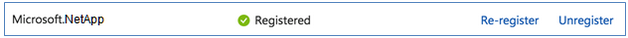

# Walkthrough Challenge 1 - Register Azure NetApp Files

**[Home](../../Readme.md)** - [Next Challenge Solution](../challenge-02/solution-02.md)

Duration: 10 minutes

## Prerequisites

The following procedure creates a virtual network with a resource subnet, and a delegated ANF subnet.
Please ensure that you successfully verified the [General prerequisits](../../Readme.md#general-prerequisites) before continuing with this challenge.

### **Task 1: Documentation, Links, Content...**

* [What's New](https://learn.microsoft.com/en-us/azure/azure-netapp-files/whats-new)
* [Azure NetApp Files Essentials](https://learn.microsoft.com/en-us/azure/azure-netapp-files/azure-netapp-files-understand-storage-hierarchy)
* [Solution and Architectures](https://learn.microsoft.com/en-us/azure/azure-netapp-files/azure-netapp-files-solution-architectures)
* [ANF Tools](https://azure.github.io/azure-netapp-files/)
* [Azure NetApp Files pricing](https://azure.microsoft.com/en-us/pricing/details/netapp/)

### **Task 2: Register for NetApp Resource Provider**

1. From the Azure portal, select the Azure Cloud Shell icon on the upper right-hand corner:


2. If you have multiple subscriptions on your Azure account, select the one that you want to configure for Azure NetApp Files:

```bash
az account set --subscription <subscriptionId>
```

3. In the Azure Cloud Shell console, enter the following command to register the Azure Resource Provider:

```bash
az provider register --namespace Microsoft.NetApp --wait
```

The --wait parameter instructs the console to wait for the registration to complete. The registration process can take some time to complete.

4. Verify that the Azure Resource Provider has been registered. To verify, enter the following command in the Azure Cloud Shell console:

```bash
az provider show --namespace Microsoft.NetApp
```

The command output appears as follows:
```bash
{
"id": "/subscriptions/<SubID>/providers/Microsoft.NetApp",
"namespace": "Microsoft.NetApp", 
"registrationState": "Registered", 
"resourceTypes": [….
```

<SubID> is your subscription ID. The state parameter value indicates Registered.

5. From the Azure portal, select Subscriptions.

6. From Subscriptions, select your subscription ID.

7. In the settings of the subscription, select Resource providers to verify that Microsoft.NetApp Provider indicates the Registered status:




💥[**Considerations:**](https://learn.microsoft.com/en-us/azure/azure-netapp-files/azure-netapp-files-delegate-subnet)
1. In scenarios involving high application volume counts,  consider larger subnets
2. Once the delegated network is created, its network mask cannot be altered.
3. In each VNet, only one subnet can be delegated to Azure NetApp Files.


You successfully completed challenge 2! 🚀🚀🚀
