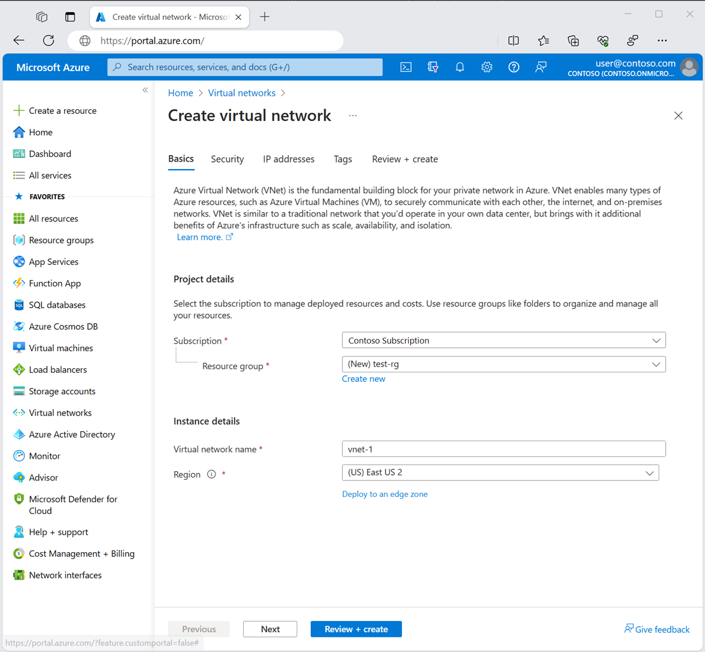
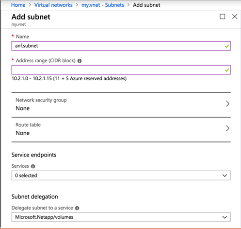

# Walkthrough Challenge 2 - Setup Network Configuration

**[Home](../../Readme.md)** - [Next Challenge Solution](../challenge-03/solution-03.md)

Duration: 20 minutes

## Prerequisites

The following procedure creates a virtual network with a resource subnet, and a delegated ANF subnet.
Please ensure that you successfully verified the [General prerequisits](../../Readme.md#general-prerequisites) before continuing with this challenge.

### **Task 1: Create a Virtual Network and Subnet**

💡 1. Log in to the [Azure portal](https://portal.azure.com/#home). 

2. In the portal, search for and select Virtual networks.

3. On the Virtual networks page, select + Create.

4. On the Basics tab of Create virtual network, enter, or select the following information:

5. Select Next to proceed to the IP Addresses tab.

6. In the address space box in Subnets, select the default subnet.

7. In Edit subnet, enter or select the following information:

* Subnet purpose: Leave the default of Default.
* Name: Enter subnet-1.
* IPv4 address range: Leave the default of 10.0.0.0/16.
* Starting address: Leave the default of 10.0.0.0.
* Size: Leave the default of /24 (256 addresses).

8. Select Save

9. Select Review + create at the bottom of the window. When validation passes, select Create

### **Task 2: Delegate a subnet to Azure NetApp Files**

1. Navigate to Virtual networks in the Azure portal. Select the virtual network that you want to use for Azure NetApp Files.

2. From Virtual network, select Subnets then the +Subnet button.

3. Create a new subnet to use for Azure NetApp Files by completing the following required fields in the Add Subnet page:

* Name: Specify the subnet name.
* Address range: Specify the IP address range.
* Subnet delegation: Select Microsoft.NetApp/volumes.

Note: You can also create and delegate a subnet when you [create a volume for Azure NetApp Files.](https://learn.microsoft.com/en-us/azure/azure-netapp-files/azure-netapp-files-create-volumes)

[💥 **Considerations:**] (https://learn.microsoft.com/en-us/azure/azure-netapp-files/azure-netapp-files-delegate-subnet)
1. In scenarios involving high application volume counts,  consider larger subnets
2. Once the delegated network is created, its network mask cannot be altered.
3. In each VNet, only one subnet can be delegated to Azure NetApp Files.

You successfully completed challenge 2! 🚀🚀🚀
