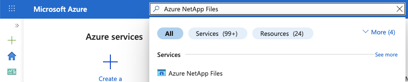
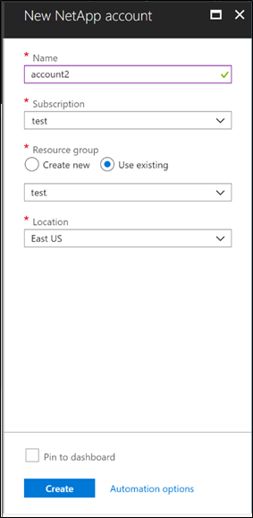
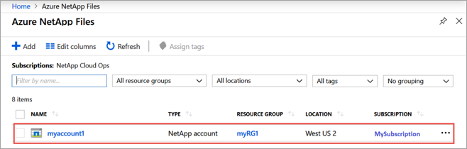
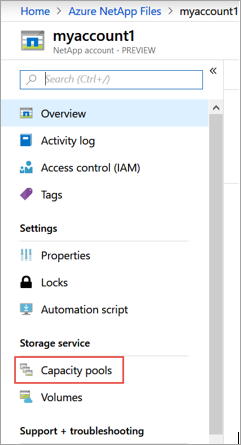
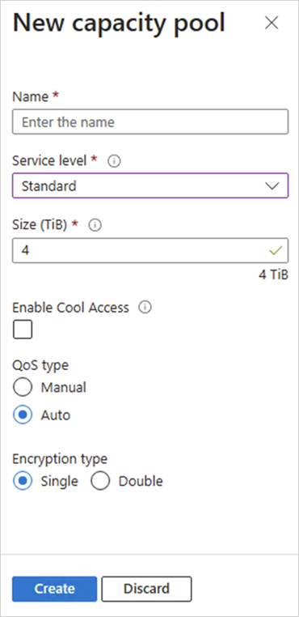
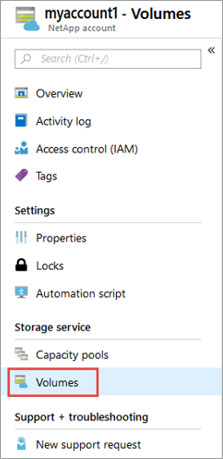
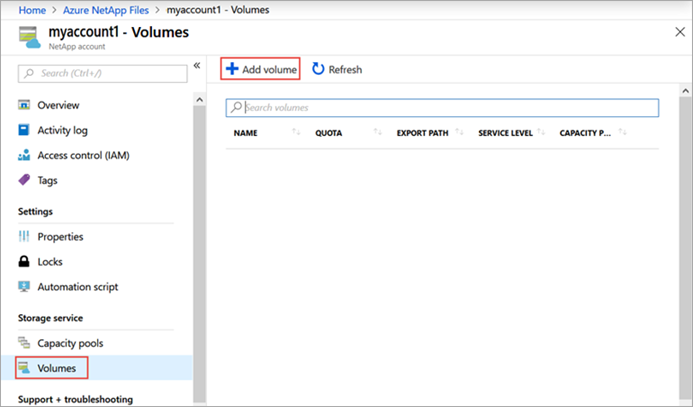
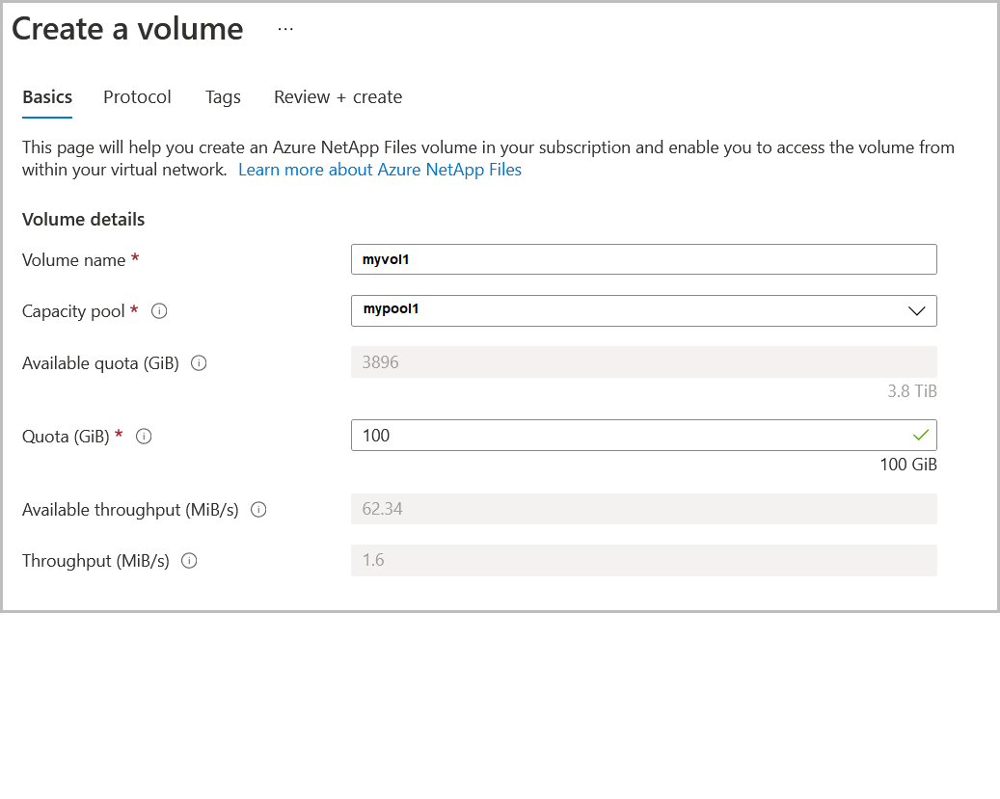
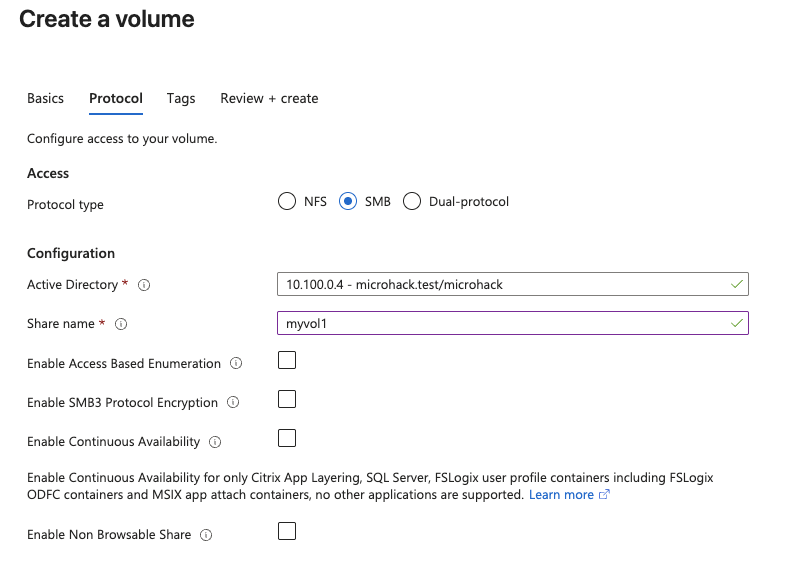

# Walkthrough Challenge 3 - Setting Up Azure NetApp Files

[Previous Challenge Solution](../challenge-02/solution-02.md) - **[Home](../../Readme.md)** - [Next Challenge Solution](../challenge-04/solution-04.md)

Duration: 30 minutes

## Prerequisites

Please ensure that you successfully verified the [General prerequisits](../../Readme.md#general-prerequisites) before continuing with this challenge.

### **Task 1: Create a NetApp account in Azure NetApp Files**

1. In the Azure portal's search box, enter **Azure NetApp Files** and then select **Azure NetApp Files** from the list that appears. 

2. Select + **Create** to create a new NetApp account. 

3. In the New NetApp Account window, provide the following information:
   
* Enter **myaccount1** for the account name. 
* Select your subscription. 
* Select **Create new** to create new resource group. Enter **myRG1** for the resource group name. Select OK. 
* Select your account location.

4. Select **Create** to create your new NetApp account.

### **Task 2: Create a capacity pool**

1. From the Azure NetApp Files management sidebar, select your NetApp account, e.g. myaccount1

2. From the Azure NetApp Files management sidebar, select **Capacity pools**.

3. Select + **Add pools**. 

4. Provide information for the capacity pool: 

* Enter **mypool1** as the pool name. 
* Select **Premium** for the service level. 
* Specify **1 (TiB)** as the pool size. 
* Use the **Auto** QoS type. 

5. Select **Create**.

### **Task 3: Create an NFS volume for Azure NetApp Files**

1. Select the Volumes blade from the Capacity Pools blade.

2. Select + Add volume to create a volume.

3. In the Create a Volume window, provide information for the volume:
   
* Enter **myvol1** as the volume name.
* Select your capacity pool (**mypool1**).
* Use the default value for quota.

4. Select **Protocol**, and then complete the following actions:

* Select **SMB** as the protocol type for the volume.
* Active Directory: **microhack.test**
* Share name: **myvol1**

5. Select **Review + create** to display information for the volume you're creating.

6. Select **Create** to create the volume. The created volume appears in the Volumes menu.

You successfully completed challenge 3! 🚀🚀🚀