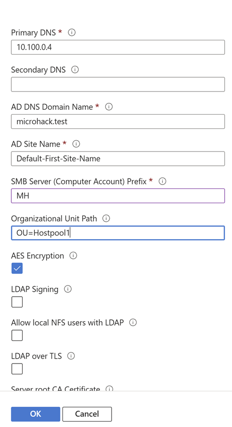

# Integrate Azure NetApp Files volume into AVD environment

## Deploy new SMB volume, integrate with AVD Session Host and verify  

## Prerequisites

The pre-provisioned AVD setup already has a designated Hostpool for each attendee. Your Hostpool is microhack_hostpool{Group Number}

### Task 1: Configure AD connection in NetApp account

1. Log in to the [Azure portal](https://portal.azure.com/#home) 

2. Pick Azure NetApp Fils service 

3. From the Azure NetApp Files management sidebar, select your NetApp account, e.g. myaccount1

4. One the left side expand "Azure Netapp Files" and click on "Active Directory connections"

5. Click "Join" and enter the following values (leave all other fields blak)

* Primary DNS: 10.100.0.4
* AD DNS Domain Name: microhack.test
* AD Site Name: Default-First-Site-Name
* SMB Serve: MH
* Organizational Unit Path: OU=Hostpool{Group Number}
* AES Encryption: checked

Example:

🔑 **Key to a successful strategy....**
- The key to success is not a technical consideration of....

### **Task 2: Think about if...**

### **Task 3: Put yourself in the position...**

* [Checklist Testing for...](Link to checklist or microsoft docs)

### Task 4: Who defines the requirements...

You successfully completed challenge 1! 🚀🚀🚀

