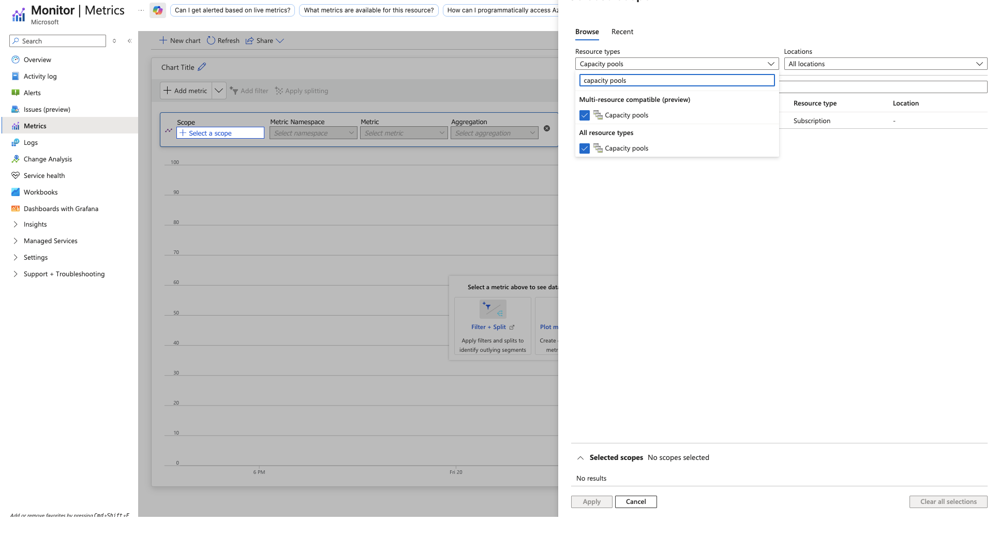

# Monitoring Azure NetApp Files

### Understand throughput, latency and much more ###

### Task 1: Configure a quick metrics dashboard

1. Open your NetApp acoount

2. On the left side open **Monitoring** and then click on **Metrics**

3. Click on **New chart**. Now you see 2 charts in total

4. On the upper chart, click on **Save to dashboard**, select **Pin to dashboard**, enter a name and hit **OK**

5. Repeat the previous step on the lower chart and pin it the the same dashboard

6. On the upper chart, click on **Scope**, click on your capacity pool and select both volumes. Hit **Apply** 

7. Click on **Metric** and select **Write throughput**

8. On the lower chart chose the same scope and select **Read Throuput** as metric

9. Change to service **Dashboard Hub** and view your new dashboard

# Walkthrough Challenge 5 - 

**[Home](../../Readme.md)** - [Next Challenge Solution](../challenge-06/solution-06.md)

Duration: 20 minutes

## Prerequisites

Please ensure that you successfully verified the [General prerequisits](../../Readme.md#general-prerequisites) before continuing with this challenge.

### **Task 1: Write down...**

💡 The first....

💥 **Here are the first three general steps that are typically happen:** 
1. Everybody struggles with finding the right person....
2. If somebody finds the plan, the first three actions...
3. Do not sress to much we have a...

🔑 **Key to a successful strategy....**
- The key to success is not a technical consideration of....

### **Task 2: Think about if...**

### **Task 3: Put yourself in the position...**

* [Checklist Testing for...](Link to checklist or microsoft docs)

### Task 4: Who defines the requirements...

You successfully completed challenge 1! 🚀🚀🚀

# Ways to access metrics and monitoring performance:

Azure NetApp Files metrics are natively integrated into Azure monitor. From within the Azure portal, you can find metrics for Azure NetApp Files capacity pools and volumes from two locations:

# Challenge:

## AVD environment 

1. Logon to your AVD client 

2. Copy some data to your user profile share 

## Azure Portal: 

1. Open **[Azure monitor](https://learn.microsoft.com/en-us/azure/azure-monitor/platform/monitor-azure-resource)** 

2. Click on **Metrics** 

3. In “Select a scope” select **Resource** type “Capacity Pools” 

4. Select the AVD capability pool being used and hit **Apply** 

5. Under “Metric” select **Pool allocated throughput**

6. Set “Local Time” to 30 minutes 

7. Watch the graph 

8. Copy more data in AVD client 

9. Check out the other capacity pool metrics 

10. Open you NetApp account and click on your volume 

11. Click on **Metrics** and check out the available volume-level metrics

