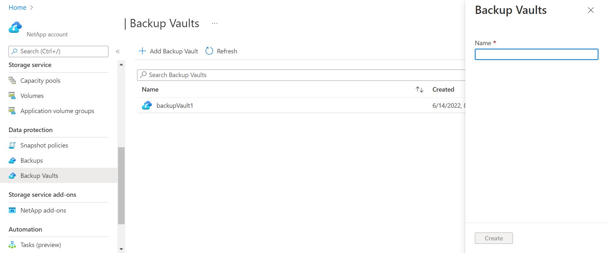
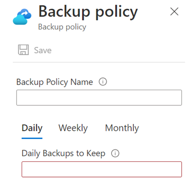
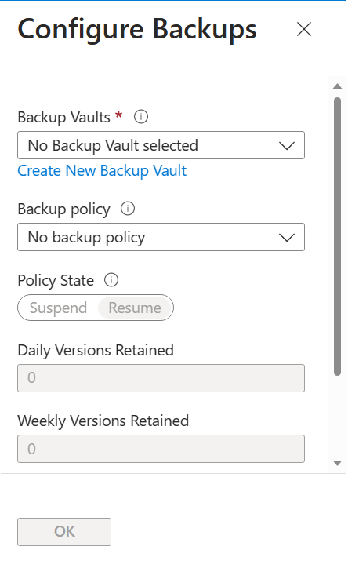

# Walkthrough Challenge 6 - Azure NetApp Files Backup

[Previous Challenge Solution](../challenge-05/solution-05.md) - **[Home](../../Readme.md)** - [Next Challenge Solution](../challenge-07/solution-07.md)

Duration: 20 minutes

### **Task 1: Create a backup vault**

1. In your Azure NetApp Files subscription, navigate to the Backup Vaults menu.

2. Select + Add Backup Vault. Assign a name to your backup vault then select Create.

### **Task 2: Configure a backup policy**

1. Sign in to the Azure portal and navigate to Azure NetApp Files.

2. Select your Azure NetApp Files account.

3. Select Backups.

4. Select Backup Policies.

5. Select Add.

6. In the Backup Policy page, specify the backup policy name. Enter the number of backups that you want to keep for daily, weekly, and monthly backups. Select Save.

The minimum value for Daily Backups to Keep is 2.

### **Task 3: Assign backup vault and backup policy to a volume**

1. Navigate to Volumes then select the volume for which you want to configure backups.

2. From the selected volume, select Backup then Configure.

3. In the Configure Backups page, select the backup vault from the Backup vaults drop-down. For information about creating a backup vault, see Create a backup vault.

4. In the Backup Policy drop-down menu, assign the backup policy to use for the volume. Select OK.

5. The Vault information is prepopulated.

### **Task 4: Migrate backups to a backup vault**

1. Navigate to Backups.

2. From the banner above the backups, select Assign Backup Vault.

3. Select the volumes for migrating backups. Then, select Assign to Backup Vault.

If there are backups from volumes that have been deleted that you want to migrate, select Include backups from Deleted Volumes. This option is only enabled if backups from deleted volumes are present.

### **Task 5: Delete a backup vault**
1. Navigate to the Backup Vault menu.

2. Identify the backup vault you want to delete and select the three dots ... next to the backup's name. Select Delete.

You successfully completed challenge 6! 🚀🚀🚀