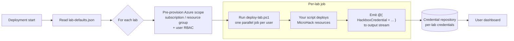

# Lab automation

This folder is **optional**. Delete it if your MicroHack does not need automated
Azure provisioning.

When present, the MicroHack platform reads [lab-defaults.json](lab-defaults.json)
to decide *how* to scope lab environments, and (optionally) invokes
[deploy-lab.ps1](deploy-lab.ps1) once per user to deploy MicroHack-specific
resources into a pre-provisioned Azure scope.

## How the platform runs your lab automation



Key points for integration:

- **One job per lab** — `deploy-lab.ps1` is invoked in parallel, once per
  lab, with that lab's `SubscriptionId` / `ResourceGroupName` /
  `AllowedEntraUserIds` already set.
- **Credentials are stored per lab** — every `HackboxCredential` hashtable your
  script writes to the output stream is captured, attributed to the lab the
  job ran for, and surfaced on that lab's personal dashboard.
- **No cross-user state** — each job runs in its own runspace. Use
  `Get-MhhStableHash` over `$AllowedEntraUserIds` if you need a deterministic,
  per-user resource name.

- [Lab automation](#lab-automation)
  - [How the platform runs your lab automation](#how-the-platform-runs-your-lab-automation)
  - [Folder layout](#folder-layout)
  - [`lab-defaults.json`](#lab-defaultsjson)
    - [Fields](#fields)
    - [`groups` — supported values](#groups--supported-values)
    - [`deploymentType` — what each value means for your script](#deploymenttype--what-each-value-means-for-your-script)
  - [`deploy-lab.ps1`](#deploy-labps1)
    - [Required parameter contract](#required-parameter-contract)
    - [What the platform guarantees before your script runs](#what-the-platform-guarantees-before-your-script-runs)
    - [Deploying when `deploymentType = subscription`](#deploying-when-deploymenttype--subscription)
    - [Returning credentials to the user (HackboxCredential)](#returning-credentials-to-the-user-hackboxcredential)
  - [Available helper cmdlets](#available-helper-cmdlets)
    - [`Get-MhhStableHash`](#get-mhhstablehash)
    - [`Invoke-MhhDeploymentWithRegionFallback`](#invoke-mhhdeploymentwithregionfallback)
    - [`Test-MhhDeploymentFailureRetryable`](#test-mhhdeploymentfailureretryable)
  - [Authoring guidelines](#authoring-guidelines)

## Folder layout

```text
labautomation/
├── lab-defaults.json   # Platform-facing configuration (required if folder exists)
└── deploy-lab.ps1      # Optional: per-user Azure deployment script
```

Both files are picked up automatically — no registration step is required.

## `lab-defaults.json`

This file tells the platform how to size and scope lab environments for your
MicroHack. The schema is published at
`https://raw.githubusercontent.com/microsoft/MicroHack/refs/heads/main/lab-defaults-schema.json`
and is validated when your MicroHack is loaded.

```json
{
  "$schema": "https://raw.githubusercontent.com/microsoft/MicroHack/refs/heads/main/lab-defaults-schema.json",
  "groups": [ "GHCPUsers" ],
  "deploymentType": "resourcegroup",
  "labsPerSubscription": 4,
  "preferredLocation": "swedencentral, norwayeast, spaincentral",
  "estimatedDailyCostsUsd": 25.0
}
```

Only include fields you want to set — missing fields fall back to platform defaults.

### Fields

| Field | Type | Description |
| --- | --- | --- |
| `groups` | `string[]` | Group-based feature activations for the Entra ID users created for this lab. See [supported values](#groups--supported-values). |
| `deploymentType` | `"resourcegroup"` \| `"subscription"` \| `"resourcegroup-with-subscriptionowner"` | Azure scope each user receives. See [details](#deploymenttype--what-each-value-means-for-your-script). |
| `labsPerSubscription` | `integer` (1–100) | How many users to pack into a single Azure subscription. Ignored when `deploymentType` is `subscription`. |
| `preferredLocation` | `string` | Comma-separated Azure regions, **in priority order** (e.g. `"swedencentral, norwayeast"`). The first region is used as the default deployment location. List multiple regions so your script can fall back if the first region doesn't support every service your lab needs — see [authoring guidelines](#authoring-guidelines). |
| `estimatedDailyCostsUsd` | `number` (≥ 0) | Estimated daily cost per lab environment in USD. Used for cost forecasting in the lab lifecycle wizard. |

### `groups` — supported values

Add a group name to provision an extra capability for every lab user created
for this MicroHack:

| Group | What it provisions for each lab user |
| --- | --- |
| `GHCPUsers` | A GitHub Copilot seat assigned to the user. |
| `M365-E5-Users` | A Microsoft 365 E5 license assigned to the user. |

You can combine multiple groups, e.g. `"groups": [ "GHCPUsers", "M365-E5-Users" ]`.
Leave the array empty (`[]`) if your MicroHack needs only Azure.

### `deploymentType` — what each value means for your script

| Value | Azure scope per user | RBAC on subscription | RBAC on resource group |
| --- | --- | --- | --- |
| `resourcegroup` | One resource group, **shared subscription** | `Reader` | `Owner` |
| `resourcegroup-with-subscriptionowner` | One resource group, **shared subscription** | `Owner` | `Owner` |
| `subscription` | One dedicated subscription | `Owner` | n/a |

Choose `subscription` only when your lab genuinely needs subscription-scoped
resources (policies, management-group operations, etc.) — it is materially more
expensive in subscription pool consumption.

## `deploy-lab.ps1`

This script is **optional**. If it is missing — or if its parameter block does
not match the contract below — the platform will skip it and only provision the
empty scope (subscription / resource group) plus RBAC.

The platform invokes your script **once per user**, in parallel, inside a
pre-configured PowerShell environment with the user's Azure context already
selected.

### Required parameter contract

Your script **must** declare exactly these parameters (a mismatching parameter
block causes the script to be skipped):

```powershell
param(
    [Parameter(Mandatory=$true)]
    [ValidateSet('subscription','resourcegroup','resourcegroup-with-subscriptionowner')]
    [string]$DeploymentType,

    [Parameter(Mandatory=$true)]
    [string]$SubscriptionId,

    [string]$ResourceGroupName = "",

    [string[]]$PreferredLocation = @(),

    [string[]]$AllowedEntraUserIds = @()
)
```

| Parameter | Provided by | Notes |
| --- | --- | --- |
| `DeploymentType` | platform | Same value as in `lab-defaults.json`. |
| `SubscriptionId` | platform | The user's target Azure subscription. `Set-AzContext` is already pointed at it. |
| `ResourceGroupName` | platform | Empty for `subscription` deployments; otherwise the user's resource group (already created, user already `Owner`). |
| `PreferredLocation` | platform | The regions from `lab-defaults.json`, in priority order. Iterate through the list and pick the first region that supports every Azure service your lab needs — skip regions that don't, and emit `Write-Warning` when you skip one (see [authoring guidelines](#authoring-guidelines)). |
| `AllowedEntraUserIds` | platform | Entra object IDs that should be granted access to anything your script provisions beyond the default RBAC. Always contains exactly one ID — the user this invocation is for. |

> `PreferredLocation` may also be declared as `[string]` (comma-separated) if you
> prefer — the platform detects the type and adapts.

### What the platform guarantees before your script runs

- The Azure subscription context is set to `$SubscriptionId`.
- For `resourcegroup` / `resourcegroup-with-subscriptionowner` deployments, the
  resource group named `$ResourceGroupName` already exists at `$PreferredLocation[0]`,
  and the user already has `Owner` on it. The resource group is a metadata-only
  container — you can still deploy individual resources into any other region
  from `$PreferredLocation` if the first region doesn't support a service your
  lab needs (emit `Write-Warning` when you fall back).
- For `subscription` deployments, the user already has `Owner` on the
  subscription, but **no resource group is created** — `$ResourceGroupName` is
  empty. Your script owns RG creation (see [below](#deploying-when-deploymenttype--subscription)).
- The `Az.Accounts` and `Az.Resources` modules are imported.
- The script runs as a service principal with subscription `Owner`.

You do **not** need to call `Connect-AzAccount` or `Set-AzContext`, and for
`resourcegroup` / `resourcegroup-with-subscriptionowner` deployments you do not
need to create the resource group or assign the user's `Owner` role.

### Deploying when `deploymentType = subscription`

Because the platform does not pre-create a resource group in this mode, you
have two options inside your script:

**Option A — create one or more resource groups yourself.**
Use `Get-MhhStableHash` to derive a deterministic name from
`$AllowedEntraUserIds` so re-runs target the same RG:

```powershell
$location = if ($PreferredLocation.Count -gt 0) { $PreferredLocation[0] } else { 'swedencentral' }
$rgName   = "lab-{0}" -f (Get-MhhStableHash -Value $AllowedEntraUserIds -Length 12)

if (-not (Get-AzResourceGroup -Name $rgName -ErrorAction SilentlyContinue)) {
    New-AzResourceGroup -Name $rgName -Location $location | Out-Null
}

# Surface the RG name so the user can find it
@{ HackboxCredential = @{ name = "Resource Group Name"; value = $rgName; note = "" } }
```

> The `Resource Group Name` credential is normally emitted by the platform for
> `resourcegroup` / `resourcegroup-with-subscriptionowner` deployments. In
> `subscription` mode it is *not* emitted — emit it yourself if you want it
> shown on the user's dashboard.

**Option B — do a subscription-scoped deployment.**
Use `New-AzDeployment` (or `New-AzSubscriptionDeployment`) with a template
whose `targetScope` is `subscription`:

```powershell
$location = if ($PreferredLocation.Count -gt 0) { $PreferredLocation[0] } else { 'swedencentral' }

New-AzDeployment `
    -Name       ("lab-" + (Get-MhhStableHash -Value $AllowedEntraUserIds -Length 12)) `
    -Location   $location `
    -TemplateFile (Join-Path $PSScriptRoot 'main.bicep') `
    -TemplateParameterObject @{ allowedEntraUserIds = $AllowedEntraUserIds } `
    | Out-Null
```

Either option is fine — pick the one that matches what your lab actually needs
at the subscription scope (e.g. policy assignments, multiple RGs, management
group operations).

### Returning credentials to the user (HackboxCredential)

Anything your script writes to the output stream as a `HackboxCredential`
hashtable is captured and surfaced to the user on their personal lab dashboard.

```powershell
# Single credential
@{ HackboxCredential = @{
    name  = "AdminPassword"
    value = "TopSecret!"
    note  = "Initial password for the VM admin account"
} }

# Multiple credentials — emit each as its own hashtable
@{ HackboxCredential = @{ name = "Storage Account"; value = $storageAccount.Name; note = "" } }
@{ HackboxCredential = @{ name = "Storage Key";     value = $key;                 note = "Primary key" } }
```

Rules:

- `name` and `value` are required and must be non-empty.
- `note` is optional context shown next to the credential.
- Emit each credential as a separate hashtable — do not wrap them in an array.
- The platform reserves certain credential names (e.g. `Subscription ID`,
  `Resource Group Name`, `Entra ID *`, `Portal URL *`) and emits them itself.
  Attempts to emit a reserved name are silently dropped.

## Available helper cmdlets

The platform ships a PowerShell module that is auto-imported into your script
(and into any `Start-Job` child runspaces you spawn). No `Import-Module` call
is required.

### `Get-MhhStableHash`

Deterministic, order-insensitive hash of one or more strings — useful for
generating stable resource names from membership (e.g. an Entra-user allow-list).

```powershell
# 24-char hex hash (default length)
$hash = Get-MhhStableHash -Value $AllowedEntraUserIds

# Use it to name a resource group / storage account / etc.
$rgName = "lab-$hash"
```

| Parameter | Description |
| --- | --- |
| `Value` (`string[]`, required) | One or more strings to hash. Accepts pipeline input. |
| `Length` (`int`, optional) | Number of hex chars to return. Range 12–64. Default 24. |

The same set of inputs (in any order, any casing) always produces the same hash.

### `Invoke-MhhDeploymentWithRegionFallback`

Deploy a Bicep / ARM template into a resource group with **automatic region
fallback** when Azure returns capacity, quota, or region-unsupported errors.
This is the recommended way to ship an RG-scoped Bicep template from
`deploy-lab.ps1` — it removes the need to hand-roll the
`foreach ($region in $PreferredLocation) { try { … } }` loop documented in the
[authoring guidelines](#authoring-guidelines).

On every attempt the helper:

1. Force-deletes the resource group if it already exists (synchronous, with
   forced VM/VMSS teardown).
2. Recreates an **empty** RG in the current candidate region.
3. Re-grants `Owner` on the RG to every Entra object ID in
   `-RgOwnerEntraObjectIds` — **you must pass `$AllowedEntraUserIds` here** or
   the user will lose access to the RG the platform originally granted them.
4. Runs your optional `-PreDeployHook` (e.g. to register resource providers).
5. Submits `New-AzResourceGroupDeployment` with your template.

On failure the error is classified by
[`Test-MhhDeploymentFailureRetryable`](#test-mhhdeploymentfailureretryable):

| Classification | Behaviour |
| --- | --- |
| Fatal (template bug, RBAC, policy, name collision…) | Re-throws immediately. No further regions are tried. |
| Retry-next-region (`SkuNotAvailable`, `QuotaExceeded`, `LocationNotAvailableForResourceType`, `ResourceProviderUnavailable`, …) | Rotates to the next region in `-PreferredLocations`. |
| Same-region transient (`TooManyRequests`, `OperationTimedOut`, `ServiceUnavailable`, `5xx`) | Bounded retry in the same region first (`-SameRegionRetryBudget`, default 1), then rotates. |

If every region is exhausted, the helper throws
`RegionFallbackExhausted: …` with a per-attempt summary.

**Key parameters (integration view):**

| Parameter | What to pass |
| --- | --- |
| `PreferredLocations` (`string[]`, required) | Pass `$PreferredLocation` straight through. |
| `ResourceGroupName` (`string`, required) | For `resourcegroup` / `resourcegroup-with-subscriptionowner`: pass `$ResourceGroupName`. For `subscription`: derive a stable name with `Get-MhhStableHash`. |
| `RgOwnerEntraObjectIds` (`string[]`) | **Pass `$AllowedEntraUserIds`** — the helper wipes and recreates the RG, so this is required to preserve the user's `Owner` role. |
| `TemplateFile` (`string`, required) | Path to your `.bicep` / `.json` template (e.g. `Join-Path $PSScriptRoot 'main.bicep'`). |
| `TemplateParameterObject` (`hashtable`) | Your template parameters. Mutually exclusive with `TemplateParameterFile`. |
| `TemplateParameterFile` (`string`) | Parameter file path. Mutually exclusive with `TemplateParameterObject`. |
| `DeploymentNamePrefix` (`string`) | Prefix for the ARM deployment name (final name includes region + timestamp). Default `mhh`. |
| `MaxAttempts` (`int`) | Caps total attempts. Default `0` = one per region. |
| `SameRegionRetryBudget` (`int`, 0–5) | Extra retries inside the same region for transient codes before rotating. Default `1`. |
| `Tag` (`hashtable`) | Tags applied to the RG on each recreate. |
| `PreDeployHook` (`scriptblock`) | Optional. Invoked after RG create, before deployment. Receives the chosen location as a positional argument. Use it to e.g. `Register-AzResourceProvider` for that region. |
| `AssumeRetryableOnUnknown` (`switch`) | Treat unknown ARM error codes as retryable instead of fatal. Off by default — leave it off so real template bugs fail fast. |

**Return value on success** (a hashtable):

| Field | Description |
| --- | --- |
| `Success` | `$true` |
| `LocationUsed` | The region the deployment actually succeeded in. |
| `DeploymentName` | Full ARM deployment name. |
| `Outputs` | Hashtable of template outputs (`name → value`), flattened for direct use. |
| `DeploymentResult` | Raw `PSResourceGroupDeployment` object. |
| `Attempts` | Per-attempt diagnostic records (region, outcome, classification, duration). |

Feed `Outputs` straight into `HackboxCredential` hashtables — that is the
typical bridge between your Bicep `output` blocks and the user's dashboard.

**Example — RG-scoped Bicep deployment with region fallback:**

```powershell
param(
    [Parameter(Mandatory=$true)]
    [ValidateSet('subscription','resourcegroup','resourcegroup-with-subscriptionowner')]
    [string]$DeploymentType,

    [Parameter(Mandatory=$true)]
    [string]$SubscriptionId,

    [string]$ResourceGroupName = "",
    [string[]]$PreferredLocation = @(),
    [string[]]$AllowedEntraUserIds = @()
)

$result = Invoke-MhhDeploymentWithRegionFallback `
    -PreferredLocations      $PreferredLocation `
    -ResourceGroupName       $ResourceGroupName `
    -RgOwnerEntraObjectIds   $AllowedEntraUserIds `
    -TemplateFile            (Join-Path $PSScriptRoot 'main.bicep') `
    -TemplateParameterObject @{
        userObjectId = $AllowedEntraUserIds[0]
    } `
    -DeploymentNamePrefix    'lab'

# Surface region used + any template outputs to the user's dashboard.
@{ HackboxCredential = @{ name = "Region"; value = $result.LocationUsed; note = "" } }
foreach ($k in $result.Outputs.Keys) {
    @{ HackboxCredential = @{ name = $k; value = [string]$result.Outputs[$k]; note = "" } }
}
```

**When *not* to use it:**

- You are not doing an ARM/Bicep deployment (e.g. you only call individual
  `New-Az*` cmdlets). Use the manual
  [region-iteration pattern](#authoring-guidelines) instead.
- You need a `subscription`-scoped deployment (`New-AzDeployment`). This helper
  is RG-scoped only.
- You need to preserve resources across retries. The helper **wipes the RG on
  every attempt** — your template must be self-contained.

### `Test-MhhDeploymentFailureRetryable`

Lower-level classifier used internally by
`Invoke-MhhDeploymentWithRegionFallback`. Call it directly only if you've
hand-rolled your own deployment loop and need to make the same
fatal / retry-next-region / same-region-transient decision.

**Parameters:**

| Parameter | Description |
| --- | --- |
| `ErrorRecord` (`ErrorRecord`, required) | The terminating error caught from `New-AzResourceGroupDeployment`. |
| `ResourceGroupName` (`string`) | Used to drill into deployment operations when the outer exception is an opaque wrapper (`DeploymentFailed` / `InvalidTemplateDeployment`). |
| `DeploymentName` (`string`) | Same as above — required for the drill-in to work. |
| `AssumeRetryableOnUnknown` (`switch`) | Treat unknown ARM error codes as retryable instead of fatal. Off by default. |

```powershell
try {
    New-AzResourceGroupDeployment @splat
}
catch {
    $verdict = Test-MhhDeploymentFailureRetryable `
        -ErrorRecord       $_ `
        -ResourceGroupName $ResourceGroupName `
        -DeploymentName    $depName

    if (-not $verdict.IsRetryable)  { throw }                  # Fatal
    if ($verdict.SameRegionRetry)   { Start-Sleep 30; <retry> } # Transient
    # else: rotate to next region in your loop
}
```

**Return value** (a hashtable):

| Field | Type | Description |
| --- | --- | --- |
| `IsRetryable` | `bool` | `$true` if you should retry (in this region or the next), `$false` if you must give up. |
| `SameRegionRetry` | `bool` | When `IsRetryable` is `$true`: `$true` = retry in the **same** region first (transient throttling / timeout / 5xx), `$false` = rotate to the **next** region (capacity / quota / region-unsupported). |
| `Classification` | `string` | One of `Fatal`, `CapacityShortage`, `QuotaExceeded`, `RegionUnsupported`, `ResourceProviderUnavailable`, `RegionalFailure`, `TransientThrottle`, `UnknownAssumedFatal`, `UnknownAssumedRetryable`. |
| `MatchedCode` | `string` | The specific ARM error code that drove the decision (e.g. `SkuNotAvailable`, `QuotaExceeded`, `TooManyRequests`). `$null` for unknown classifications. |
| `AllCodes` | `string[]` | Every ARM error code discovered while walking the error tree — useful for diagnostics / logging. |
| `Reason` | `string` | The surface error message from the original exception. |
| `RetryAfterSeconds` | `int` | Suggested backoff before retrying. Default `30`. |

For most labs, prefer
[`Invoke-MhhDeploymentWithRegionFallback`](#invoke-mhhdeploymentwithregionfallback)
and you won't need to call this directly.

## Authoring guidelines

- **Be idempotent.** The platform may re-invoke your script if a deployment is
  retried. Use `-ErrorAction SilentlyContinue` + `if (-not …)` patterns, or
  `New-AzResourceGroupDeployment` with the same deployment name.
- **Prefer `Invoke-MhhDeploymentWithRegionFallback` for RG-scoped Bicep/ARM
  deployments.** It handles RG recreate, Owner re-grant, region fallback, and
  failure classification for you — see
  [the helper docs](#invoke-mhhdeploymentwithregionfallback).
- **Honour `$PreferredLocation` — but skip unsupported regions.** Iterate
  through `$PreferredLocation` in order and pick the first region that
  supports every Azure service your lab needs. If you have to skip a region,
  emit a `Write-Warning` so the operator can see *why* the lab landed in a
  fallback region. If none of the preferred regions work, `throw` with a clear
  message. Never hardcode regions, and never silently ignore the list.

  ```powershell
  $location = $null
  foreach ($candidate in $PreferredLocation) {
      # Replace with your own probe — e.g. Get-AzComputeResourceSku,
      # Get-AzLocation, or a service-specific availability check.
      if (Test-MyLabRegionSupported -Location $candidate) {
          $location = $candidate
          break
      }
      Write-Warning "Skipping region '$candidate': required services are not available there."
  }
  if (-not $location) {
      throw "None of the preferred regions support this lab: $($PreferredLocation -join ', ')"
  }
  ```

- **Scope RBAC to `$AllowedEntraUserIds`.** If you provision additional
  identities (managed identities, service principals, etc.) and want the user
  to manage them, grant the user access explicitly.
- **Keep total runtime reasonable.** Your script runs concurrently for every
  user; long synchronous deployments slow down the whole event start.
- **Do not call `Connect-AzAccount` or `Set-AzContext`.** The platform manages
  authentication and subscription context for you.
