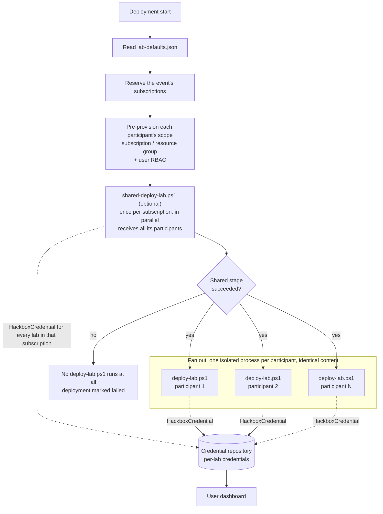

# Lab automation

This folder is **optional**. Delete it if your MicroHack does not need automated
Azure provisioning.

When present, the MicroHack platform reads [lab-defaults.json](lab-defaults.json)
to decide *how* to scope lab environments, and (optionally) invokes
[deploy-lab.ps1](deploy-lab.ps1) once per participant to deploy
MicroHack-specific resources into a pre-provisioned Azure scope. One further
optional script, [shared-deploy-lab.ps1](shared-deploy-lab.ps1), runs once per
subscription *ahead of* that fan-out to lay down whatever the individual labs
build on. See
[Optional hook](#optional-hook-shared-deploy-labps1).

**One deployment fans out into N identical labs, one per participant.** The
platform runs *your one script* many times over, in a separate process each
time, and every run builds the same lab content in its own Azure scope for a
different participant. Nothing is shared between those copies: not the Azure
resources, not the Azure CLI profile, not the OpenTofu state. Write your script
as if it only ever deploys a single lab for a single user,
**because from inside the script, that is exactly what it does.**

## How the platform runs your lab automation


```mermaid
flowchart TD
    A[Deployment start] --> B[Read lab-defaults.json]
    B --> C["Reserve the event's subscriptions"]
    C --> D["Pre-provision each participant's scope<br/>subscription / resource group<br/>+ user RBAC"]
    D --> SH["shared-deploy-lab.ps1 (optional)<br/>once per subscription, in parallel<br/>receives all its participants"]
    SH --> G{"Shared stage<br/>succeeded?"}
    G -- no --> X["No deploy-lab.ps1 runs at all<br/>deployment marked failed"]

    subgraph fan["Fan out: one isolated process per participant, identical content"]
        direction LR
        L1["deploy-lab.ps1<br/>participant 1"]
        L2["deploy-lab.ps1<br/>participant 2"]
        LN["deploy-lab.ps1<br/>participant N"]
    end

    G -- yes --> L1
    G -- yes --> L2
    G -- yes --> LN

    SH -. HackboxCredential for every lab in that subscription .-> CR
    L1 -. HackboxCredential .-> CR
    L2 -. HackboxCredential .-> CR
    LN -. HackboxCredential .-> CR

    CR[(Credential repository<br/>per-lab credentials)] --> DASH[User dashboard]
```

Key points for integration:

- **One process per participant, same content every time:** `deploy-lab.ps1`
  runs in its own PowerShell process, with that participant's `SubscriptionId` /
  `ResourceGroupName` / `AllowedEntraUserIds` already set. Your script never
  loops over participants and never sees more than one; the platform does the
  fan-out for you.
- **Credentials are stored per lab:** every `HackboxCredential` hashtable your
  script writes to the output stream is captured, attributed to the lab the
  job ran for, and surfaced on that lab's personal dashboard. A credential
  emitted by one participant's run can never leak into another's.
- **No cross-lab state:** sibling processes are building the *same* lab for
  *other* participants at the same time, so nothing may be shared between them.
  Each process automatically gets its own Azure CLI profile, keyed by
  subscription + resource group. OpenTofu is opt-in: its equally isolated
  working directory is created the first time your script calls
  [`Invoke-MhhTofuCommand`](#invoke-mhhtofucommand). Use `Get-MhhStableHash`
  over `$AllowedEntraUserIds` if you need a deterministic, per-participant
  resource name.
- **Anything that must happen once, not N times, belongs in the shared hook.**
  Resources several labs in one subscription share (a hub network, a central
  workspace, …), and one-off subscription preparation every parallel
  `deploy-lab.ps1` would otherwise race on (registering resource providers, …),
  go into `shared-deploy-lab.ps1`. It is optional and independent of
  `deploy-lab.ps1`, and it always completes before the first lab starts.

- [Lab automation](#lab-automation)
  - [How the platform runs your lab automation](#how-the-platform-runs-your-lab-automation)
  - [Folder layout](#folder-layout)
  - [`lab-defaults.json`](#lab-defaultsjson)
    - [Fields](#fields)
    - [Cost forecasting formula](#cost-forecasting-formula)
    - [`groups`: supported values](#groups-supported-values)
    - [`deploymentType`: what each value means for your script](#deploymenttype-what-each-value-means-for-your-script)
  - [`deploy-lab.ps1`](#deploy-labps1)
    - [Required parameter contract](#required-parameter-contract)
    - [What the platform guarantees before your script runs](#what-the-platform-guarantees-before-your-script-runs)
    - [Keeping credentials alive in long-running scripts](#keeping-credentials-alive-in-long-running-scripts)
    - [Deploying when `deploymentType = subscription`](#deploying-when-deploymenttype--subscription)
    - [Deploying with OpenTofu](#deploying-with-opentofu)
    - [Returning credentials to the user (HackboxCredential)](#returning-credentials-to-the-user-hackboxcredential)
      - [Passwords and re-runs](#passwords-and-re-runs)
    - [Cleaning up](#cleaning-up)
    - [Local testing](#local-testing)
  - [Optional hook: `shared-deploy-lab.ps1`](#optional-hook-shared-deploy-labps1)
    - [Where it fits in the pipeline](#where-it-fits-in-the-pipeline)
    - [Shared hook parameter contract](#shared-hook-parameter-contract)
    - [Rules for the shared hook](#rules-for-the-shared-hook)
    - [Example: a shared hub network](#example-a-shared-hub-network)
    - [Testing the shared hook locally](#testing-the-shared-hook-locally)
  - [Available helper cmdlets](#available-helper-cmdlets)
    - [`New-MhhStablePassword`](#new-mhhstablepassword)
    - [`Get-MhhStableHash`](#get-mhhstablehash)
    - [`Get-MhhLabUser`](#get-mhhlabuser)
    - [`Update-MhhToken`](#update-mhhtoken)
    - [`Invoke-MhhSynchronized`](#invoke-mhhsynchronized)
    - [`Set-MhhManagedIdentityRoleMember`](#set-mhhmanagedidentityrolemember)
    - [`Invoke-MhhTofuCommand`](#invoke-mhhtofucommand)
    - [`Remove-MhhTofuWorkspace`](#remove-mhhtofuworkspace)
    - [`Invoke-MhhDeploymentWithRegionFallback`](#invoke-mhhdeploymentwithregionfallback)
    - [`Test-MhhDeploymentFailureRetryable`](#test-mhhdeploymentfailureretryable)
    - [`Remove-MhhResourceGroup`](#remove-mhhresourcegroup)
  - [Authoring guidelines](#authoring-guidelines)

## Folder layout

```text
labautomation/
├── lab-defaults.json        # Platform-facing configuration (required if folder exists)
├── shared-deploy-lab.ps1    # Optional: runs once per subscription, before the labs
├── deploy-lab.ps1           # Optional: per-user Azure deployment script
├── main.bicep               # Optional: Bicep/ARM template your script deploys  (Recommended)
└── tofu/                    # Optional: OpenTofu (.tf) module your script deploys (NOT Recommended)
```

`lab-defaults.json`, `deploy-lab.ps1` and `shared-deploy-lab.ps1` are picked up
automatically by file name, no registration step is required. Anything else in
the folder is yours; reference it from your script with
`Join-Path $PSScriptRoot '<name>'`.

## `lab-defaults.json`

This file tells the platform how to size and scope lab environments for your
MicroHack. The schema is published at
`https://raw.githubusercontent.com/microsoft/MicroHack/refs/heads/main/lab-defaults-schema.json`
and is validated when your MicroHack is loaded.

```json
{
  "$schema": "https://raw.githubusercontent.com/microsoft/MicroHack/refs/heads/main/lab-defaults-schema.json",
  "groups": [ "GHCPUsers" ],
  "deploymentType": "resourcegroup",
  "labsPerSubscription": 4,
  "preferredLocation": "swedencentral, norwayeast, spaincentral",
  "estimatedDailyCostsUsd": 25.0,
  "estimatedSharedDeploymentDailyCostsUsd": 0.0
}
```

Only include fields you want to set; missing fields fall back to platform defaults.

### Fields

| Field | Type | Description |
| --- | --- | --- |
| `groups` | `string[]` | Group-based feature activations for the Entra ID users created for this lab. See [supported values](#groups-supported-values). |
| `deploymentType` | `"resourcegroup"` \| `"subscription"` \| `"resourcegroup-with-subscriptionowner"` | Azure scope each user receives. See [details](#deploymenttype-what-each-value-means-for-your-script). |
| `labsPerSubscription` | `integer` (1–100) | How many users to pack into a single Azure subscription. Ignored when `deploymentType` is `subscription`. |
| `preferredLocation` | `string` | Comma-separated Azure regions, **in priority order** (e.g. `"swedencentral, norwayeast"`). The first region is used as the default deployment location. List multiple regions so your script can fall back if the first region doesn't support every service your lab needs; see [authoring guidelines](#authoring-guidelines). |
| `estimatedDailyCostsUsd` | `number` (≥ 0) | Estimated daily cost per lab environment in USD. Based on the resources created by `deploy-lab.ps1`. Used for cost forecasting in the lab lifecycle wizard. |
| `estimatedSharedDeploymentDailyCostsUsd` | `number` (≥ 0) | Estimated daily cost in USD of resources created once per subscription by `shared-deploy-lab.ps1`. Cost forecasting multiplies this value by the subscription count: labs divided by `labsPerSubscription`, rounded up, for resource-group deployments; one subscription per lab for `subscription` deployments. Defaults to `0` when absent. |

### Cost forecasting formula

The number of Azure subscriptions required for a deployment is:

```math
\displaystyle \text{subs} =
\begin{cases}
\displaystyle \text{labs} & \text{deploymentType} = \texttt{subscription} \\[4pt]
\left\lceil \dfrac{\text{labs}}{\text{labsPerSubscription}} \right\rceil
& \text{deploymentType} \in \{\texttt{resourcegroup}, \texttt{resourcegroup-with-subscriptionowner}\}
\end{cases}
```

The final estimated cost in USD is:

```math
\displaystyle \text{est} = \text{days} \times \left(
\displaystyle \text{labs} \times
\underbrace{\left(\text{estimatedDailyCostsUsd} + \textstyle\sum \text{groupSurcharge}\right)}_{\text{per-lab}}
+ \text{subs} \times
\underbrace{\text{estimatedSharedDeploymentDailyCostsUsd}}_{\text{per-subscription}}
\right)
```

Here, `labs` is the number of lab environments, `days` is the deployment duration,
and $\sum \text{groupSurcharge}$ represents the license costs for `groups` per lab.
Per-lab costs and group surcharges are multiplied by `labs`; shared deployment costs are multiplied by `subs`
because `shared-deploy-lab.ps1` runs once per subscription.

### `groups`: supported values

Add a group name to provision an extra capability for every lab user created
for this MicroHack:

| Group | What it provisions for each lab user |
| --- | --- |
| `GHCPUsers` | A GitHub Copilot seat assigned to the user. |
| `M365-E5-Users` | A Microsoft 365 E5 license assigned to the user. |

You can combine multiple groups, e.g. `"groups": [ "GHCPUsers", "M365-E5-Users" ]`.
Leave the array empty (`[]`) if your MicroHack needs only Azure.

### `deploymentType`: what each value means for your script

| Value | Azure scope per user | RBAC on subscription | RBAC on resource group |
| --- | --- | --- | --- |
| `resourcegroup` | One resource group, **shared subscription** | `Reader` | `Owner` |
| `resourcegroup-with-subscriptionowner` | One resource group, **shared subscription** | `Owner` | `Owner` |
| `subscription` | One dedicated subscription | `Owner` | n/a |

Choose `subscription` only when your lab genuinely needs subscription-scoped
resources (policies, management-group operations, etc.); it is materially more
expensive in subscription pool consumption.

## `deploy-lab.ps1`

This script is **optional**. If it is missing, or if its parameter block does
not match the contract below, the platform will skip it and only provision the
empty scope (subscription / resource group) plus RBAC.

The platform invokes your script **once per participant**, in parallel, inside a
pre-configured PowerShell environment with that participant's Azure context
already selected. Every invocation gets the same script and the same content but
a different scope, so write it for exactly one lab: the parameters below are
already narrowed to a single participant, and `$AllowedEntraUserIds` always
contains IDs, that require access to the lab.

### Required parameter contract

Your script's param block is **validated before it runs**. If it doesn't match
the contract below, the script is skipped and a warning is written to the job
log; the lab still gets its empty scope and RBAC, but none of your resources.

```powershell
param(
    [Parameter(Mandatory=$true)]
    [ValidateSet('subscription','resourcegroup','resourcegroup-with-subscriptionowner')]
    [string]$DeploymentType,

    [Parameter(Mandatory=$true)]
    [string]$SubscriptionId,

    [string]$ResourceGroupName = "",

    [string[]]$PreferredLocation = @(),

    [string[]]$AllowedEntraUserIds = @()
)
```

| Parameter | Provided by | Notes |
| --- | --- | --- |
| `DeploymentType` | platform | Same value as in `lab-defaults.json`. |
| `SubscriptionId` | platform | The user's target Azure subscription. `Set-AzContext` is already pointed at it. |
| `ResourceGroupName` | platform | Empty for `subscription` deployments; otherwise the user's resource group (already created, user already `Owner`). |
| `PreferredLocation` | platform | The regions from `lab-defaults.json`, in priority order. Iterate through the list and pick the first region that supports every Azure service your lab needs; skip regions that don't, and emit `Write-Warning` when you skip one (see [authoring guidelines](#authoring-guidelines)). |
| `AllowedEntraUserIds` | platform | Entra object IDs that should be granted access to anything your script provisions beyond the default RBAC. Always contains at least one ID that requires access to the lab. |

> `PreferredLocation` may also be declared as `[string]` (comma-separated) if you
> prefer; the platform detects the type and adapts.

### What the platform guarantees before your script runs

You never need to authenticate. Before your first line executes:

- **Az PowerShell** is logged in from the current federated token, with the
  subscription context set to `$SubscriptionId`. The `Az.Accounts` and
  `Az.Resources` modules are imported.
- **Azure CLI** is logged in against a **private `AZURE_CONFIG_DIR`**, keyed by
  subscription + resource group, with the correct subscription already selected.
  This isolation matters because your sibling processes are building the *same*
  lab for *other* participants right now: on a shared profile, one lab's
  `az account set` would silently change which subscription another lab
  resolves. Yours is already private, so `az` calls in your script are safe
  as-is, just never point them at a shared profile.
- **Lab users are cached**, so [`Get-MhhLabUser`](#get-mhhlabuser) resolves
  `$AllowedEntraUserIds` to UPNs without an Entra round-trip.
- The script runs as a service principal with subscription `Owner`.
- For `resourcegroup` / `resourcegroup-with-subscriptionowner` deployments, the
  resource group named `$ResourceGroupName` already exists at `$PreferredLocation[0]`,
  and the user already has `Owner` on it. The resource group is a metadata-only
  container; you can still deploy individual resources into any other region
  from `$PreferredLocation` if the first region doesn't support a service your
  lab needs (emit `Write-Warning` when you fall back).
- For `subscription` deployments, the user already has `Owner` on the
  subscription, but **no resource group is created**: `$ResourceGroupName` is
  empty. Your script owns RG creation (see [below](#deploying-when-deploymenttype--subscription)).

You do **not** need to call `Connect-AzAccount`, `Set-AzContext` or `az login`,
and for `resourcegroup` / `resourcegroup-with-subscriptionowner` deployments you
do not need to create the resource group or assign the user's `Owner` role.

**OpenTofu is not initialised for you.** This will be done, when your script calls
[`Invoke-MhhTofuCommand`](#invoke-mhhtofucommand); see
[Deploying with OpenTofu](#deploying-with-opentofu).

The helper cmdlets below are auto-imported (no `Import-Module` needed) and all
of them ship full help: `Get-Help Invoke-MhhTofuCommand -Full`.

### Keeping credentials alive in long-running scripts

**The rule:** any *single* command must finish within ~90 minutes. Total script
runtime is unlimited, as long as you refresh between commands.

Az PowerShell, the Azure CLI and OpenTofu each cache the runner's Azure
credential when they log in, and none of them renew it on their own. A script
that runs for hours therefore drifts out of date and starts failing with
`AADSTS700024`. Refreshing is one call; you just have to make it at the right
moments:

| Situation | What to do |
| --- | --- |
| Script start | Nothing, already handled |
| `Invoke-MhhDeploymentWithRegionFallback` | Nothing, refreshes automatically during retries |
| `Invoke-MhhTofuCommand` | Nothing, refreshes automatically before each run |
| **Between long phases** | Call [`Update-MhhToken`](#update-mhhtoken) |
| **Before shelling out to raw `az`** | Call [`Update-MhhToken`](#update-mhhtoken) |
| **Polling / waiting loops** | Call [`Update-MhhToken`](#update-mhhtoken) |

> **Never shell out to `tofu` directly.** Always go through
> [`Invoke-MhhTofuCommand`](#invoke-mhhtofucommand): a bare `tofu` misses the
> isolated working directory, the authentication and the credential refresh.

```powershell
Update-MhhToken
```

One call refreshes Az PowerShell, the Azure CLI and OpenTofu's environment
together. It takes **no scope arguments**: the subscription and resource group
come from the platform, so you cannot accidentally point a refresh at another
participant's lab. It is cheap and a no-op when there is nothing new, so just
call it unconditionally at the top of every iteration:

```powershell
foreach ($phase in $phases) {
    Update-MhhToken
    & $phase
}
```

**What this cannot fix:** a *single* `tofu apply` or `New-AzResourceGroupDeployment`
running past ~90 minutes. A command already in flight holds the credential it
started with, and no refresh can reach into it. Split long deployments into
phases.

**If a single deployment genuinely needs longer, submit it asynchronously and
poll.** The submit returns immediately, ARM carries on server-side, and the poll
loop refreshes the credential on every pass, so nothing your script holds is
ever more than one iteration old:

```powershell
$name = "lab-$(Get-Date -f yyyyMMddHHmmss)"
New-AzResourceGroupDeployment -Name $name -ResourceGroupName $rg -TemplateFile $t -AsJob | Out-Null

do {
    Start-Sleep -Seconds 30
    Update-MhhToken
    $state = (Get-AzResourceGroupDeployment -ResourceGroupName $rg -Name $name -ErrorAction SilentlyContinue).ProvisioningState
} while ($state -notin 'Succeeded', 'Failed', 'Canceled')
```

The deployment name is captured up front because the poll needs it, and
`-ErrorAction SilentlyContinue` covers the moment before ARM has registered the
deployment. Check `$state` afterwards: the loop exits on `Failed` and `Canceled`
just as it does on `Succeeded`.

### Deploying when `deploymentType = subscription`

Because the platform does not pre-create a resource group in this mode, you
have two options inside your script:

**Option A: create one or more resource groups yourself.**
Use `Get-MhhStableHash` to derive a deterministic name from
`$AllowedEntraUserIds` so re-runs target the same RG:

```powershell
$location = if ($PreferredLocation.Count -gt 0) { $PreferredLocation[0] } else { 'swedencentral' }
$rgName   = "lab-{0}" -f (Get-MhhStableHash -Value $AllowedEntraUserIds -Length 12)

if (-not (Get-AzResourceGroup -Name $rgName -ErrorAction SilentlyContinue)) {
    New-AzResourceGroup -Name $rgName -Location $location | Out-Null
}

# Surface the RG name so the user can find it
@{ HackboxCredential = @{ name = "Resource Group Name"; value = $rgName; note = "" } }
```

> The `Resource Group Name` credential is normally emitted by the platform for
> `resourcegroup` / `resourcegroup-with-subscriptionowner` deployments. In
> `subscription` mode it is *not* emitted; emit it yourself if you want it
> shown on the user's dashboard.

**Option B: do a subscription-scoped deployment.**
Use `New-AzDeployment` (or `New-AzSubscriptionDeployment`) with a template
whose `targetScope` is `subscription`:

```powershell
$location = if ($PreferredLocation.Count -gt 0) { $PreferredLocation[0] } else { 'swedencentral' }

New-AzDeployment `
    -Name       ("lab-" + (Get-MhhStableHash -Value $AllowedEntraUserIds -Length 12)) `
    -Location   $location `
    -TemplateFile (Join-Path $PSScriptRoot 'main.bicep') `
    -TemplateParameterObject @{ allowedEntraUserIds = $AllowedEntraUserIds } `
    | Out-Null
```

Either option is fine; pick the one that matches what your lab actually needs
at the subscription scope (e.g. policy assignments, multiple RGs, management
group operations).

### Deploying with OpenTofu

> **Not recommended, prefer Bicep/ARM.** Two reasons:
>
> - **State does not survive the run.** The working directory lives inside the
>   deployment container, which is thrown away when the job ends. If the whole
>   deployment has to be rescheduled (a failed run, a retry, a second attempt)
>   the new container starts with *no* state, so OpenTofu can
>   neither update nor clean up what the previous run created. Every run is
>   effectively a first run against a scope that may not be empty.
>   **And you have to fix this on your own (e.g. clean up resources first, ...).**
> - **No region fallback and no failure classification.** Bicep/ARM labs get
>   [`Invoke-MhhDeploymentWithRegionFallback`](#invoke-mhhdeploymentwithregionfallback)
>   and [`Test-MhhDeploymentFailureRetryable`](#test-mhhdeploymentfailureretryable),
>   which turn a capacity or quota error into an automatic retry in the next
>   `$PreferredLocation` region. There is no equivalent for OpenTofu: a
>   `SkuNotAvailable` in your first region simply fails the lab.
> - **Longer deployments fail.**  Deployments running past ~90 minutes cannot be refreshed
>   and will fail with `AADSTS700024` and leave the lab in an unknown state.
>
> Use OpenTofu only when your lab genuinely needs something Bicep/ARM cannot
> reach, and design it to be **idempotent from scratch every time**.

Nothing OpenTofu-related is set up in advance: put your `.tf` files in a folder
next to `deploy-lab.ps1` and drive them with
[`Invoke-MhhTofuCommand`](#invoke-mhhtofucommand), which creates and
authenticates the isolated workspace on its first call. Every OpenTofu command
must go through this cmdlet: never invoke `tofu` yourself.

```powershell
$tofuDir = Join-Path $PSScriptRoot 'tofu'

Invoke-MhhTofuCommand -SubscriptionId $SubscriptionId -ResourceGroupName $ResourceGroupName `
    -ModulePath $tofuDir -Clean init -input=false

Invoke-MhhTofuCommand -SubscriptionId $SubscriptionId -ResourceGroupName $ResourceGroupName `
    -Variable @{ location = $PreferredLocation[0]; prefix = $user.ShortName } `
    -TimeoutSeconds 3600 apply -auto-approve
```

Points that will save you time:

- **`-ModulePath` is required on the first call.** The content folder is mounted
  read-only, so your `.tf` files are copied into a private working directory
  that is unique to this lab; that is what keeps every participant's copy of
  the *same* module on its own state file and provider tree. Omit `-ModulePath`
  on follow-up calls to reuse what's already there.
- **`-Clean` on `init` only**: it wipes the workspace so no state survives a re-run.
- **Never write a `backend` block.** A shared remote backend would make every
  participant's lab write to the same state. State stays local to the
  per-lab working directory, which is already isolated.
- **`init` is offline.** The `azurerm` provider is baked into the image, so there
  is nothing to download; don't add `-upgrade`, it will reach for the network.
- **Pass secrets via `-Variable`, never `-var`.** `-Variable` writes them to a
  private file; command lines are readable by anything else in the pod.
- **Auth is automatic.** Don't set `ARM_*` yourself and don't put credentials in
  the provider block.

For Bicep/ARM instead, use
[`Invoke-MhhDeploymentWithRegionFallback`](#invoke-mhhdeploymentwithregionfallback):
it retries in your other `$PreferredLocation` regions on capacity errors.

### Returning credentials to the user (HackboxCredential)

Anything your script writes to the output stream as a `HackboxCredential`
hashtable is captured and surfaced to the user on their personal lab dashboard.

```powershell
# Single credential
@{ HackboxCredential = @{
    name  = "AdminPassword"
    value = "TopSecret!"
    note  = "Initial password for the VM admin account"
} }

# Multiple credentials: emit each as its own hashtable
@{ HackboxCredential = @{ name = "Storage Account"; value = $storageAccount.Name; note = "" } }
@{ HackboxCredential = @{ name = "Storage Key";     value = $key;                 note = "Primary key" } }
```

Rules:

- **Emit hashtables**: a `PSCustomObject` is ignored.
- `name` and `value` are required and must be non-empty.
- `note` is optional context shown next to the credential.
- Emit each credential as a separate hashtable; do not wrap them in an array.
- **Re-emitting a `name` overwrites the stored value**, so emit a credential only
  once the resource actually has that value; otherwise a run that fails midway
  can leave a password on the dashboard that was never applied.
- Derive passwords with [`New-MhhStablePassword`](#new-mhhstablepassword) so they
  survive a re-run; see [Passwords and re-runs](#passwords-and-re-runs). The
  platform handles assigning the credential to the right lab and user.
- The platform reserves certain credential names (e.g. `Subscription ID`,
  `Resource Group Name`, `Entra ID *`, `Portal URL *`) and emits them itself.
  Attempts to emit a reserved name are silently dropped.

#### Passwords and re-runs

A credential is stored the moment you emit it, and the participant may already
be using it. If a re-run (an idempotent redeploy, or a region-fallback retry that
wipes and recreates the resource group) generates a *new* random password, the
one on the dashboard silently stops working.

So **derive credentials, do not randomise them**:

```powershell
$vmPassword = New-MhhStablePassword -Purpose 'vm-admin'
```

[`New-MhhStablePassword`](#new-mhhstablepassword) returns the same value on every
run for a given lab and purpose, so the dashboard stays correct no matter how
often the script runs.

### Cleaning up

You normally **do not clean up**: the platform deletes the participant's scope when
the event ends. Two cases need action from your script:

- **You hand-roll a region fallback with the Azure CLI or OpenTofu.** Neither path
  can use [`Invoke-MhhDeploymentWithRegionFallback`](#invoke-mhhdeploymentwithregionfallback),
  so when the first region does not offer capacity, you have to wipe the resource
  group and recreate it in the next `$PreferredLocation` region yourself. Two
  things to get right:

  1. Use [`Remove-MhhResourceGroup`](#remove-mhhresourcegroup) rather than
     `Remove-AzResourceGroup`, so backup vaults are drained first and
     soft-deletable names (Key Vault, Cognitive Services / AI Foundry, App
     Configuration, APIM, ML workspaces) are purged afterwards. Otherwise the
     retry in the next region collides with its own leftovers.
  2. **Deleting the resource group also deletes the participant's `Owner`
     assignment on it.** Re-grant `Owner` to every ID in `$AllowedEntraUserIds`
     after you recreate the group, or the user loses access to their own lab.

  ```powershell
  Remove-MhhResourceGroup -ResourceGroupName $ResourceGroupName | Out-Null
  New-AzResourceGroup -Name $ResourceGroupName -Location $nextLocation | Out-Null

  foreach ($id in $AllowedEntraUserIds) {
      New-AzRoleAssignment -ObjectId $id -RoleDefinitionName 'Owner' `
          -ResourceGroupName $ResourceGroupName -ErrorAction SilentlyContinue | Out-Null
  }
  ```

- **You used OpenTofu and deleted the resource group.** Drop the isolated working
  directory too with
  [`Remove-MhhTofuWorkspace`](#remove-mhhtofuworkspace), so the next run does not
  reuse the previous run's state.

For Bicep/ARM labs none of this applies:
[`Invoke-MhhDeploymentWithRegionFallback`](#invoke-mhhdeploymentwithregionfallback)
does the teardown, the recreate in the next region and the `Owner` re-grant on
every attempt, as long as you pass `$AllowedEntraUserIds` to
`-RgOwnerEntraObjectIds`.

### Local testing

You can run `deploy-lab.ps1` and `shared-deploy-lab.ps1` on your own machine in
a PowerShell environment similar to the one used by the platform. Use the
[`adminpwsh`](https://github.com/qxsch/adminpwsh) container image:

```powershell
docker run -it -v '.\:/app' --rm "ghcr.io/qxsch/adminpwsh:latest"
```

This mounts the current folder (the `labautomation` folder containing
`deploy-lab.ps1` and `shared-deploy-lab.ps1`) at `/app` inside the container.
Once inside the container's shell, authenticate Az PowerShell and the Azure
CLI. Unlike a platform-triggered run, you need to log in yourself:

```powershell
Connect-AzAccount -UseDeviceAuthentication
az login --use-device-code
# optional, if you use Set-MhhManagedIdentityRoleMember cmdlet:    Connect-MgGraph -UseDeviceCode -Scopes 'Application.Read.All','RoleManagement.ReadWrite.Directory'

$rg = "lab-local-test"
if (Get-AzResourceGroup -Name "$rg" -ErrorAction SilentlyContinue) {
    throw "Resource group '$rg' already exists. Please delete the rg first."
}
New-AzResourceGroup -Name "$rg" -Location "swedencentral"
```

Then run the script exactly as the platform would, passing at least the
required parameters from the [contract](#required-parameter-contract):

```powershell
# like this for resourcegroup deployments
./deploy-lab.ps1 -DeploymentType resourcegroup -SubscriptionId (Get-AzContext).Subscription.Id -ResourceGroupName "$rg" -AllowedEntraUserIds (Get-AzADUser -SignedIn).Id
```

> The helper cmdlets (`New-MhhStablePassword`, `Get-MhhStableHash`,
> `Update-MhhToken`, `Invoke-MhhTofuCommand`, …) are simplified local-dev stand-ins.
> They are not identical to the platform versions, but they are sufficient for
> testing your script logic and parameter contract.

## Optional hook: `shared-deploy-lab.ps1`

`deploy-lab.ps1` deliberately only ever sees one lab. That is what makes it safe
to run 50 times in parallel, but it also means there is no place in it for work
that must happen **once per subscription** rather than once per participant.
[`shared-deploy-lab.ps1`](shared-deploy-lab.ps1) fills exactly that gap: the
platform runs it once for every subscription that holds labs, **before** the
first `deploy-lab.ps1` starts, so whatever it provisions is already in place
when the individual labs are built on top of it.

Use it for:

- **Shared resources** several labs in the same subscription are meant to use:
  a hub VNet the participant spokes peer into, a central Log Analytics
  workspace, a shared AI Foundry / OpenAI resource whose quota you do not want
  to multiply by the number of participants.
- **One-off subscription preparation** that every parallel `deploy-lab.ps1`
  would otherwise race on or duplicate: registering resource providers,
  accepting Azure Marketplace image terms — anything that is a property of the
  *subscription* rather than of a lab.

The script is optional and independent: you can ship it without a
`deploy-lab.ps1`, and vice versa. As with `deploy-lab.ps1`, its param block is
validated before it runs — a mismatch means the hook is skipped with a warning
in the job log and the labs are built without it, so keep the parameter names
and types exactly as documented below.

### Where it fits in the pipeline

| | `shared-deploy-lab.ps1` | `deploy-lab.ps1` |
| --- | --- | --- |
| Invocations | once per subscription | once per lab |
| Timing | after every lab's scope + RBAC exist, **before any lab is built** | after the shared stage finished successfully |
| Concurrency | parallel, one job per subscription | parallel, one job per lab |
| Azure scope handed in | one subscription, **no** resource group (create your own) | one subscription **+** that lab's resource group |
| lab handed in | **every** lab in that subscription | exactly one |
| `HackboxCredential` output | stored for **every** lab in that subscription | stored for that one lab |
| On failure | **no** `deploy-lab.ps1` runs at all, in any subscription; deployment marked failed | the lab is marked failed |
| Helper cmdlets, Az / Azure CLI login, `Get-MhhLabUser` | available | available |

> **One failing subscription blocks the whole event.** The gate is global, not
> per subscription: if the shared hook fails for *one* subscription, the
> platform skips `deploy-lab.ps1` for *every* participant and fails the
> deployment. Idempotency is therefore critical!

### Shared hook parameter contract

```powershell
param(
    [Parameter(Mandatory=$true)]
    [string]$SubscriptionId,

    [Parameter(Mandatory=$true)]
    [string]$PreferredLocation,

    [Parameter(Mandatory=$false)]
    [string[]]$AllowedEntraUserIds = @()
)
```

| Parameter | Provided by | Notes |
| --- | --- | --- |
| `SubscriptionId` | platform | The subscription this invocation is responsible for. Az PowerShell and the Azure CLI already point at it. |
| `PreferredLocation` | platform | The regions from `lab-defaults.json`, in priority order. May be declared as `[string]` (comma-separated) or `[string[]]`; the platform detects the type and adapts, exactly as for `deploy-lab.ps1`. |
| `AllowedEntraUserIds` | platform | **All** participants holding a lab in this subscription — up to `labsPerSubscription` of them, or exactly one when `deploymentType` is `subscription`. |

### Rules for the shared hook

- **`$AllowedEntraUserIds` is a list, not a single user.** Grant RBAC on
  everything you create to *all* of them; the platform assigns no roles on the
  resources this hook provisions.
- **There is no `$ResourceGroupName`.** Create your own resource group and never
  deploy into a participant's. A fixed name such as `rg-shared` is fine — the
  subscription only ever holds this one event's labs — or derive one with
  [`Get-MhhStableHash`](#get-mhhstablehash).
- **`Invoke-MhhDeploymentWithRegionFallback` wipes the resource group it deploys
  into.** Harmless for a dedicated shared RG, catastrophic if you ever point it
  at a participant's RG.
- **Emitted credentials fan out to every participant in the subscription.** The
  right behaviour for a shared endpoint, hostname or resource group name; never
  emit a per-participant secret from here.
- **Hand results down through the dashboard, not through variables.**
  `deploy-lab.ps1` runs in a separate process and receives nothing from this
  hook. If a lab needs to find the shared resources, either look them up in the
  lab (`Get-AzResource`, a well-known name or tag) or surface them as a
  `HackboxCredential`.
- **`deploy-lab.ps1` may assume the shared resources exist** — that is the whole
  point of the ordering — but only if this hook is genuinely finished. Don't
  submit long ARM deployments with `-AsJob` and return before they complete.
- **Be idempotent.** The hook re-runs whenever the deployment is re-run,
  including after a partial failure. Guard with
  `-ErrorAction SilentlyContinue` + `if (-not …)`, or redeploy the same template.
- **Registration is asynchronous.** `Register-AzResourceProvider` returns
  immediately; a provider may still be `Registering` when the labs start.
  Register here, and re-check in `deploy-lab.ps1` if a provider is mandatory.
- **Everything else matches `deploy-lab.ps1`:** its own process, Az PowerShell
  and the Azure CLI logged in against `$SubscriptionId` with a private
  `AZURE_CONFIG_DIR`, the lab-user cache pre-seeded (so
  [`Get-MhhLabUser`](#get-mhhlabuser) is free) and all helper cmdlets
  auto-imported. [`Update-MhhToken`](#update-mhhtoken) is scoped to the
  subscription and takes no arguments here either. Do not call
  `Connect-AzAccount`, `Set-AzContext` or `az login`.

### Example: a shared hub network

```powershell
param(
    [Parameter(Mandatory=$true)]
    [string]$SubscriptionId,

    [Parameter(Mandatory=$true)]
    [string[]]$PreferredLocation,

    [Parameter(Mandatory=$false)]
    [string[]]$AllowedEntraUserIds = @()
)

$sharedResourceGroup = 'rg-shared'

$result = Invoke-MhhDeploymentWithRegionFallback `
    -PreferredLocations      $PreferredLocation `
    -ResourceGroupName       $sharedResourceGroup `
    -RgOwnerEntraObjectIds   $AllowedEntraUserIds `
    -TemplateFile            (Join-Path $PSScriptRoot 'shared.bicep') `
    -TemplateParameterObject @{ userIds = $AllowedEntraUserIds } `
    -DeploymentNamePrefix    'shared'

# Shown on the dashboard of every participant in this subscription.
@{ HackboxCredential = @{
    name  = 'Shared Resource Group'
    value = $sharedResourceGroup
    note  = 'Shared by all labs in your subscription'
} }
@{ HackboxCredential = @{
    name  = 'Hub VNet'
    value = [string]$result.Outputs['hubVnetName']
    note  = ''
} }
```

`deploy-lab.ps1` can then peer each participant's spoke into `rg-shared`,
because the hub is guaranteed to exist by the time it runs.

### Testing the shared hook locally

Same [`adminpwsh`](https://github.com/qxsch/adminpwsh) container and login steps
as in [Local testing](#local-testing); only the invocation differs:

```powershell
./shared-deploy-lab.ps1 `
    -SubscriptionId       (Get-AzContext).Subscription.Id `
    -PreferredLocation    "swedencentral" `
    -AllowedEntraUserIds  (Get-AzADUser -SignedIn).Id
```

Pass `-PreferredLocation` as a comma-separated string or as an array, matching
however you declared it. Run the scripts in the real order —
`shared-deploy-lab.ps1` first, then `deploy-lab.ps1` — if you want to reproduce
what the platform does. Pass more than one object ID to `-AllowedEntraUserIds`
to check that your RBAC really covers every participant.

## Available helper cmdlets

The platform ships a PowerShell module that is auto-imported into your script
(and into any `Start-Job` child runspaces you spawn). No `Import-Module` call
is required. Every cmdlet has full comment-based help:
`Get-Help Invoke-MhhTofuCommand -Full`.

### `New-MhhStablePassword`

Derive a password that is **the same on every re-run** for a given lab. An
idempotent redeploy, or a region-fallback retry that wipes and recreates the
resource group, keeps the credential already shown on the participant's
dashboard valid.

```powershell
$vmPassword  = New-MhhStablePassword -Purpose 'vm-admin'
$sqlPassword = New-MhhStablePassword -Purpose 'sql-admin' -Length 24

@{ HackboxCredential = @{ name = 'VM Admin Password'; value = $vmPassword; note = 'vm-01' } }
@{ HackboxCredential = @{ name = 'SQL Admin Password'; value = $sqlPassword; note = 'sql-01' } }
```

| Parameter | Description |
| --- | --- |
| `Purpose` (`string`, positional 0) | Distinguishes multiple passwords within one lab (`vm-admin`, `sql-admin`, …). Different purposes give unrelated passwords for the same lab. Default `default`. |
| `Length` (`int`, 16 - 128) | Default 16. |
| `SubscriptionId` (`string`) | Scope override. Defaults to the lab's subscription (`$env:MHH_LAB_SUBSCRIPTION_ID`). Leave it alone. |
| `ResourceGroupName` (`string`) | Scope override. Defaults to the lab's resource group (`$env:MHH_LAB_RESOURCE_GROUP`), empty for subscription-scoped labs. Leave it alone. |
| `Secret` (`string`) | Overrides the derivation seed. Local development and tests only; on the platform the seed is injected for you. |
| `AsSecureString` (`switch`) | Return a `SecureString`, useful for a Bicep `@secure()` parameter. |

- **Scoped to the lab, so no two participants share a password.** The scope comes
  from the platform via `SubscriptionId` / `ResourceGroupName`, so in practice you
  pass only `-Purpose`. Overriding either of them changes the derived password and
  breaks the "same value on every re-run" guarantee.
- **Output is `[A-Za-z0-9]` only**, so it survives connection strings, YAML, JSON
  and shell quoting with no escaping, and always contains at least one lowercase,
  one uppercase and one digit, enough for the Azure VM and SQL "3 of 4 character
  classes" rule without a special character.

### `Get-MhhStableHash`

Deterministic, order-insensitive hash of one or more strings, useful for
generating stable resource names.

```powershell
# 24-char hex hash (default length)
$hash = Get-MhhStableHash -Value $AllowedEntraUserIds

# Use it to name a resource group / storage account / etc.
$rgName = "lab-$hash"
```

| Parameter | Description |
| --- | --- |
| `Value` (`string[]`, required) | One or more strings to hash. Accepts pipeline input. **Every element must be non-empty**; filter the input first if a value can be blank. |
| `Length` (`int`, optional) | Number of hex chars to return. Range 12 - 64. Default 24. |

The same set of inputs (in any order, any casing) always produces the same hash.
It is an unkeyed SHA-256, so use it for resource **names**. For passwords use
[`New-MhhStablePassword`](#new-mhhstablepassword), which is keyed.

### `Get-MhhLabUser`

Resolve the Entra object IDs you receive in `$AllowedEntraUserIds` to lab-user
records (`UserPrincipalName` + a short, lowercase name). Content scripts only
get bare object IDs; use this cmdlet whenever you need the user's UPN or a
human-friendly name (e.g. to tag resources, build a greeting, or derive a
stable per-user resource name).

```powershell
# Resolve the single user this invocation is for
$me = Get-MhhLabUser -UserId $AllowedEntraUserIds[0]
Write-Host "Deploying for $($me.UserPrincipalName) ($($me.ShortName))"

# Or resolve many at once via the pipeline
$AllowedEntraUserIds | Get-MhhLabUser | ForEach-Object { $_.ShortName }
```

| Parameter | Description |
| --- | --- |
| `UserId` (`string[]`, required) | One or more Entra object IDs (GUIDs). Also accepts the aliases `-ObjectId` / `-Id`, and accepts pipeline input. |

**Return value**: one `PSCustomObject` per input ID:

| Field | Description |
| --- | --- |
| `Id` | The Entra object ID you passed in. |
| `UserPrincipalName` | The user's UPN (e.g. `user01@contoso.onmicrosoft.com`). |
| `ShortName` | The lowercase local part of the UPN (the bit before `@`), handy for resource names and greetings. |

Resolution is served from a cache that the platform pre-seeds before your script runs,
so hits cost nothing.

### `Update-MhhToken`

Refresh the Azure credential for **every** client at once: Az PowerShell, the
Azure CLI and OpenTofu. This is the cmdlet a long-running `deploy-lab.ps1` calls
between phases; see
[Keeping credentials alive](#keeping-credentials-alive-in-long-running-scripts)
for when it's needed.

```powershell
Update-MhhToken
```

| Parameter | Description |
| --- | --- |
| `Target` (`string[]`) | Restrict to `AzPowerShell`, `AzureCli` and/or `OpenTofu`. Defaults to every client installed in the image. Naming a target that isn't installed is an error. |
| `MinimumRemainingMinutes` (`int`, 0 - 1440) | Warn when the refreshed credential has less life left than the longest single command still to run. |

Returns `@{ Mode; Rotated; TokenLifetimeSeconds; RemainingSeconds; Refreshed; Skipped }`
and **throws** if any attempted target fails, so you can't silently continue with
dead credentials.

### `Invoke-MhhSynchronized`

Run a script block under a container-wide exclusive lock. Use it around short
critical sections that mutate shared state and could otherwise race when
participant deployments run in parallel, such as adding subnets to a shared
VNet.

```powershell
Invoke-MhhSynchronized -Name 'shared-vnet' {
    $vnet = Get-AzVirtualNetwork -Name $vnetName -ResourceGroupName $sharedRg
    Add-AzVirtualNetworkSubnetConfig `
        -VirtualNetwork $vnet `
        -Name $subnetName `
        -AddressPrefix $addressPrefix |
        Set-AzVirtualNetwork
}
```

| Parameter | Description |
| --- | --- |
| `ScriptBlock` (`scriptblock`, required, positional 0) | Critical section to run while holding the lock. Its output and exceptions pass through unchanged. |
| `Name` (`string`, positional 1) | Case-insensitive lock name. 1-64 characters from `[A-Za-z0-9._-]`; `.` and `..` are rejected because the name becomes a path component. Default `Default`. |
| `TimeoutSeconds` (`int`, 1-86400) | Maximum time to wait for the lock before throwing. Default 900. |
| `MaxSleepDelayMilliseconds` (`int`, 250-1000000) | Maximum random delay after releasing a lock, applied only when this call had to queue. Default 1000. |

- **Locks are container-wide and keyed only by `Name`.** Calls using the same name serialize even if
  they target different subscriptions, so give unrelated critical sections different names.
- **Keep the script block short.** Every other job waiting for that name remains
  blocked until the block finishes. The lock is released even if the block
  throws, and a timeout includes details about the current lock holder.
- **Closures work normally.** The block runs in the caller's scope, so it can use
  local variables without `$using:`. Nested calls using the same name in the
  same process are supported.

### `Set-MhhManagedIdentityRoleMember`

Grant an Entra ID directory role to the system-assigned managed identities of
supported Azure resources. The helper collects all resource IDs from the
parameter and pipeline, then processes them in one synchronized operation. It
is safe to re-run: existing memberships return `AlreadyAssigned` rather than
failing.

The helper supports only the following provider types:

- `Microsoft.Sql/managedInstances`
- `Microsoft.Compute/virtualMachines`
- `Microsoft.Web/sites`
- `Microsoft.App/containerApps`

Only the **Directory Readers** role is supported. Unsupported or invalid
resource IDs are returned with status `Skipped` and produce a warning.

```powershell
# One SQL Managed Instance
Set-MhhManagedIdentityRoleMember -ResourceId $sqlManagedInstance.Id -Role 'Directory Readers'

# Every SQL Managed Instance in a resource group
Get-AzSqlInstance -ResourceGroupName $ResourceGroupName |
    Set-MhhManagedIdentityRoleMember -Role 'Directory Readers'
```

| Parameter | Description |
| --- | --- |
| `ResourceId` (`string[]`, required, positional 0) | Azure resource IDs whose system-assigned identities receive the role.<br><br>Supported providers:<br>• `Microsoft.Sql/managedInstances`<br>• `Microsoft.Compute/virtualMachines`<br>• `Microsoft.Web/sites`<br>• `Microsoft.App/containerApps`<br><br>Accepts pipeline input and the aliases `Id` and `ResourceIds`. Duplicate IDs are processed once. |
| `Role` (`string[]`, positional 1) | Directory roles to grant. Only `Directory Readers` (or `Directory Reader`) is currently supported. Default `Directory Readers`. |
| `TimeoutSeconds` (`int`, 60-3600) | Maximum time to wait for the container-wide directory-role lock. Default 900. |

**Return value:** one result object per resource and role combination:

| Field | Description |
| --- | --- |
| `resourceId` | Azure resource ID supplied to the helper. |
| `principalId` | Resolved managed identity object ID, or `$null` when it could not be resolved. |
| `displayName` | Azure resource / managed identity display name. |
| `role` | Resolved directory role name. |
| `status` | `Assigned`, `AlreadyAssigned`, `Skipped` or `Failed`. |

### `Invoke-MhhTofuCommand`

Run one OpenTofu command in a working directory isolated by subscription +
resource group. Every participant's process runs the *same* `.tf` module, so
this isolation is what stops them sharing a state file, a provider link tree or
a plan file. See [Deploying with OpenTofu](#deploying-with-opentofu) for the
usage rules.

```powershell
Invoke-MhhTofuCommand -SubscriptionId $SubscriptionId -ResourceGroupName $ResourceGroupName `
    -ModulePath (Join-Path $PSScriptRoot 'tofu') -Clean init -input=false
```

| Parameter | Description |
| --- | --- |
| `ArgumentList` (`string[]`, required, positional) | Arguments passed to `tofu`. Trailing arguments are accepted positionally; use the explicit array form for a bare flag that could prefix-match a parameter here (e.g. tofu's `-var` vs `-Variable`). |
| `SubscriptionId` (`string`, required) | The **lab's** subscription. Sets `ARM_SUBSCRIPTION_ID` and scopes the isolated working directory. |
| `ResourceGroupName` (`string`) | Narrows the isolation further. Omit for subscription-scoped labs. |
| `ModulePath` (`string`) | Directory holding the `.tf` files. Copied into the working directory before the command runs. Required on the first call; omit afterwards. |
| `Variable` (`hashtable`) | Template variables, written to a private variables file rather than the command line. Use this for secrets; never `-var`. |
| `AuthMode` (`string`) | `Auto` (default), `WorkloadIdentity`, `Msi` or `AzureCli`. |
| `TimeoutSeconds` (`int`, 0–86400) | Kill the process tree after this many seconds. `0` (default) waits indefinitely. |
| `Clean` (`switch`) | Delete the working directory before running. Use on the first command so no state survives an earlier run. |
| `IgnoreExitCode` (`switch`) | Return the result instead of throwing when `tofu` exits non-zero. |
| `SkipCredentialRefresh` (`switch`) | Skip the throttled credential refresh that otherwise runs before each invocation. |

Returns `@{ Success; ExitCode; WorkingDirectory; Output; DurationSeconds; TimedOut }`
and throws on failure unless `-IgnoreExitCode` is supplied.

### `Remove-MhhTofuWorkspace`

Delete the isolated OpenTofu working directory for one subscription + resource
group. Only this lab's own directory is removed, so the other participants' labs
building concurrently are untouched.

**Purpose:** if your script deletes the resource group itself, drop the OpenTofu working directory too so the next run starts with a clean workspace and does not accidentally reuse the previous run's state.

```powershell
Remove-MhhTofuWorkspace -SubscriptionId $SubscriptionId -ResourceGroupName $ResourceGroupName
```

| Parameter | Description |
| --- | --- |
| `SubscriptionId` (`string`, required, positional 0) | Lab subscription. |
| `ResourceGroupName` (`string`, positional 1) | Omit for subscription-scoped labs. |
| `IncludeAzCliContext` (`switch`) | Also delete the isolated Azure CLI profile directory for the same key. |

Returns `@{ WorkspacePath; Removed; AzCliConfigPath; AzCliRemoved; Errors }`.

### `Invoke-MhhDeploymentWithRegionFallback`

Deploy a Bicep / ARM template into a resource group with **automatic region
fallback** when Azure returns capacity, quota, or region-unsupported errors.
This is the recommended way to ship an RG-scoped Bicep template from
`deploy-lab.ps1`: it removes the need to hand-roll the
`foreach ($region in $PreferredLocation) { try { … } }` loop documented in the
[authoring guidelines](#authoring-guidelines).

On every attempt the helper:

1. Force-deletes the resource group if it already exists (synchronous, with
   forced VM/VMSS teardown).
2. Recreates an **empty** RG in the current candidate region.
3. Re-grants `Owner` on the RG to every Entra object ID in
   `-RgOwnerEntraObjectIds` (**you must pass `$AllowedEntraUserIds` here**) or
   the user will lose access to the RG the platform originally granted them.
4. Runs your optional `-PreDeployHook` (e.g. to register resource providers).
5. Submits `New-AzResourceGroupDeployment` with your template.

On failure the error is classified by
[`Test-MhhDeploymentFailureRetryable`](#test-mhhdeploymentfailureretryable):

| Classification | Behaviour |
| --- | --- |
| Fatal (template bug, RBAC, policy, name collision…) | Re-throws immediately. No further regions are tried. |
| Retry-next-region (`SkuNotAvailable`, `QuotaExceeded`, `LocationNotAvailableForResourceType`, `ResourceProviderUnavailable`, …) | Rotates to the next region in `-PreferredLocations`. |
| Same-region transient (`TooManyRequests`, `OperationTimedOut`, `ServiceUnavailable`, `5xx`) | Bounded retry in the same region first (`-SameRegionRetryBudget`, default 1), then rotates. |

If every region is exhausted, the helper throws
`RegionFallbackExhausted: …` with a per-attempt summary.

**Parameters:**

| Parameter | What to pass |
| --- | --- |
| `PreferredLocations` (`string[]`, required) | Pass `$PreferredLocation` straight through. |
| `ResourceGroupName` (`string`, required) | For `resourcegroup` / `resourcegroup-with-subscriptionowner`: pass `$ResourceGroupName`. For `subscription`: derive a stable name with `Get-MhhStableHash`. |
| `RgOwnerEntraObjectIds` (`string[]`) | **Pass `$AllowedEntraUserIds`**: the helper wipes and recreates the RG, so this is required to preserve the user's `Owner` role. |
| `TemplateFile` (`string`, required) | Path to your `.bicep` / `.json` template (e.g. `Join-Path $PSScriptRoot 'main.bicep'`). |
| `TemplateParameterObject` (`hashtable`) | Your template parameters. Mutually exclusive with `TemplateParameterFile`. |
| `TemplateParameterFile` (`string`) | Parameter file path. Mutually exclusive with `TemplateParameterObject`. |
| `DeploymentNamePrefix` (`string`) | Prefix for the ARM deployment name (final name includes region + timestamp). Default `mhh`. |
| `MaxAttempts` (`int`, 0–50) | Caps total attempts. Default `0` = one per region. |
| `CleanupTimeoutSeconds` (`int`, 60–3600) | Per-attempt poll timeout for "is the resource group gone yet?" before the recreate. Raise it for labs whose resources are slow to delete; the helper throws `RegionFallbackCleanupTimeout: …` when it expires. Default `600`. |
| `SameRegionRetryBudget` (`int`, 0–5) | Extra retries inside the same region for transient codes before rotating. Default `1`. |
| `Tag` (`hashtable`) | Tags applied to the RG on each recreate. |
| `PreDeployHook` (`scriptblock`) | Optional. Invoked after RG create, before deployment. Receives the chosen location as a positional argument. Use it to e.g. `Register-AzResourceProvider` for that region. |
| `AssumeRetryableOnUnknown` (`switch`) | Treat unknown ARM error codes as retryable instead of fatal. Off by default; leave it off so real template bugs fail fast. |

**Return value on success** (a hashtable):

| Field | Description |
| --- | --- |
| `Success` | `$true` |
| `LocationUsed` | The region the deployment actually succeeded in. |
| `DeploymentName` | Full ARM deployment name. |
| `Outputs` | Hashtable of template outputs (`name → value`), flattened for direct use. |
| `DeploymentResult` | Raw `PSResourceGroupDeployment` object. |
| `Attempts` | Per-attempt diagnostic records (region, outcome, classification, duration). |

Feed `Outputs` straight into `HackboxCredential` hashtables: that is the
typical bridge between your Bicep `output` blocks and the user's dashboard.

**Example: RG-scoped Bicep deployment with region fallback:**

```powershell
param(
    [Parameter(Mandatory=$true)]
    [ValidateSet('subscription','resourcegroup','resourcegroup-with-subscriptionowner')]
    [string]$DeploymentType,

    [Parameter(Mandatory=$true)]
    [string]$SubscriptionId,

    [string]$ResourceGroupName = "",
    [string[]]$PreferredLocation = @(),
    [string[]]$AllowedEntraUserIds = @()
)

$result = Invoke-MhhDeploymentWithRegionFallback `
    -PreferredLocations      $PreferredLocation `
    -ResourceGroupName       $ResourceGroupName `
    -RgOwnerEntraObjectIds   $AllowedEntraUserIds `
    -TemplateFile            (Join-Path $PSScriptRoot 'main.bicep') `
    -TemplateParameterObject @{
        userObjectId = $AllowedEntraUserIds[0]
    } `
    -DeploymentNamePrefix    'lab'

# Surface region used + any template outputs to the user's dashboard.
@{ HackboxCredential = @{ name = "Region"; value = $result.LocationUsed; note = "" } }
foreach ($k in $result.Outputs.Keys) {
    @{ HackboxCredential = @{ name = $k; value = [string]$result.Outputs[$k]; note = "" } }
}
```

**Example: setting static tags on the resource group via `-Tag`:**

For plain, known-upfront tag values, pass `-Tag` directly: the helper applies
it to the RG on every (re)create, no hook required.

```powershell
$result = Invoke-MhhDeploymentWithRegionFallback `
    -PreferredLocations      $PreferredLocation `
    -ResourceGroupName       $ResourceGroupName `
    -RgOwnerEntraObjectIds   $AllowedEntraUserIds `
    -TemplateFile            (Join-Path $PSScriptRoot 'main.bicep') `
    -TemplateParameterObject @{
        userObjectId = $AllowedEntraUserIds[0]
    } `
    -Tag                     @{ 'some-tag' = 'myvalue' }
```

**When *not* to use it:**

- You are not doing an ARM/Bicep deployment (e.g. you only call individual
  `New-Az*` cmdlets). Use the manual
  [region-iteration pattern](#authoring-guidelines) instead.
- You need a `subscription`-scoped deployment (`New-AzDeployment`). This helper
  is RG-scoped only.
- You need to preserve resources across retries. The helper **wipes the RG on
  every attempt**: your template must be self-contained.

### `Test-MhhDeploymentFailureRetryable`

Lower-level classifier used internally by
`Invoke-MhhDeploymentWithRegionFallback`. Call it directly only if you've
hand-rolled your own deployment loop and need to make the same
fatal / retry-next-region / same-region-transient decision.

**Parameters:**

| Parameter | Description |
| --- | --- |
| `ErrorRecord` (`ErrorRecord`, required) | The terminating error caught from `New-AzResourceGroupDeployment`. |
| `ResourceGroupName` (`string`) | Used to drill into deployment operations when the outer exception is an opaque wrapper (`DeploymentFailed` / `InvalidTemplateDeployment`). |
| `DeploymentName` (`string`) | Same as above; required for the drill-in to work. |
| `AssumeRetryableOnUnknown` (`switch`) | Treat unknown ARM error codes as retryable instead of fatal. Off by default. |

```powershell
try {
    New-AzResourceGroupDeployment @splat
}
catch {
    $verdict = Test-MhhDeploymentFailureRetryable `
        -ErrorRecord       $_ `
        -ResourceGroupName $ResourceGroupName `
        -DeploymentName    $depName

    if (-not $verdict.IsRetryable)  { throw }                  # Fatal
    if ($verdict.SameRegionRetry)   { Start-Sleep 30; <retry> } # Transient
    # else: rotate to next region in your loop
}
```

**Return value** (a hashtable):

| Field | Type | Description |
| --- | --- | --- |
| `IsRetryable` | `bool` | `$true` if you should retry (in this region or the next), `$false` if you must give up. |
| `SameRegionRetry` | `bool` | When `IsRetryable` is `$true`: `$true` = retry in the **same** region first (transient throttling / timeout / 5xx), `$false` = rotate to the **next** region (capacity / quota / region-unsupported). |
| `Classification` | `string` | One of `Fatal`, `CapacityShortage`, `QuotaExceeded`, `RegionUnsupported`, `ResourceProviderUnavailable`, `RegionalFailure`, `TransientThrottle`, `UnknownAssumedFatal`, `UnknownAssumedRetryable`. |
| `MatchedCode` | `string` | The specific ARM error code that drove the decision (e.g. `SkuNotAvailable`, `QuotaExceeded`, `TooManyRequests`). `$null` for unknown classifications. |
| `AllCodes` | `string[]` | Every ARM error code discovered while walking the error tree, useful for diagnostics / logging. |
| `Reason` | `string` | The surface error message from the original exception. |
| `RetryAfterSeconds` | `int` | Suggested backoff before retrying. Default `30`. |

For most labs, prefer
[`Invoke-MhhDeploymentWithRegionFallback`](#invoke-mhhdeploymentwithregionfallback)
and you won't need to call this directly.

### `Remove-MhhResourceGroup`

Hard-delete a resource group **and release every name it held**, so the same
template can be redeployed with the same names. A plain
`Remove-AzResourceGroup` is not enough: backup vaults block the delete, and
soft-deletable resources (Key Vault, Cognitive Services / OpenAI / AI Foundry,
Managed HSM, App Configuration, API Management, ML workspaces) keep their names
reserved afterwards, so a retry collides with its own leftovers.

This is what
[`Invoke-MhhDeploymentWithRegionFallback`](#invoke-mhhdeploymentwithregionfallback)
uses internally. Call it directly only if you tear an RG down outside that
helper. It requires an active Az context, or an explicit `-SubscriptionId`.

```powershell
$teardown = Remove-MhhResourceGroup -ResourceGroupName $ResourceGroupName
if ($teardown.Errors.Count -gt 0) { $teardown.Errors | ForEach-Object { Write-Warning $_ } }
```

| Parameter | Description |
| --- | --- |
| `ResourceGroupName` (`string`, required) | The resource group to tear down. Owned entirely by this cmdlet. |
| `SubscriptionId` (`string`) | Defaults to the current Az context's subscription. |
| `CleanupTimeoutSeconds` (`int`, 60-3600) | Poll timeout for "is the RG gone?". Throws `RegionFallbackCleanupTimeout: …` when it expires. Default 600. |
| `SkipSoftDeletePurge` (`switch`) | Delete the RG but leave soft-deleted names reserved. Off by default. |

**Return value** (a hashtable): `ResourceGroupName`, `Existed`,
`ManifestCaptured`, `LocksRemoved`, `VaultsDrained`, `WorkspacesPurged`,
`SoftDeletedPurged`, `Errors`. `ManifestCaptured` is `$false` when the
pre-delete resource enumeration failed, which means the RG was deleted without a
complete soft-delete purge.

## Authoring guidelines

- **Write for exactly one lab.** Your script is executed once per participant in
  its own process, with `$AllowedEntraUserIds` already narrowed to the precreated Entra user ID(s).
- **Make it scalable.** Your script runs a lot of times in parallel, so avoid global state or pulling stuff from the internet.
  This might work for a single lab deployment, but will likely fail when 50 labs are being deployed at the same time.
  Put everything you need in the `labautomation` folder or at least ensure that you pull e.g. images from a source, that can handle the concurrency without throttling or failing.
- **Be idempotent.** The platform may re-invoke your script if a deployment has failed.
  "Idempotent" here means a re-run converges to the same working lab,
  not that it produces byte-identical values. Use
  `-ErrorAction SilentlyContinue` + `if (-not …)` patterns, or
  `New-AzResourceGroupDeployment` with the same deployment name. For generated
  secrets, see [Passwords and re-runs](#passwords-and-re-runs).
- **Prefer `Invoke-MhhDeploymentWithRegionFallback` for RG-scoped Bicep/ARM deployments.**
  It handles RG recreate, Owner re-grant, region fallback, and
  failure classification for you; see
  [the helper docs](#invoke-mhhdeploymentwithregionfallback).
- **Never delete a resource group with `Remove-AzResourceGroup` or `az group delete`.**
  Both leave the lab in a state a redeploy cannot recover from:
  backup vaults block the delete, and soft-deletable resources (Key Vault,
  Cognitive Services / AI Foundry, Managed HSM, App Configuration, APIM, ML
  workspaces) keep their names reserved, so recreating the same lab collides
  with its own leftovers. Use [`Remove-MhhResourceGroup`](#remove-mhhresourcegroup) instead, and re-grant
  `Owner` to `$AllowedEntraUserIds` after you recreate the group; see [Cleaning up](#cleaning-up).
- **It is not recommended use `Remove-MhhResourceGroup` for bicep / ARM deployments to recover from failures.** Instead use `Invoke-MhhDeploymentWithRegionFallback` to deploy and handle the cleanup safely.
- **Prefer Bicep/ARM over OpenTofu.** OpenTofu is supported, but it has three major drawbacks in the environment:

   1. OpenTofu state does not survive a rescheduled deployment,
   2. OpenTofu has currently no region-fallback or failure-classification helper.
   3. OpenTofu deployments running past ~90 minutes cannot be refreshed, so a single `tofu apply` that takes too long will fail with `AADSTS700024` and leave the lab in an unknown state.

   If you do use it, **never shell out to `tofu` directly, always use  `Invoke-MhhTofuCommand`**; a bare `tofu` misses the isolated working directory,
  the authentication and the credential refresh. See
  [Deploying with OpenTofu](#deploying-with-opentofu).
- **Honour `$PreferredLocation`, but skip unsupported regions.** Iterate
  through `$PreferredLocation` in order and pick the first region that
  supports every Azure service your lab needs. If you have to skip a region,
  emit a `Write-Warning` so the operator can see *why* the lab landed in a
  fallback region. If none of the preferred regions work, `throw` with a clear
  message. Never hardcode regions, and never silently ignore the list.

  ```powershell
  $location = $null
  foreach ($candidate in $PreferredLocation) {
      # Replace with your own probe, e.g. Get-AzComputeResourceSku,
      # Get-AzLocation, or a service-specific availability check.
      if (Test-MyLabRegionSupported -Location $candidate) {
          $location = $candidate
          break
      }
      Write-Warning "Skipping region '$candidate': required services are not available there."
  }
  if (-not $location) {
      throw "None of the preferred regions support this lab: $($PreferredLocation -join ', ')"
  }
  ```

- **Scope RBAC to `$AllowedEntraUserIds`.** If you provision additional
  identities (managed identities, service principals, etc.) and want the user
  to manage them, grant the user access explicitly.
- **Keep any single command under ~90 minutes.** Total script runtime is
  unlimited, but a command that is already in flight holds the credential it
  started with. Split long deployments into phases and call
  [`Update-MhhToken`](#update-mhhtoken) between them.
- **Use async for long-running deployments.** If a deployment could outlive the
  ~90-minute ceiling, submit it in the background and poll, rather than blocking
  on it. The submit returns immediately, ARM carries on server-side, and the poll
  loop refreshes the credential (if applicable) on every pass:

  ```powershell
  $name = "lab-$(Get-Date -f yyyyMMddHHmmss)"
  New-AzResourceGroupDeployment -Name $name -ResourceGroupName $ResourceGroupName -TemplateFile $t -AsJob | Out-Null

  do {
      Start-Sleep -Seconds 30
      Update-MhhToken
      $state = (Get-AzResourceGroupDeployment -ResourceGroupName $ResourceGroupName -Name $name -ErrorAction SilentlyContinue).ProvisioningState
  } while ($state -notin 'Succeeded', 'Failed', 'Canceled')
  ```

  The same pattern with the Azure CLI with `--no-wait`, and
  `2>$null` replaces `-ErrorAction SilentlyContinue`:

  ```powershell
  $name = "lab-$(Get-Date -f yyyyMMddHHmmss)"
  az deployment group create --name $name --resource-group $ResourceGroupName --template-file $t --no-wait

  do {
      Start-Sleep -Seconds 30
      Update-MhhToken
      $state = az deployment group show --resource-group $ResourceGroupName --name $name --query provisioningState -o tsv 2>$null
  } while ($state -notin 'Succeeded', 'Failed', 'Canceled')
  ```

  Poll on the *deployment*, not the PowerShell job: the job holds the credential
  it started with, while the `Get-AzResourceGroupDeployment` / `az deployment
  group show` call uses the freshly refreshed one. Capture the deployment name up
  front, swallow the error from the moment before ARM has registered it, and
  check `$state` afterwards: the loop also exits on `Failed` and `Canceled`.
  For subscription-scoped templates use `New-AzDeployment -AsJob` or
  `az deployment sub create --no-wait`.
- **Keep total runtime reasonable.** The same script runs concurrently for every
  participant; long synchronous deployments slow down the whole event start.
- **Do not call `Connect-AzAccount`, `Set-AzContext` or `az login`.** The platform
  manages authentication, subscription context and Azure CLI profile isolation
  for you.


