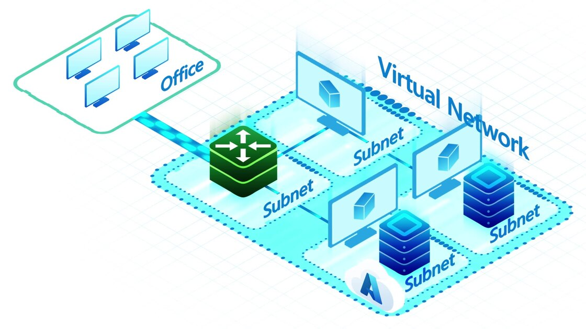

# 2. Setup Network Configuration 

## Objective: 
Design an effective network architecture for your workloads to benefit from the rich capabilities of Azure NetApp Files. 

 

## Topics Covered: 

* Presentation: Design considerations for Azure NetApp Files network planning 

* Review basic requirements and networking options 

 

## Activities: 

* Demo: Live demonstration of setting up Azure NetApp Files networking 

* Hands-On Lab: Participants create their own VNET and delegated subnet 

 

## Materials: 

* Slide deck on Azure NetApp Files networking planning  

* Hands-on Lab guide  

* Microsoft Learn: Guidelines for Azure Netapp Files network planning 
