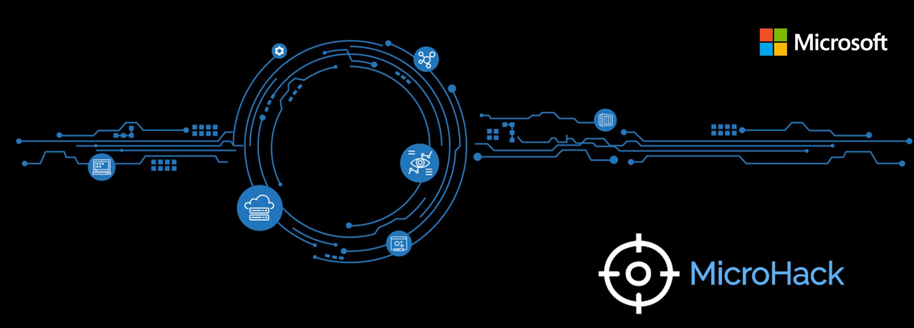

# **Microsoft MicroHacks**

- [**Microsoft MicroHacks**](#microsoft-microhacks)
- [**MicroHack Overview**](#microhack-overview)
  - [**What is a MicroHack?**](#what-is-a-microhack)
  - [**How does it work?**](#how-does-it-work)
  - [**What is the benefit?**](#what-is-the-benefit)
- [**Pre-requisites**](#pre-requisites)
  - [License](#license)
  - [Subscription](#subscription)
- [**How to contribute** 🚀](#how-to-contribute-)
- [**Security hints and handling / Report an issue**](#security-hints-and-handling--report-an-issue)
- [**Which MicroHacks are available**](#which-microhacks-are-available)
  - [01 - Identity and Access Management](#01---identity-and-access-management)
  - [02 - Security](#02---security)
  - [03 - Azure](#03---azure)
  - [04 - M365](#04---m365)
  - [99 - MicroHack-Template](#99---microhack-template)

# **MicroHack Overview**

MicroHacks are great for building base knowledge for people new to a technical area. However, they are often too high-level building technical readiness in Microsoft Azure niche areas where customers need support for. Our teams often hear from customers once they have read the documentation and tried to set up a PoC. If it fails, they come to us looking for support. To be effective in this situation we need to build additional ‘hands on’ technical readiness.

## **What is a MicroHack?**

A MicroHack is a small workshop, less than six hours, where you’ll get hands-on experience and solve different challenges to better understand a certain technology or topic. Let’s say, it’s the mini Version of an OpenHack which focuses on a real-life scenario or transformation.

## **How does it work?**

There are many small individual MicroHacks that build on top of each other and therefore imply dependencies. In each MicroHack the requirements are  described to understand exactly what the prerequisits are. The procedure is described relatively simple and is explained step-by-step. You have to fulfill certain tasks (based on challenges) before you can continue with the next challenge. At a first glance, everything looks simple, but if you take a closer look, the whole construct is revealed at the end of the MicroHack series.

## **What is the benefit?**

The great benefit of MicroHacks is that you can quickly, precisely and hands on understand one or the combination of several services. There are often only a few concrete tasks to do and the hands on experience is lifted to the next level in a very short time. After completing all the challenges you will almost certainly have jumped over your own shadow, expanded the mindset and can directly deal with the implementation in practice and outside of a lab environment.

# **Pre-requisites**

## License

Regarding licenses, just read the requirements in each and every MicroHack. It describes exactly which requirements are necessary to perform the MicroHack by your self or together with Microsoft colleagues. If you are supported by a partner or directly by Microsoft, you can always contact a colleague at the partner or your Microsoft account team.  

## Subscription

Some Microhacks require an Azure subscription. This always depends on the topic, but as mentioned above, before each MicroHack we will explain exactly which requirements you need.

# **How to contribute** 🚀

To [contribute](./CONTRIBUTING.md) to the MicroHacks, you need to fork this repository and submit a pull request for the Markdown and/or image changes that you're proposing.

All you need to know for contributing is documented --> [Jump directly to the contributing guide](./CONTRIBUTING.md).

# **Security hints and handling / [Report an issue](./SECURITY.md)**

Microsoft takes security of our software products and services seriously, which includes all source code repositories managed through our GitHub organizations, which include [Microsoft](https://github.com/Microsoft), [Azure](https://github.com/Azure), [DotNet](https://github.com/dotnet), [AspNet](https://github.com/aspnet), [Xamarin](https://github.com/xamarin), and [our GitHub organizations](https://opensource.microsoft.com/). Click here to jump

# **Which MicroHacks are available**

## 01 - Identity and Access Management

In _Identity and Access Management_ you will find the MicroHacks around Identity and Access Management. Identity and Access management is often not taken seriously, but these microhacks show you real insights into many exciting topics.

[Click here to jump directly to the Identity and Access Management MicroHacks](./01-Identity%20and%20Access%20Management/)

## 02 - Security

In _Security_ you will find all the exciting topics around security and it will be discussed, for example, how I can collect all my relevant security logs in the infrastructure and how I can integrate Hands with other security products. Not to be forgotten when it comes to security, is the integration into existing 3rd party solutions or even multi-hybrid cloud integrations. These integrations are critically examined by our experts in some MicroHacks and tuned to the necessary degree for implementation.

[Click here to jump directly to the Advanced Security MicroHacks](./02-Security/)

## 03 - Azure

In _Azure_ you will find Microhacks for all Azure services, best practices implementations and concrete implementations not only for cloud native, but also for hybrid and multicloud approaches. Also exciting are the Application Innovation and Developer MicroHacks, which also allow developers to gain deep dive hands on experience with Azure.

[Click here to jump directly to the Overall Azure MicroHacks](./03-Azure/)

## 04 - M365

In _M365_ you will find Microhacks for M365 services, best practices implementations and concrete implementations. Very exciting are integrations of Power Plattform and Azure MicroHacks, which allow developers and citizen developers to gain deep-dive hands-on experience.

[Click here to jump directly to the Overall M365 MicroHacks](./04-Microsoft-365/)

## 99 - MicroHack-Template

[See here for template instructions](./99-MicroHack-Template/)
